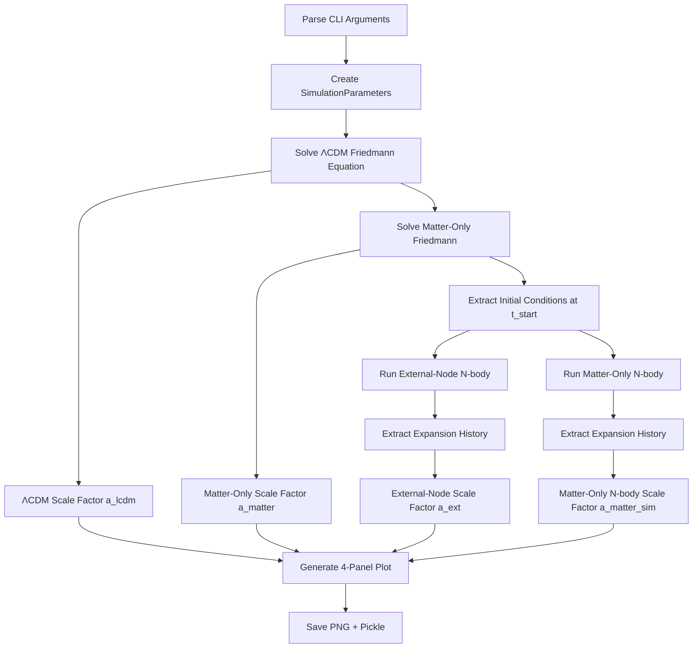

# Data Flow

## `run_simulation.py` Execution Flow



## Key Data Transformations

### 1. Initial Conditions (run_simulation.py:44-73)

**Input**: `t_start_Gyr` (e.g., 10.8 Gyr)

**Process**:
```python
# Solve Friedmann equation from Big Bang to present
a_full = odeint(friedmann_equation, a0=0.001, t_span_full, args=(H0, Ω_m, Ω_Λ))

# Find scale factor at t_start
idx_start = argmin(|t_Gyr_full - t_start_Gyr|)
a_at_start = a_full[idx_start]

# Calculate initial box size
lcdm_initial_size = 14.5 Gpc × (a_at_start / a_today)
```

**Output**: `a_at_start`, `lcdm_initial_size` (e.g., a=0.839, size=11.59 Gpc)

### 2. Particle Initialization (particles.py:73-116)

**Input**: `box_size_Gpc`, `n_particles`, `a_start`, `damping_factor_override`

**Process**:
```python
# Random positions in cube
for i in range(N):
    pos = np.random.uniform(-box_size/2, box_size/2, 3)

# Auto-calculate damping if not provided
if damping_factor_override is not None:
    damping = damping_factor_override
else:
    q = 0.5 × Ω_m(a) / [Ω_m(a) + Ω_Λ] - 1.0
    damping = clip(0.4 - 0.25×q, 0.1, 0.7)

# Damped Hubble flow + peculiar velocities
H_start = H_at_time(a_start)
v_hubble = damping × H_start × pos
v_peculiar = np.random.normal(0, 1e5, 3)  # ~100 km/s
vel = v_hubble + v_peculiar

# Uniform masses
masses = (Ω_m × ρ_crit × box_size³) / N
```

**Output**: `ParticleSystem` with N particles, initial v ≈ damping × Hr + v_pec (typical damping: 0.6 auto, or 0.91 override)

### 3. HMEA Grid Construction (particles.py:196-228)

**Input**: `M_ext`, `S` (spacing), `irregularity=0.05`

**Process**:
```python
# 3×3×3 lattice (center excluded) = 26 nodes
for i,j,k in [-1,0,1]³:
    if (i,j,k) ≠ (0,0,0):
        base_position = [i×S, j×S, k×S]
        perturbed_position = base_position + random(-S×0.05, S×0.05)
        nodes.append((M_ext, perturbed_position))
```

**Output**: 26 HMEA nodes at ~24 Gpc spacing with 5% irregularity

### 4. Force Calculation (integrator.py:159-179)

**Input**: Particle positions, velocities

**Process**:
```python
a_total = (
    calculate_internal_forces()        # O(N²) pairwise gravity
    + calculate_external_forces()      # 26 × N tidal forces
    + calculate_dark_energy_forces()   # H₀² Ω_Λ r (ΛCDM only)
    + calculate_hubble_drag()          # -2Hr (ΛCDM only)
)
```

**Output**: Acceleration vector for each particle [m/s²]

### 5. Leapfrog Integration (integrator.py:229-252)

**Input**: Current state (r, v), timestep dt

**Process**:
```python
# Kick (half)
v += a × dt/2

# Drift (full)
r += v × dt

# Kick (half)
a = calculate_total_forces()
v += a × dt/2

t += dt
```

**Output**: Updated state (r', v', t+dt)

### 6. Expansion History Extraction (simulation.py:86-145)

**Input**: List of snapshots (positions, velocities, times)

**Process**:
```python
for snapshot in snapshots:
    # Center of mass
    com = mean(positions, weighted_by=masses)

    # RMS radius
    displacements = positions - com
    rms_radius = sqrt(mean(displacements²))

    # Scale factor
    a = rms_radius / initial_rms_radius

    expansion_history.append({
        'time_Gyr': t / Gyr_to_s,
        'scale_factor': a,
        'size': rms_radius / Gpc_to_m
    })
```

**Output**: Time series of (t, a, size)

### 7. Plot Generation (run_simulation.py:167-228)

**Input**: Four time series (t_lcdm, a_lcdm), (t_ext, a_ext), (t_matter, a_matter), (t_matter_sim, a_matter_sim)

**Panels**:
1. **Scale Factor vs Time**: Direct comparison a(t)
2. **Hubble Parameter vs Time**: H = gradient(a, t) / a
3. **Ratio to ΛCDM**: size_ext / size_lcdm (should ≈ 1.0)
4. **Physical Size vs Time**: size in Gpc (shows node spacing)

**Output**: 4-panel matplotlib figure (14×10 inches, 150 dpi)

## Data Types

| Variable | Type | Units | Typical Value |
|----------|------|-------|---------------|
| `a` | float | dimensionless | 0.839 → 1.045 |
| `t` | float | seconds | 3.4e17 s (10.8 Gyr) |
| `positions` | (N,3) array | meters | ±5.8e25 m (±5.8 Gpc) |
| `velocities` | (N,3) array | m/s | ±6e5 m/s |
| `masses` | (N,) array | kg | 1e53 kg each |
| `accelerations` | (N,3) array | m/s² | 1e-10 m/s² typical |
| `H` | float | 1/s | 2.3e-18 /s (70 km/s/Mpc) |
| `size` | float | meters | 1.2e26 m (12 Gpc) |

## Snapshot Structure

Each snapshot dict:
```python
{
    'time': float,              # seconds since Big Bang
    'positions': (N,3) array,   # meters, current positions
    'velocities': (N,3) array,  # m/s, current velocities
    'accelerations': (N,3) array # m/s², current accelerations
}
```

Snapshots saved every `save_interval` steps (default 10) → ~15 snapshots per simulation.

## Expansion History Structure

Each history entry dict:
```python
{
    'time_Gyr': float,        # Gyr since Big Bang
    'scale_factor': float,    # dimensionless, normalized to initial
    'size': float,            # Gpc, RMS radius from center of mass
    'H': float                # km/s/Mpc (optional, calculated later)
}
```
