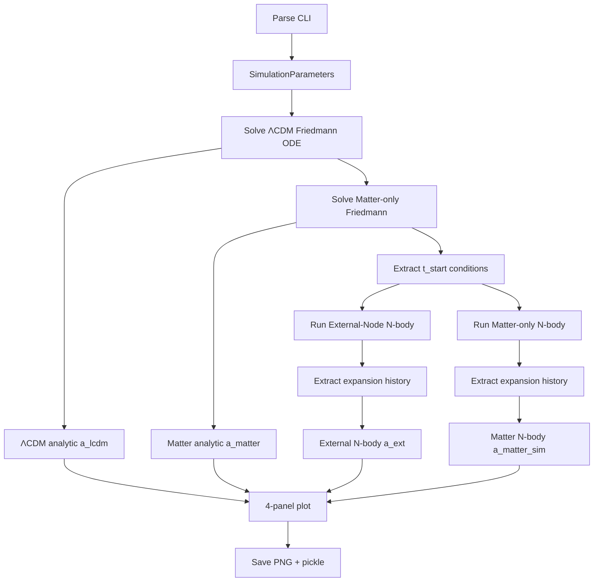

# Data Flow

## run_simulation.py Execution



## Key Transformations

### 1. Initial Conditions (run_simulation.py:44-73)

**Input**: t_start_Gyr (e.g., 10.8)

**Output**: a_at_start, box_size_initial

Solve Friedmann ODE from Big Bang → present. Extract scale factor at t_start. Calculate box size: `14.5 Gpc × (a_start / a_today)`.

Example: t=10.8 Gyr → a≈0.839 → size≈12.2 Gpc

### 2. Particle Init (particles.py:73-116)

**Input**: box_size, n_particles, a_start, damping_override

**Output**: ParticleSystem with N particles

Random positions in box. Velocities: `v = damping×H(a)×r + v_pec` where damping auto-calculated from deceleration param q or overridden. Masses uniform: total_mass/N.

See [initial-conditions.md](../physics/initial-conditions.md) for damping details.

### 3. HMEA Grid (particles.py:196-228)

**Input**: M_ext, S (spacing)

**Output**: 26 HMEA nodes

3×3×3 cubic lattice, center excluded. Each node at `[i,j,k]×S` with 5% positional irregularity (virialized realism).

### 4. Force Calculation (integrator.py:159-179)

**Input**: Particle positions, velocities

**Output**: Total accelerations

```
a_total = internal_gravity + external_tidal + dark_energy + hubble_drag
```

- Internal: O(N²) pairwise with softening
- External: Vectorized over 26 nodes (if use_external_nodes)
- Dark energy: H₀²Ω_Λ×r (if use_dark_energy)
- Hubble drag: -2H(a)×v (if use_dark_energy)

See [force-calculations.md](../physics/force-calculations.md).

### 5. Leapfrog Step (integrator.py:229-252)

**Input**: dt, current state

**Output**: Updated positions, velocities

Kick-Drift-Kick: half-step velocity kick, full-step position drift, half-step velocity kick. Symplectic, energy-conserving.

See [integration.md](../physics/integration.md).

### 6. Expansion Tracking (simulation.py:90-150)

**Input**: Particle snapshots over time

**Output**: Scale factor history

Calculate RMS radius of particle distribution at each snapshot:
```
R_rms(t) = sqrt(mean(||r_i - r_cm||²))
a(t) = R_rms(t) / R_rms(t_start)
```

Also compute H(t) = (da/dt) / a via finite differences.

### 7. Comparison Plot (run_simulation.py:180-230)

**Input**: Three expansion histories (ΛCDM analytic, External N-body, Matter N-body)

**Output**: 4-panel figure

- Top-left: Scale factor a(t)
- Top-right: Hubble parameter H(t)
- Bottom-left: Ratio External/ΛCDM (match quality)
- Bottom-right: Physical size evolution

Saved as PNG with timestamp + params in filename.

## Data Types

**SimulationParameters**: Unified config object holding M_value, S_value, n_particles, seed, t_start, t_duration, n_steps, damping_factor. Auto-calculates derived quantities (M_ext in kg, S in meters, external_params).

**ParticleSystem**: List of Particle objects with positions (m), velocities (m/s), masses (kg), accelerations (m/s²).

**HMEAGrid**: List of (M_ext, position) tuples for 26 external nodes.

**Expansion history**: Arrays of (time, scale_factor, hubble_param, rms_radius).

## File I/O

**Output files** (results/):
- PNG: 4-panel comparison plot
- Pickle: Full CosmologicalSimulation object (particles, history, parameters)

**Filename convention**:
```
figure_simulation_results_YYYY-MM-DD_HH.MM.SS_300p_10.8-16.8Gyr_800M_24S_150steps_0.91d.png
```

Includes timestamp, particles, time range, M/S params, steps, damping.

## Performance Notes

**Bottleneck**: Internal force O(N²). ~2 min for 300 particles × 150 steps.

**Parallelization**: External forces vectorized over 26 nodes (NumPy broadcasting).

**Memory**: Minimal. Snapshots saved every save_interval steps (default 10).

## References

Particle init: [initial-conditions.md](../physics/initial-conditions.md)
Forces: [force-calculations.md](../physics/force-calculations.md)
Integration: [integration.md](../physics/integration.md)
Module organization: [module-structure.md](./module-structure.md)
