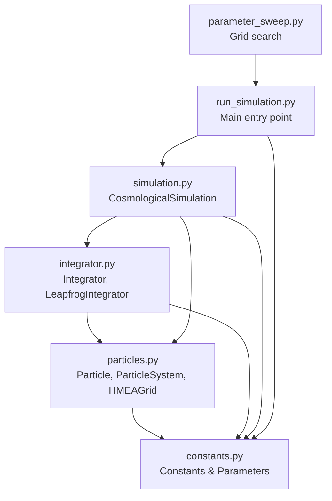

# Module Structure

## Dependency Hierarchy



## Module Responsibilities

### `cosmo/constants.py`
**Purpose**: Physical constants and parameter configuration classes.

**Classes**:
- `CosmologicalConstants`: G, c, Mpc_to_m, Gpc_to_m, Gyr_to_s, M_observable, etc.
- `LambdaCDMParameters`: H₀, Ω_m, Ω_Λ, method `H_at_time(a)`
- `ExternalNodeParameters`: M_ext, S, Ω_Λ_eff, method `calculate_required_spacing()`
- `SimulationParameters`: Unified config (M_value, S_value, n_particles, seed, t_start_Gyr, t_duration_Gyr, n_steps, damping_factor)

**Exports**: All four classes.

**Key feature**: SimulationParameters auto-calculates derived quantities (M_ext, S in SI units, t_end_Gyr, external_params) in `_calculate_derived()`.

### `cosmo/particles.py`
**Purpose**: Physical structures (particles and external nodes).

**Classes**:
- `Particle`: Single entity with position, velocity, mass, acceleration, id
- `ParticleSystem`: N particles with update methods, energy calculations
- `HMEAGrid`: 26-node cubic lattice (3×3×3-1), vectorized tidal force calculation

**Key methods**:
- `ParticleSystem._initialize_particles()`: Sets up particles with damped Hubble flow + peculiar velocities (particles.py:73-116)
  - Auto-calculates damping from deceleration parameter q if damping_factor_override=None
  - Uses override if provided (e.g., 0.0 for tests, 0.91 for best-fit)
- `HMEAGrid.calculate_tidal_acceleration_batch()`: Vectorized tidal forces across all 26 nodes

**Exports**: All three classes.

### `cosmo/integrator.py`
**Purpose**: N-body physics and time evolution.

**Classes**:
- `Integrator`: Base class calculating forces (internal, external, dark energy, Hubble drag)
- `LeapfrogIntegrator`: Kick-Drift-Kick time stepping

**Key methods**:
- `calculate_internal_forces()`: Direct O(N²) gravity with softening (integrator.py:52-87)
- `calculate_external_forces()`: Delegates to HMEAGrid (integrator.py:89-102)
- `calculate_dark_energy_forces()`: a_Λ = H₀² Ω_Λ r (integrator.py:104-125)
- `calculate_hubble_drag()`: a_drag = -2Hr (ΛCDM only) (integrator.py:127-157)
- `LeapfrogIntegrator.step(dt)`: Single timestep (integrator.py:229-252)
- `LeapfrogIntegrator.evolve()`: Full simulation loop (integrator.py:254-298)

**Exports**: `Integrator`, `LeapfrogIntegrator`.

### `cosmo/simulation.py`
**Purpose**: High-level simulation orchestration.

**Classes**:
- `CosmologicalSimulation`: Combines ParticleSystem + Integrator, tracks expansion history

**Key methods**:
- `__init__()`: Sets up particles, HMEA grid, integrator based on mode flags
- `run(t_end_Gyr, n_steps, save_interval)`: Executes integration, calculates expansion metrics
- `save(filename)`, `load(filename)`: Pickle persistence

**Mode flags**:
- `use_external_nodes=True, use_dark_energy=False`: External-Node Model
- `use_external_nodes=False, use_dark_energy=True`: ΛCDM
- `use_external_nodes=False, use_dark_energy=False`: Matter-only

**Exports**: `CosmologicalSimulation`.

### `run_simulation.py`
**Purpose**: Main script orchestrating full comparison workflow.

**Key functions**:
- `run_simulation(output_dir, sim_params)`: Runs 3 simulations (ΛCDM analytic, External-Node N-body, Matter-only N-body), generates 4-panel plot
- `parse_arguments()`: CLI with argparse

**Workflow**:
1. Solve Friedmann equation for ΛCDM and Matter-only (scipy.odeint)
2. Run External-Node N-body simulation
3. Run Matter-only N-body simulation
4. Compare all three, generate plot
5. Save PNG + pickle

**Entry point**: `if __name__ == "__main__"`

### `parameter_sweep.py`
**Purpose**: Grid search over M and S parameter space.

**Function**: Calls `run_simulation()` in nested loops, aggregates match percentages.

## File Locations

| File | Lines | Purpose |
|------|-------|---------|
| `cosmo/constants.py` | 206 | Parameter definitions |
| `cosmo/particles.py` | 277 | Physical structures |
| `cosmo/integrator.py` | 308 | Force calculations + integration |
| `cosmo/simulation.py` | 182 | High-level runner |
| `run_simulation.py` | 349 | Main comparison script |
| `parameter_sweep.py` | 101 | Parameter exploration |

## Import Pattern

All scripts import from `cosmo` package:
```python
from cosmo.constants import CosmologicalConstants, LambdaCDMParameters, SimulationParameters
from cosmo.simulation import CosmologicalSimulation
```

No circular dependencies. Linear dependency chain: constants → particles → integrator → simulation → scripts.
