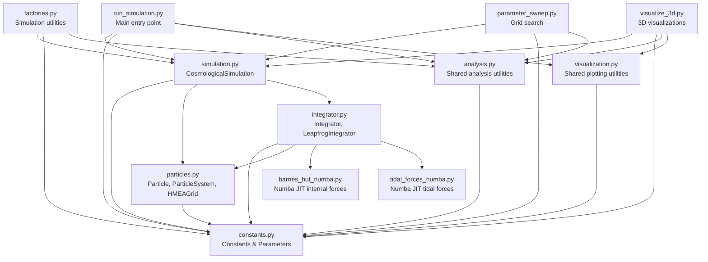

# Module Structure

## Dependency Hierarchy



## Module Responsibilities

### `cosmo/constants.py`
**Purpose**: Physical constants and parameter configuration classes.

**Classes**:
- `CosmologicalConstants`: G, c, Mpc_to_m, Gpc_to_m, Gyr_to_s, M_observable, etc.
- `LambdaCDMParameters`: H₀, Ω_m, Ω_Λ, method `H_at_time(a)`
- `ExternalNodeParameters`: M_ext, S, Ω_Λ_eff, method `calculate_required_spacing()`
- `SimulationParameters`: Unified config (M_value, S_value, n_particles, seed, t_start_Gyr, t_duration_Gyr, n_steps, damping_factor)

**Exports**: All four classes.

**Key feature**: SimulationParameters auto-calculates derived quantities (M_ext, S in SI units, t_end_Gyr, external_params) in `_calculate_derived()`.

### `cosmo/particles.py`
**Purpose**: Physical structures (particles and external nodes).

**Classes**:
- `Particle`: Single entity with position, velocity, mass, acceleration, id
- `ParticleSystem`: N particles with update methods, energy calculations
- `HMEAGrid`: 26-node cubic lattice (3×3×3-1), vectorized tidal force calculation

**Key methods**:
- `ParticleSystem._initialize_particles()`: Sets up particles with damped Hubble flow + peculiar velocities (particles.py:73-116)
  - Auto-calculates damping from deceleration parameter q if damping_factor_override=None
  - Uses override if provided (e.g., 0.0 for tests, 0.91 for best-fit)
- `HMEAGrid.calculate_tidal_acceleration_batch()`: Vectorized tidal forces across all 26 nodes

**Exports**: All three classes.

### `cosmo/integrator.py`
**Purpose**: N-body physics and time evolution.

**Classes**:
- `Integrator`: Base class calculating forces (internal, external, dark energy, Hubble drag)
- `LeapfrogIntegrator`: Kick-Drift-Kick time stepping

**Key methods**:
- `calculate_internal_forces()`: Direct O(N²) gravity with softening (integrator.py:52-87)
- `calculate_external_forces()`: Delegates to HMEAGrid (integrator.py:89-102)
- `calculate_dark_energy_forces()`: a_Λ = H₀² Ω_Λ r (integrator.py:104-125)
- `calculate_hubble_drag()`: a_drag = -2Hr (ΛCDM only) (integrator.py:127-157)
- `LeapfrogIntegrator.step(dt)`: Single timestep (integrator.py:229-252)
- `LeapfrogIntegrator.evolve()`: Full simulation loop (integrator.py:254-298)

**Exports**: `Integrator`, `LeapfrogIntegrator`.

### `cosmo/barnes_hut_numba.py`
**Purpose**: Numba JIT-compiled internal gravity calculation for performance.

**Note**: Despite the name, uses direct O(N²) summation with Numba JIT compilation (14-17x speedup), not Barnes-Hut tree approximation. Speedup comes from compilation, not algorithmic complexity reduction.

**Functions**:
- `calculate_internal_forces_numba()`: JIT-compiled pairwise gravity with softening

**Used by**: `integrator.py` for N≥100 particles (auto-selected)

### `cosmo/tidal_forces_numba.py`
**Purpose**: Numba JIT-compiled tidal force calculation from external HMEA nodes.

**Functions**:
- `calculate_tidal_forces_numba(particle_positions, node_positions, node_masses, G)`: Returns (N, 3) accelerations in m/s²

**Algorithm**: Double loop over N particles × M nodes (M=26), computing attractive acceleration toward each node. Singularity protection at r < 1e10 m.

**Used by**: `integrator.py` for external force calculations

### `cosmo/factories.py`
**Purpose**: Utility functions for running simulations and extracting results.

**Functions**:
- `run_and_extract_results(sim, t_duration_Gyr, n_steps, save_interval)`: Runs simulation, returns dict with t_Gyr, a, diameter_Gpc, max_radius_Gpc, sim

**Used by**: Scripts needing streamlined simulation execution

### `cosmo/simulation.py`
**Purpose**: High-level simulation orchestration.

**Classes**:
- `CosmologicalSimulation`: Combines ParticleSystem + Integrator, tracks expansion history

**Key methods**:
- `__init__()`: Sets up particles, HMEA grid, integrator based on mode flags
- `run(t_end_Gyr, n_steps, save_interval)`: Executes integration, calculates expansion metrics
- `save(filename)`, `load(filename)`: Pickle persistence

**Mode flags**:
- `use_external_nodes=True, use_dark_energy=False`: External-Node Model
- `use_external_nodes=False, use_dark_energy=True`: ΛCDM
- `use_external_nodes=False, use_dark_energy=False`: Matter-only

**Exports**: `CosmologicalSimulation`.

### `cosmo/analysis.py`
**Purpose**: Shared analysis utilities for cosmological calculations.

**Functions**:
- `friedmann_equation(a, t, H0, Omega_m, Omega_Lambda)`: ODE for scale factor evolution
- `solve_friedmann_equation(t_start, t_end, Omega_Lambda, n_points)`: Solve ΛCDM/matter-only evolution
- `calculate_initial_conditions(t_start, reference_size)`: Compute a_start, box_size from t_start
- `normalize_to_initial_size(a_array, initial_size)`: Convert scale factors to physical sizes
- `compare_expansion_histories(size_ext, size_lcdm, return_array=False)`: Calculate match percentage. Returns array if return_array=True and inputs are arrays; otherwise returns scalar averaged match.
- `detect_runaway_particles(max_distance, rms_size, threshold)`: Detect numerical instability
- `calculate_today_marker(t_start, t_duration, today)`: Position of "today" in simulation time

**Used by**: `run_simulation.py`, `parameter_sweep.py`, `visualize_3d.py`

**Exports**: All functions listed above.

### `cosmo/visualization.py`
**Purpose**: Shared visualization utilities for plots and 3D graphics.

**Functions**:
- `get_node_positions(S_Gpc)`: Calculate 26 HMEA node positions in 3×3×3 grid
- `draw_universe_sphere(ax, radius, alpha, color, resolution)`: Draw sphere on 3D axes
- `draw_cube_edges(ax, half_size, color, alpha, linewidth)`: Draw cube outline
- `setup_3d_axes(ax, lim, title, elev, azim)`: Configure 3D plot axes
- `generate_output_filename(base_name, sim_params, extension, output_dir, include_timestamp)`: Standardized filenames with parameters
- `format_simulation_title(sim_params, include_particles)`: Standardized plot titles

**Used by**: `run_simulation.py`, `visualize_3d.py`

**Exports**: All functions listed above.

### `run_simulation.py`
**Purpose**: Main script orchestrating full comparison workflow.

**Key functions**:
- `run_simulation(output_dir, sim_params)`: Runs 3 simulations (ΛCDM analytic, External-Node N-body, Matter-only N-body), generates 4-panel plot
- `parse_arguments()`: CLI with argparse

**Workflow**:
1. Calculate initial conditions using `analysis.calculate_initial_conditions()`
2. Solve Friedmann equation for ΛCDM and Matter-only using `analysis.solve_friedmann_equation()`
3. Run External-Node N-body simulation
4. Run Matter-only N-body simulation
5. Compare using `analysis.compare_expansion_histories()`, detect runaways with `analysis.detect_runaway_particles()`
6. Generate plot using `visualization.format_simulation_title()`
7. Save using `visualization.generate_output_filename()`

**Entry point**: `if __name__ == "__main__"`

### `parameter_sweep.py`
**Purpose**: Grid search over M and S parameter space.

**Workflow**:
1. Calculate initial conditions once using `analysis.calculate_initial_conditions()`
2. Run ΛCDM baseline simulation
3. Test multiple (M, S) configurations
4. Compare each using `analysis.compare_expansion_histories()`
5. Sort results by best match, save best configuration

**No longer calls**: `run_simulation()` - now uses shared utilities directly for efficiency.

## File Locations

| File | Lines | Purpose |
|------|-------|---------|
| `cosmo/constants.py` | 154 | Parameter definitions |
| `cosmo/particles.py` | 340 | Physical structures |
| `cosmo/integrator.py` | 316 | Force calculations + integration |
| `cosmo/simulation.py` | 214 | High-level runner |
| `cosmo/analysis.py` | 382 | Shared analysis utilities |
| `cosmo/visualization.py` | 213 | Shared plotting utilities |
| `cosmo/barnes_hut_numba.py` | 160 | Numba JIT internal forces |
| `cosmo/tidal_forces_numba.py` | 60 | Numba JIT tidal forces |
| `cosmo/factories.py` | 39 | Simulation utilities |
| `run_simulation.py` | 345 | Main comparison script |
| `parameter_sweep.py` | 365 | Parameter exploration |
| `visualize_3d.py` | 747 | 3D visualization |

## Import Pattern

All scripts import from `cosmo` package:
```python
from cosmo.constants import CosmologicalConstants, LambdaCDMParameters, SimulationParameters
from cosmo.simulation import CosmologicalSimulation
```

No circular dependencies. Linear dependency chain: constants → particles → integrator → simulation → scripts.
