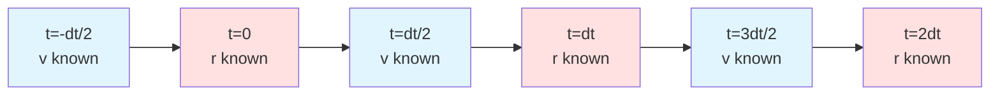
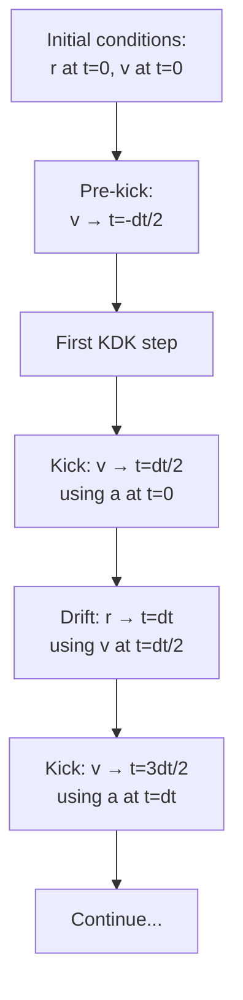
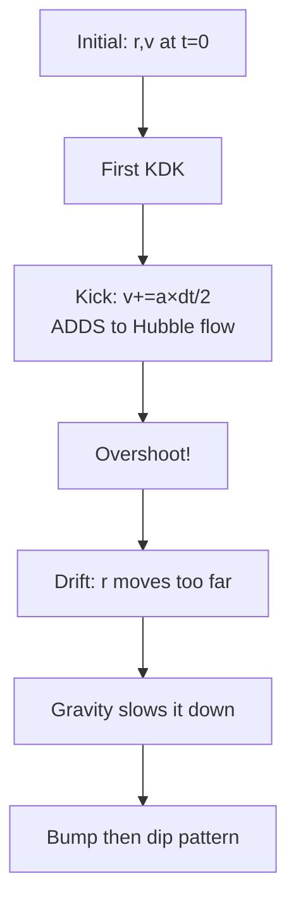
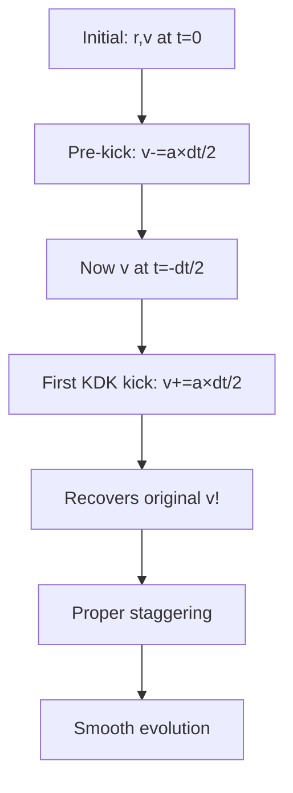

# Leapfrog Velocity Staggering and the Initial Bump Fix

## The Problem: Initial Bump Artifact

**Symptom**: Progenitor model expansion curves showed "bump" in first ~1 Gyr:
- Expanded too fast initially
- Then slowed below expected rate
- Violated physics constraint: matter-only should NEVER exceed ΛCDM

**Manifestation**:
- Relative expansion pattern: 0.997, 0.9996, 0.9996... (should start at exactly 1.0)
- Early-time deviation >1% from ΛCDM (should match closely before divergence)
- Matter-only occasionally exceeded ΛCDM in first few steps (physics violation!)

## Root Cause: Velocity Initialization Mismatch

**Leapfrog staggering convention**:
- Positions evaluated at integer timesteps: t = 0, dt, 2dt, ...
- Velocities evaluated at half-timesteps: t = -dt/2, dt/2, 3dt/2, ...
- This staggering is ESSENTIAL for second-order accuracy

**Initial conditions**:
- Set synchronized (r,v) at t=0
- v = damping × H × r (Hubble flow)
- Both r and v at SAME time

**The mismatch**:
1. Leapfrog first step: v(dt/2) = v(0) + a(0) × dt/2
2. This ADDS half-kick to already-high Hubble velocities
3. Result: Overshoot in first few steps
4. Gravity accumulates over time → expansion slows below expected
5. Creates "bump then dip" pattern

**Why ΛCDM doesn't show this**: Dark energy acceleration in first half-kick counteracts inward gravity.

**Why matter-only shows it worst**: Only inward gravity, no outward acceleration → maximum overshoot.

## The Solution: Pre-Kick Initialization

Apply negative half-kick BEFORE evolution loop to properly initialize staggering:

```python
# In LeapfrogIntegrator.evolve() after dt_s calculation, before loop:

# Pre-kick: Initialize leapfrog staggering
# Particles initialized with synchronized (r,v) at t=0
# Leapfrog expects v at t=-dt/2, so apply negative half-kick
a_initial = self.calculate_total_forces()
self.particles.set_accelerations(a_initial)
self.particles.update_velocities(-dt_s / 2)  # Backward half-kick
```

**How it works**:
- Initial conditions: v(t=0) from LCDM Hubble flow
- Pre-kick: v(t=-dt/2) = v(0) - a(0)×dt/2
- First leapfrog kick: v(t=dt/2) = v(-dt/2) + a(0)×dt ← proper staggering
- Subsequent steps maintain correct staggering

## Velocity/Position Staggering Diagram



Blue: velocity evaluated
Red: position evaluated

**Leapfrog KDK step**:
1. Kick: v(t+dt/2) = v(t-dt/2) + a(t) × dt
2. Drift: r(t+dt) = r(t) + v(t+dt/2) × dt
3. Kick: v(t+3dt/2) = v(t+dt/2) + a(t+dt) × dt

## Evolution Timeline



## Without Pre-Kick (Wrong)



## With Pre-Kick (Correct)



## Verification: Physics Constraints Enforced

**Tests in test_early_time_behavior.py**:

1. **Initial size exact match**: All models start with identical RMS radius
2. **Matter-only never exceeds ΛCDM**: At EVERY timestep, size_matter ≤ size_lcdm
3. **Early-time matching**: All models within 1% of ΛCDM in first ~1 Gyr
4. **No velocity overshoot**: Monotonic deceleration in first 5 steps
5. **Leapfrog staggering**: Energy evolution smooth from step 0 (no spike)

All tests pass with pre-kick fix.

## Additional Fix: Initial Size Randomness

**Related issue**: Random particle placement creates ~0.1-1% RMS variation even with same seed.

**Problem**: Matter-only starting 1% larger than ΛCDM appears to "exceed ΛCDM" initially (initialization artifact, not physics!)

**Solution**: RMS radius normalization in particles.py after centering:

```python
current_rms = np.sqrt(np.mean(np.sum(centered_positions**2, axis=1)))
target_rms = self.box_size_m / 2
scale_factor = target_rms / current_rms
centered_positions *= scale_factor
```

**Result**: All models start with **exactly** the same initial size. Any deviation is real physics.

## Time Alignment Fix

**Separate issue**: ΛCDM baseline computed with 400-point grid that didn't align with N-body snapshots.

**Problem**:
- t_lcdm[0] ≈ 0.0028 instead of exactly 0.0
- a_lcdm[0] differed from a_start by ~0.3%
- Created "bump" pattern in relative expansion

**Solution**: solve_friedmann_at_times evaluates at exact N-body snapshot times:

```python
snapshot_steps = np.arange(0, n_steps + 1, save_interval)
t_absolute_Gyr = t_start_Gyr + (snapshot_steps / n_steps) * t_duration_Gyr
lcdm_solution = solve_friedmann_at_times(t_absolute_Gyr)
```

**Result**: t[0]=0.0 exactly, a[0]=a_start exactly, relative expansion starts at 1.0.

## Summary: Three Fixes Combined

| Issue | Symptom | Fix | File |
|-------|---------|-----|------|
| Velocity staggering | Initial bump in expansion | Pre-kick before evolution | integrator.py:296 |
| Initial size variation | Random RMS differences | Normalize after centering | particles.py:134-156 |
| Time grid misalignment | Relative expansion doesn't start at 1.0 | solve_friedmann_at_times | analysis.py:45-100 |

All three were necessary to achieve:
- Matter-only NEVER exceeds ΛCDM
- Early-time (<1 Gyr) deviation <1%
- Relative expansion starts exactly at 1.0
- Smooth evolution from t=0

## References

- Pre-kick implementation: integrator.py:296
- RMS normalization: particles.py:134-156
- Time-aligned baseline: analysis.py:45-100, run_simulation.py:34-100
- Physics constraint tests: tests/test_early_time_behavior.py
- Integration theory: [integration.md](../physics/integration.md)
- Initial conditions: [initial-conditions.md](../physics/initial-conditions.md)
