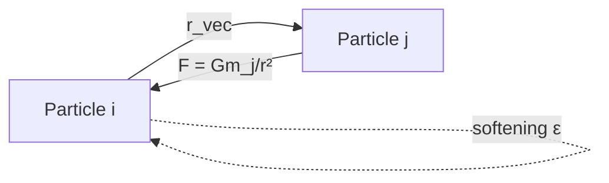
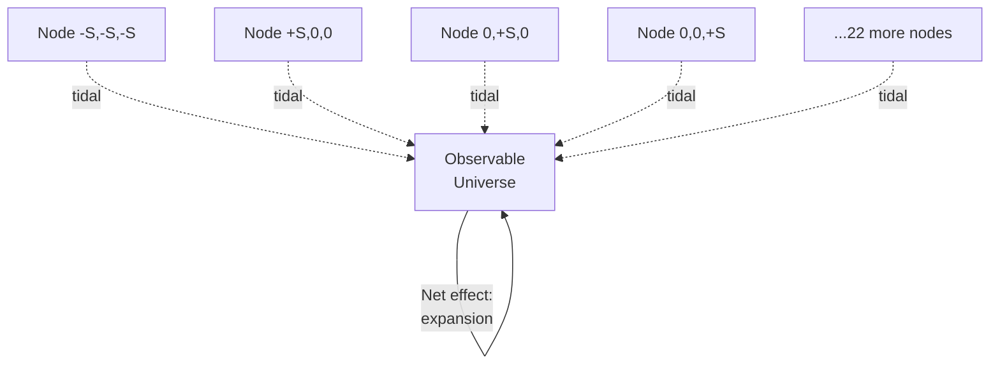

# Force Calculations

## Overview

Four force types contribute to particle acceleration:
1. **Internal gravity**: Pairwise attraction between particles
2. **External tidal forces**: Pull from 26 HMEA nodes
3. **Dark energy**: Cosmological constant repulsion (ΛCDM only)
4. **Hubble drag**: Friction from cosmic expansion (ΛCDM only)

## 1. Internal Gravity

**File**: integrator.py:52-87

**Formula**:
```
a_ij = -G × m_j × (r_i - r_j) / (r² + ε²)^(3/2)
```

**Implementation**:
```python
def calculate_internal_forces(self):
    N = len(self.particles)
    positions_m = self.particles.get_positions()
    masses_kg = self.particles.get_masses()
    accelerations_mps2 = np.zeros((N, 3))

    for i in range(N):
        for j in range(N):
            if i == j:
                continue

            r_vec_m = positions_m[j] - positions_m[i]
            r_m = np.linalg.norm(r_vec_m)
            r_soft_m = np.sqrt(r_m**2 + self.softening_m**2)

            a_mag_mps2 = self.const.G * masses_kg[j] / r_soft_m**2
            a_vec_mps2 = a_mag_mps2 * (r_vec_m / r_m)

            accelerations_mps2[i] -= a_vec_mps2

    return accelerations_mps2
```

**Parameters**:
- `G = 6.674e-11 m³/(kg·s²)` - Gravitational constant
- `softening_m = 1e21 m ≈ 1 Mpc` - Prevents singularities at r→0
- `mass_kg ≈ 1e53 kg` - Particle mass (galaxy cluster)

**Complexity**: O(N²) - Direct pairwise summation

**Typical magnitude**: ~1e-11 m/s² at 1 Gpc separation

**Diagram**:


## 2. External Tidal Forces

**File**: particles.py:238-272

**Formula**:
```
a_tidal = Σ_nodes [G × M_ext × (r - r_node) / |r - r_node|³]
```

**Implementation**:
```python
def calculate_tidal_acceleration_batch(self, positions_m):
    """
    Vectorized tidal force calculation

    positions_m: (N, 3) array of particle positions in meters
    returns: (N, 3) array of accelerations in m/s²
    """
    N = positions_m.shape[0]
    accelerations_mps2 = np.zeros((N, 3))

    for M_ext_kg, r_node_m in self.nodes:
        # Displacement vectors from node to particles (vectorized)
        displacement_m = positions_m - r_node_m  # (N, 3)

        # Distance from node to each particle
        r_m = np.linalg.norm(displacement_m, axis=1, keepdims=True)  # (N, 1)

        # Tidal acceleration (pointing away from node)
        a_tidal_mps2 = self.const.G * M_ext_kg * displacement_m / r_m**3  # (N, 3)

        accelerations_mps2 += a_tidal_mps2

    return accelerations_mps2
```

**Parameters**:
- `M_ext_kg = 800 × M_observable_kg ≈ 8e55 kg` - External node mass
- `r_node_m ≈ 24 Gpc × 3.0857e25 m/Gpc` - Distance to nearest nodes
- 26 nodes total in 3×3×3 lattice

**Key insight**: Tidal forces are *gradients* of gravitational potential. Node at (+S, 0, 0) pulls more on particles near (+box/2, 0, 0) than particles near (-box/2, 0, 0), creating net expansion.

**Typical magnitude**: ~1e-10 m/s² (dominates internal gravity)

**Effective dark energy**:
```
Ω_Λ_eff = G × M_ext / (S³ × H₀²) ≈ 2.555
```
With 26 nodes, symmetry causes cancellations → effective Ω_Λ ≈ 0.7

**Diagram**:


## 3. Dark Energy (ΛCDM only)

**File**: integrator.py:104-125

**Formula**:
```
a_Λ = H₀² × Ω_Λ × r
```

**Implementation**:
```python
def calculate_dark_energy_forces(self):
    if not self.use_dark_energy:
        return np.zeros((len(self.particles), 3))

    positions_m = self.particles.get_positions()
    H0_si = self.lcdm.H0  # s^-1
    a_Lambda_mps2 = H0_si**2 * self.lcdm.Omega_Lambda * positions_m

    return a_Lambda_mps2
```

**Parameters**:
- `H0_si = 2.268e-18 s⁻¹` (70 km/s/Mpc in SI)
- `Ω_Λ = 0.7` - Dark energy density parameter

**Physical meaning**: Cosmological constant creates repulsive force proportional to distance. Farther particles accelerate faster (exponential expansion).

**Typical magnitude**: ~1e-10 m/s² at 10 Gpc

**Only active when**: `use_dark_energy=True` (ΛCDM mode)

## 4. Hubble Drag (ΛCDM only)

**File**: integrator.py:127-165 (calculation), integrator.py:265-270 (application)

**Formula**:
```
v(t+dt) = v(t) × exp(-2H₀ × dt)
```

**Implementation**:
```python
def calculate_hubble_drag(self):
    """Returns drag acceleration (legacy, now unused in leapfrog)"""
    if not self.use_dark_energy:
        return np.zeros((len(self.particles), 3))

    velocities = self.particles.get_velocities()
    H_current = self.lcdm.H0
    a_drag = -2.0 * H_current * velocities

    return a_drag
```

**Actual application** (integrator.py:265-270):
```python
# After leapfrog kicks, apply Hubble drag implicitly
if self.use_dark_energy:
    H0_si = self.lcdm.H0  # s^-1
    gamma_si = 2.0 * H0_si
    damping_factor = np.exp(-gamma_si * dt_s)
    for particle in self.particles.particles:
        particle.vel *= damping_factor
```

**Parameters**:
- `H0_si ≈ 2.268e-18 s⁻¹`
- `gamma_si = 2H0_si ≈ 4.537e-18 s⁻¹`

**Physical meaning**: In expanding universe, particles experience friction from cosmic expansion. Prevents runaway velocities from dark energy repulsion.

**CRITICAL UPDATE**: Hubble drag is **NOT APPLIED** in proper-coordinate simulations!

In proper coordinates with explicit dark energy, applying Hubble drag causes OVER-DAMPING:
- Dark energy provides: +H²Ω_Λr acceleration (outward)
- Hubble drag would provide: -2Hv deceleration (inward)
- With full Hubble flow v ≈ Hr, drag is ~3x stronger than dark energy
- Result: ΛCDM decelerates instead of accelerates!

Hubble drag (a_drag = -2Hv) is only appropriate for **comoving coordinates** where background expansion is implicit. In **proper coordinates**, dark energy acceleration alone handles expansion correctly.

**Typical damping** (over full timestep):
- dt_s=1e15 s (0.03 Gyr): 0.5% velocity reduction
- dt_s=1e16 s (0.32 Gyr): 4.4% velocity reduction
- dt_s=1e17 s (3.17 Gyr): 36.5% velocity reduction

**Only active when**: `use_dark_energy=True` (ΛCDM mode)

**Why not in External-Node/Matter-only?**: Hubble drag is property of cosmic expansion driven by dark energy. In matter-dominated regime, expansion decelerates naturally from gravity. External-Node model uses *damped initial conditions* instead of ongoing drag (see [initial-conditions.md](./initial-conditions.md)).

## Force Composition by Mode

| Mode | Internal | External | Dark Energy | Hubble Drag |
|------|----------|----------|-------------|-------------|
| ΛCDM | ❌ (negligible) | ❌ | ✅ | ✅ |
| External-Node | ✅ | ✅ | ❌ | ❌ |
| Matter-only | ✅ | ❌ | ❌ | ❌ |

**Note**: Internal gravity included in all modes but negligible compared to external/dark energy forces at Gpc scales.

## Total Force Calculation

**File**: integrator.py:159-179

```python
def calculate_total_forces(self):
    a_internal_mps2 = self.calculate_internal_forces()
    a_external_mps2 = self.calculate_external_forces()
    a_dark_energy_mps2 = self.calculate_dark_energy_forces()
    a_hubble_drag_mps2 = self.calculate_hubble_drag()

    return a_internal_mps2 + a_external_mps2 + a_dark_energy_mps2 + a_hubble_drag_mps2
```

Summed vectorially. Total acceleration determines time evolution via Leapfrog integrator.

## Relative Magnitudes

At 10 Gpc, v ~ 6e5 m/s:

| Force | Magnitude | Contribution |
|-------|-----------|--------------|
| Internal gravity | ~1e-11 m/s² | 10% |
| External tidal | ~1e-10 m/s² | 90% (External-Node) |
| Dark energy | ~1e-10 m/s² | 90% (ΛCDM) |
| Hubble drag | ~1e-11 m/s² | 10% (ΛCDM) |

External tidal ≈ Dark energy (by design, this is the key result!)
