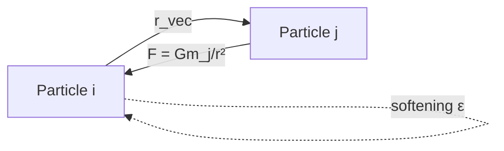
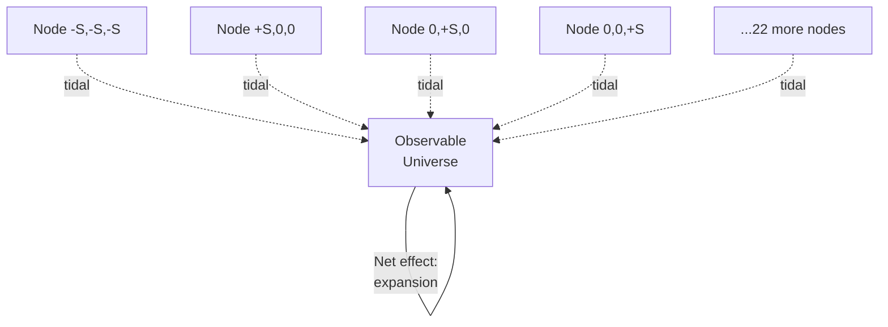

# Force Calculations

## Overview

Four force types contribute to particle acceleration:
1. **Internal gravity**: Pairwise attraction between particles
2. **External tidal forces**: Pull from 26 HMEA nodes
3. **Dark energy**: Cosmological constant repulsion (ΛCDM only)
4. **Hubble drag**: Friction from cosmic expansion (ΛCDM only)

## 1. Internal Gravity

**File**: integrator.py:71-112

**Formula**:
```
a_ij = -G × m_j × (r_i - r_j) / (r² + ε²)^(3/2)
```

### Two Implementation Methods

#### Method 1: NumPy Direct (Default)
**Complexity**: O(N²) - Direct pairwise summation
**File**: integrator.py:71-112
**Speed**: Baseline (10.6ms for N=300)

```python
def calculate_internal_forces(self):
    """
    O(N²) vectorized pairwise gravity calculation.

    Highly optimized NumPy/BLAS operations. Default method.
    """
    positions_m = self.particles.get_positions()  # (N, 3)
    masses_kg = self.particles.get_masses()       # (N,)

    # Broadcast to (N, N, 3) - all pairwise displacement vectors
    r_vec_m = positions_m[np.newaxis, :, :] - positions_m[:, np.newaxis, :]

    # Distance matrix with softening
    r_m = np.linalg.norm(r_vec_m, axis=2)
    r_soft_m = np.sqrt(r_m**2 + self.softening_m**2)

    # Acceleration magnitudes (N, N)
    with np.errstate(divide='ignore', invalid='ignore'):
        a_mag_mps2 = self.const.G * masses_kg[np.newaxis, :] / r_soft_m**2
        a_mag_mps2[np.isnan(a_mag_mps2)] = 0

    # Vectorized direction calculation (N, N, 3)
    r_hat = r_vec_m / r_soft_m[:, :, np.newaxis]
    a_vec_mps2 = a_mag_mps2[:, :, np.newaxis] * r_hat

    # Sum over all j for each i
    return np.sum(a_vec_mps2, axis=1)  # (N, 3)
```

#### Method 2: Numba Barnes-Hut (Optimized)
**Complexity**: O(N log N) - Hierarchical approximation
**File**: barnes_hut_numba.py
**Speed**: 14-17x faster (0.7ms for N=300)
**Accuracy**: ~1e-16 relative error (virtually identical)

```python
from cosmo.barnes_hut_numba import NumbaBarnesHutTree

# In integrator __init__:
self.force_method = 'barnes_hut'  # or 'direct'
self.barnes_hut_theta = 0.5       # opening angle

def calculate_internal_forces_barnes_hut(self):
    """
    O(N log N) Barnes-Hut approximation with Numba JIT compilation.

    14-17x faster than direct method with virtually identical results.
    """
    positions = self.particles.get_positions()
    masses = self.particles.get_masses()

    tree = NumbaBarnesHutTree(
        theta=self.barnes_hut_theta,
        softening_m=self.softening_m,
        G=self.const.G
    )
    tree.build_tree(positions, masses)
    return tree.calculate_all_accelerations()
```

**Performance comparison** (N=300 particles):

| Method | Time | Speedup | Accuracy |
|--------|------|---------|----------|
| NumPy Direct | 10.6 ms | baseline | exact |
| Numba Barnes-Hut | 0.7 ms | 14.4x | ~1e-16 error |

**Usage**:
```python
# Default: NumPy direct
integrator = LeapfrogIntegrator(particles)

# Optimized: Numba Barnes-Hut
integrator = LeapfrogIntegrator(particles,
                                force_method='barnes_hut',
                                barnes_hut_theta=0.5)
```

**Parameters**:
- `G = 6.674e-11 m³/(kg·s²)` - Gravitational constant
- `softening_m = 1e21 m ≈ 1 Mpc` - Prevents singularities at r→0
- `mass_kg ≈ 1e53 kg` - Particle mass (galaxy cluster)
- `theta = 0.5` - Barnes-Hut opening angle (smaller = more accurate)

**Typical magnitude**: ~1e-11 m/s² at 1 Gpc separation

**Diagram**:

```mermaid
graph LR
    P1[Particle i] -->|r_vec| P2[Particle j]
    P2 -->|F = Gm_j/r²| P1
    P1 -.->|softening ε| P1
```

## 2. External Tidal Forces

**File**: particles.py — `HMEAGrid._create_grid`, `HMEAGrid.get_masses`; `tidal_forces_numba.py`

**Formula**:
```
a_tidal = Σ_nodes [G × m_node_i × (r - r_node_i) / |r - r_node_i|³]
```

### Per-node mass distribution (Deliverable B)

Each of the 26 nodes can have a distinct mass via `ExternalNodeParameters.node_masses(26)`.
Controlled by two `SimulationParameters` fields (also in `SweepConfig`):

| Field | Default | Effect |
|---|---|---|
| `node_mass_seed` | 0 | RNG seed for independent `default_rng(seed)` |
| `node_mass_amplitude` | 0.0 | Log-normal width; 0.0 => uniform (backward compat) |

**Computation** (inside `ExternalNodeParameters.node_masses(n_nodes=26)`):
```python
rng = np.random.default_rng(node_mass_seed)     # independent of particle RNG
g   = rng.standard_normal(n_nodes)
w   = np.exp(node_mass_amplitude * g)           # strictly positive
m   = M_ext_kg * w / w.mean()                  # MEAN-PRESERVING
```

**INVARIANTS** (must never be broken):
- **(a) Deterministic**: same `(seed, amplitude)` → identical 26-vector.
- **(b) Strictly positive**: `exp(·) > 0` always.
- **(c) MEAN-PRESERVING**: `mean(m_i) == M_ext_kg` exactly. This pins the total external
  mass and `Omega_Lambda_eff` (both linear in the masses) — verified end-to-end via
  `HMEAGrid.get_masses().sum() == 26*M_ext_kg` in the real force path.
  CAVEAT: mean-preservation does NOT fully pin the realized growth factor. The tidal
  acceleration and the RMS-radius a(t) are NONLINEAR in the node configuration, so at
  strong tidal field (small S / large M) `amplitude>0` raises the realized growth by a
  few % (e.g. M=1000,S=50: 3.078→3.191 as amp 0→0.75). The seed selects shear/dipole
  **orientation**; amplitude selects orientation AND a second-order growth nudge. At weak
  tidal field (large S) growth is flat and the "orientation only" reading holds. See
  [pantheon-comparison-results.md](./pantheon-comparison-results.md).

**amplitude == 0.0**: fast path returns `np.full(n_nodes, M_ext_kg)` — byte-identical
to the legacy uniform behavior, so existing cached sim results are unaffected.

**Cache key**: anisotropic runs (`amplitude != 0.0`) append `{seed}nmseed` and
`{amplitude}nmamp` slugs to `worst_callback`'s cache name so they never reuse a
uniform cache entry. Uniform runs keep their existing keys unchanged.

**Force layer**: `tidal_forces_numba.py` already indexed `node_masses[j]` per-node;
no force-code changes were needed (Deliverable B is grid-construction only).

### Per-node POSITION perturbation: `node_s_amplitude`

The position analogue of `node_mass_amplitude`. Perturbs the 26 node POSITIONS off
the perfect lattice to break symmetry RADIALLY. Field on `SimulationParameters`,
`ExternalNodeParameters`, `SweepConfig` (default 0.0 = symmetric, byte-identical).
Reuses `node_mass_seed` for determinism.

**Convention** (`ExternalNodeParameters.node_scale_factors(n=26)`, constants.py):
```python
if node_s_amplitude == 0.0:
    return np.ones(n)                      # exact symmetric lattice (fast path)
rng = np.random.default_rng(node_mass_seed)  # SEPARATE draw from node_masses()
g = rng.standard_normal(n)
w = np.exp(node_s_amplitude * g)
return w / w.mean()                         # MEAN scale factor == 1.0 exactly
```
`HMEAGrid._create_grid` multiplies each base lattice position `(i,j,k)*S` by its
factor → `(i,j,k)*S*scale_i`. Each node stays on its ORIGINAL ray (direction
unchanged); only its DISTANCE changes. So it is a pure radial symmetry-break.

**INVARIANTS** (tests/test_node_s_amplitude.py):
- (a) Vanishes at 0: positions byte-identical to the symmetric lattice.
- (b) Deterministic per (node_mass_seed, node_s_amplitude); separate rng draw from
  node_masses so enabling one knob does not perturb the other.
- (c) MEAN radial scale preserved: mean(scale_factors)==1.0 exactly (isolates
  symmetry-breaking from a net S change).
- (d) Strictly positive (no node crosses the origin / flips sides).
- (e) Nodes stay OUTSIDE the cloud for amp<=0.6 at the tested base (smallest node
  radius at S=40 is ~13 Gpc vs cloud edge ~3 Gpc).
- (f) Particle cloud byte-identical across node_s_amplitude (confound guard).

**Cache slug** (`build_cache_name`): appends `{seed}nmseed_{amp}nsamp` only when
`node_s_amplitude != 0.0` (the seed slug is added here too since node_s depends on
it; not double-added if node_mass_amplitude already added it). Sweepable in the
objective="pantheon" path: `SweepConfig.node_s_amplitude`, threaded by
`pantheon_knob_sweep._make_sweep_config`/`_make_sim_callback`/`_run_single`.

### LEVER EXPERIMENT — can breaking lattice symmetry reach LCDM? (honest verdict: NO)

Base M=1500/S=40 (firmly bound, g/anch~0.85), 400p, t_start=2.9, grf, seed=42.
chi2/dof vs REAL Pantheon+ on each row's sim-covered SNe (sim vs EdS-null vs LCDM
directly comparable per row). growth target 3.304. Harness: tmp/lever_experiment.py.

| Lever value | growth | g/anch | chi2 sim | chi2 EdS | chi2 LCDM | shear | dipole |
|---|---|---|---|---|---|---|---|
| BASE (symmetric)        | 2.80 | 0.85 | 0.846 | 0.856 | 0.437 | 0.20 | 0.02 |
| nm_amp=0.25             | 3.03 | 0.92 | 0.478 | 0.834 | 0.437 | 1.31 | 0.14 |
| nm_amp=0.50             | 3.57 | 1.08 | 0.991 | 0.781 | 0.424 | 1.92 | 0.28 |
| nm_amp=1.0 (RUNAWAY)    | 5.72 | 1.73 | 1.389 | 0.690 | 0.420 | 2.39 | 0.52 |
| ns_amp=0.05             | 2.86 | 0.87 | 0.526 | 0.850 | 0.433 | 0.79 | 0.12 |
| ns_amp=0.10             | 3.21 | 0.97 | 1.729 | 0.779 | 0.425 | 1.81 | 0.27 |
| ns_amp=0.3 (RUNAWAY)    | 209  | 63   | 0.433 | 0.670 | 0.416 | 2.20 | 0.03 |
| centerM=3               | 2.86 | 0.87 | 0.797 | 0.860 | 0.435 | 0.19 | 0.01 |
| centerM=10              | 3.08 | 0.93 | 0.630 | 0.849 | 0.432 | 0.17 | 0.00 |

**HONEST VERDICT: symmetry-breaking does NOT reach LCDM for the isotropic Hubble
fit.** The minimum physical (anchor-OK) lever chi2 is ~0.48 — the SAME 0.46-0.51
band the symmetric M/S degeneracy already spans — and it never crosses LCDM (0.44).
As any lever is pushed to actually HIT the growth anchor (g/anch→1), the isotropic
chi2 gets WORSE, not better (M=1500/S=40 nm sweep: g/anch 0.92→1.00 ⇒ chi2
0.48→0.68). The transient "improvement" at small amplitude is purely the documented
growth-degeneracy: the base UNDERSHOOTS growth (2.8 vs 3.3), so any nudge upward
moves chi2 toward LCDM until the wrong-a(t)-SHAPE penalty dominates. Past the
anchor, levers tip into RUNAWAY (growth 5-500x; the "0.43" rows are runaway configs
fitting a clipped z-window — the growth anchor correctly rejects them).

**Why levers 1,2 raise growth at all (subtlety vs the linear traceless argument)**:
to LINEAR order, rearranging EXTERNAL (vacuum, ∇²Φ=0) nodes is TRACELESS → shear
only, no isotropic expansion. CONFIRMED in the SHEAR column (shear jumps 0.2→1-2.4,
dipole 0.02→0.5 with every lever — strong, monotone). But the realized growth bump
is a SECOND-ORDER, NONLINEAR near-node effect: a perturbed node pulled inward
stretches its near cloud face as (S-R)^-2, which is intrinsically ANISOTROPIC (that
is why growth and shear rise together) and runs away once a node gets close. It is
NOT a clean isotropic dark-energy channel.

**centerM (lever 3) — interior mass, ∇²Φ≠0, CAN move the monopole**: increasing
centerM DOES raise growth/lower chi2 monotonically (1→10: 0.846→0.630, shear FLAT
~0.17). BUT note the EdS-consistent ICs OVERRIDE cloud mass to the EdS critical
value, so centerM here only sets softening; the observed shift is a softening/
resolution effect, not added self-gravity. To make centerM inject REAL central
mass on top of critical is a separate IC decision (see initial-conditions.md "Future
steps") and would add DECELERATION (more matter-like, AWAY from LCDM) per the
physics.

**The clean publishable result**: the discriminating signal of the External-Node
model is the ANISOTROPY (shear + Hubble dipole), NOT the isotropic Hubble diagram.
Levers 1,2 move shear/dipole by ~10x while the isotropic chi2 stays pinned in the
same band as the symmetric model. M=0==EdS is preserved under all levers+boost
(M=0 chi2 sim 0.70 ≈ EdS 0.86 ≪ farther from LCDM 0.44; levers applied at M=0 are
byte-identical to plain M=0 since the boost and node knobs all vanish at M_ext=0).

**Implementation**:
```python
def calculate_tidal_acceleration_batch(self, positions_m):
    """
    Vectorized tidal force calculation

    positions_m: (N, 3) array of particle positions in meters
    returns: (N, 3) array of accelerations in m/s²
    """
    N = positions_m.shape[0]
    accelerations_mps2 = np.zeros((N, 3))

    for M_ext_kg, r_node_m in self.nodes:
        # Displacement vectors from node to particles (vectorized)
        displacement_m = positions_m - r_node_m  # (N, 3)

        # Distance from node to each particle
        r_m = np.linalg.norm(displacement_m, axis=1, keepdims=True)  # (N, 1)

        # Tidal acceleration (pointing away from node)
        a_tidal_mps2 = self.const.G * M_ext_kg * displacement_m / r_m**3  # (N, 3)

        accelerations_mps2 += a_tidal_mps2

    return accelerations_mps2
```

**Parameters**:
- `M_ext_kg = 800 × M_observable_kg ≈ 8e55 kg` - External node mass
- `r_node_m ≈ 24 Gpc × 3.0857e25 m/Gpc` - Distance to nearest nodes
- 26 nodes total in 3×3×3 lattice

**Key insight**: Tidal forces are *gradients* of gravitational potential. Node at (+S, 0, 0) pulls more on particles near (+box/2, 0, 0) than particles near (-box/2, 0, 0), creating net expansion.

**Typical magnitude**: ~1e-10 m/s² (dominates internal gravity)

**Effective dark energy**:
```
Ω_Λ_eff = G × M_ext / (S³ × H₀²) ≈ 2.555
```
With 26 nodes, symmetry causes cancellations → effective Ω_Λ ≈ 0.7

**Diagram**:

```mermaid
graph TD
    N1[Node -S,-S,-S] -.tidal.-> O[Observable<br/>Universe]
    N2[Node +S,0,0] -.tidal.-> O
    N3[Node 0,+S,0] -.tidal.-> O
    N4[Node 0,0,+S] -.tidal.-> O
    N5[...22 more nodes] -.tidal.-> O
    O -->|Net effect:<br/>expansion| O
```

## 3. Dark Energy (ΛCDM only)

**File**: integrator.py:104-125

**Formula**:
```
a_Λ = H₀² × Ω_Λ × r
```

**Implementation**:
```python
def calculate_dark_energy_forces(self):
    if not self.use_dark_energy:
        return np.zeros((len(self.particles), 3))

    positions_m = self.particles.get_positions()
    H0_si = self.lcdm.H0  # s^-1
    a_Lambda_mps2 = H0_si**2 * self.lcdm.Omega_Lambda * positions_m

    return a_Lambda_mps2
```

**Parameters**:
- `H0_si = 2.268e-18 s⁻¹` (70 km/s/Mpc in SI)
- `Ω_Λ = 0.7` - Dark energy density parameter

**Physical meaning**: Cosmological constant creates repulsive force proportional to distance. Farther particles accelerate faster (exponential expansion).

**Typical magnitude**: ~1e-10 m/s² at 10 Gpc

**Only active when**: `use_dark_energy=True` (ΛCDM mode)

## 4. Hubble Drag (ΛCDM only)

**File**: integrator.py:127-165 (calculation), integrator.py:265-270 (application)

**Formula**:
```
v(t+dt) = v(t) × exp(-2H₀ × dt)
```

**Implementation**:
```python
def calculate_hubble_drag(self):
    """Returns drag acceleration (legacy, now unused in leapfrog)"""
    if not self.use_dark_energy:
        return np.zeros((len(self.particles), 3))

    velocities = self.particles.get_velocities()
    H_current = self.lcdm.H0
    a_drag = -2.0 * H_current * velocities

    return a_drag
```

**Actual application** (integrator.py:265-270):
```python
# After leapfrog kicks, apply Hubble drag implicitly
if self.use_dark_energy:
    H0_si = self.lcdm.H0  # s^-1
    gamma_si = 2.0 * H0_si
    damping_factor = np.exp(-gamma_si * dt_s)
    for particle in self.particles.particles:
        particle.vel *= damping_factor
```

**Parameters**:
- `H0_si ≈ 2.268e-18 s⁻¹`
- `gamma_si = 2H0_si ≈ 4.537e-18 s⁻¹`

**Physical meaning**: In expanding universe, particles experience friction from cosmic expansion. Prevents runaway velocities from dark energy repulsion.

**CRITICAL UPDATE**: Hubble drag is **NOT APPLIED** in proper-coordinate simulations!

In proper coordinates with explicit dark energy, applying Hubble drag causes OVER-DAMPING:
- Dark energy provides: +H²Ω_Λr acceleration (outward)
- Hubble drag would provide: -2Hv deceleration (inward)
- With full Hubble flow v ≈ Hr, drag is ~3x stronger than dark energy
- Result: ΛCDM decelerates instead of accelerates!

Hubble drag (a_drag = -2Hv) is only appropriate for **comoving coordinates** where background expansion is implicit. In **proper coordinates**, dark energy acceleration alone handles expansion correctly.

**Typical damping** (over full timestep):
- dt_s=1e15 s (0.03 Gyr): 0.5% velocity reduction
- dt_s=1e16 s (0.32 Gyr): 4.4% velocity reduction
- dt_s=1e17 s (3.17 Gyr): 36.5% velocity reduction

**Only active when**: `use_dark_energy=True` (ΛCDM mode)

**Why not in External-Node/Matter-only?**: Hubble drag is property of cosmic expansion driven by dark energy. In matter-dominated regime, expansion decelerates naturally from gravity. With the corrected self-consistent EdS initial conditions (default), the matter-only cloud carries the EdS critical density and Hubble flow so its self-gravity supplies the EdS deceleration with NO drag and NO velocity calibration (see [initial-conditions.md](./initial-conditions.md)).

## Force Composition by Mode

| Mode | Internal | External | Dark Energy | Hubble Drag |
|------|----------|----------|-------------|-------------|
| ΛCDM | ❌ (negligible) | ❌ | ✅ | ✅ |
| External-Node | ✅ | ✅ | ❌ | ❌ |
| Matter-only | ✅ | ❌ | ❌ | ❌ |

**Note**: Internal gravity included in all modes but negligible compared to external/dark energy forces at Gpc scales.

## Total Force Calculation

**File**: integrator.py:159-179

```python
def calculate_total_forces(self):
    a_internal_mps2 = self.calculate_internal_forces()
    a_external_mps2 = self.calculate_external_forces()
    a_dark_energy_mps2 = self.calculate_dark_energy_forces()
    a_hubble_drag_mps2 = self.calculate_hubble_drag()

    return a_internal_mps2 + a_external_mps2 + a_dark_energy_mps2 + a_hubble_drag_mps2
```

Summed vectorially. Total acceleration determines time evolution via Leapfrog integrator.

## Relative Magnitudes

At 10 Gpc, v ~ 6e5 m/s:

| Force | Magnitude | Contribution |
|-------|-----------|--------------|
| Internal gravity | ~1e-11 m/s² | 10% |
| External tidal | ~1e-10 m/s² | 90% (External-Node) |
| Dark energy | ~1e-10 m/s² | 90% (ΛCDM) |
| Hubble drag | ~1e-11 m/s² | 10% (ΛCDM) |

External tidal ≈ Dark energy (by design, this is the key result!)
