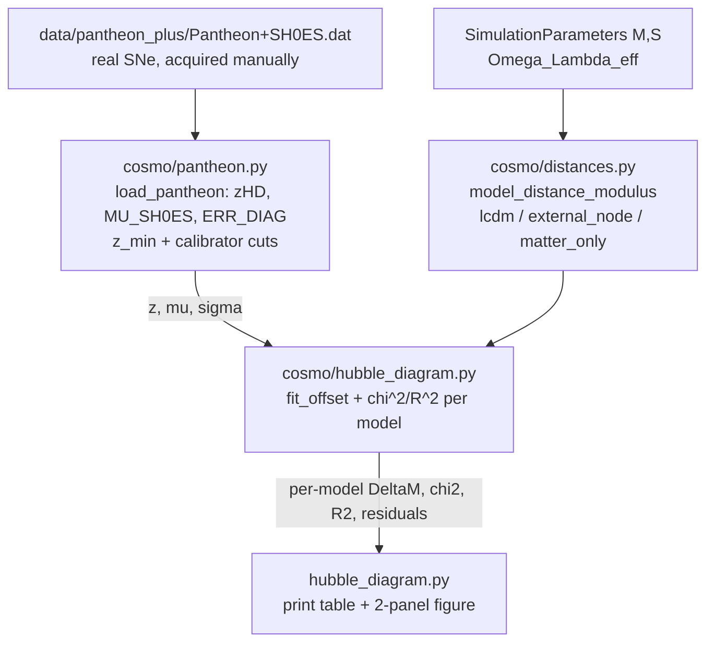

# Hubble-Diagram Test vs Real Pantheon+ Supernovae

Data-anchored background test. Turns each model's H(z) into a distance-modulus
mu(z) Hubble diagram, overlays real Pantheon+SH0ES Type Ia SNe, and reports a
per-model chi^2 / R^2 after marginalizing the magnitude offset.

This is DISTINCT from the N-body model-vs-LCDM-theory R^2 (see
[../numerics/lcdm-baseline.md](../numerics/lcdm-baseline.md) and
[../scripts/parameter-sweep.md](../scripts/parameter-sweep.md)):
- N-body test = how well the External-Node sim tracks the *LCDM theory curve*
  (model vs model).
- Hubble-diagram test = how well each model's H(z) fits *real observed SNe data*
  (model vs data). Fixes the "model only ever traced against another model"
  credibility gap.

The existing N-body simulation path (run_simulation.py, parameter_sweep.py,
cosmo/simulation.py, integrator, particles, factories) is UNTOUCHED and
INDEPENDENT. The Hubble-diagram capability is purely additive and semi-analytic;
it never calls CosmologicalSimulation.run() and does not depend on or modify the
N-body start time (t_start=5.8 Gyr).

## Semi-analytic H(z)

For density parameters (Omega_m, Omega_de), with Omega_k = 1 - Omega_m - Omega_de:

    E(z) = sqrt( Omega_m (1+z)^3 + Omega_k (1+z)^2 + Omega_de )
    H(z) = H0 * E(z)

Three models (all Omega_m = 0.3, H0 = 70 km/s/Mpc):
- `lcdm`          : Omega_de = 0.7                       (flat)
- `external_node` : Omega_de = Omega_Lambda_eff(M,S)    (flat-or-curved)
- `matter_only`   : Omega_de = 0.0, Omega_k = 0.7       (open; sinh branch)

`Omega_Lambda_eff = G*M_ext / (S^3 * H0_si^2)` comes from
`ExternalNodeParameters` (cosmo/constants.py). The paper's claim is that the
External-Node H(a) equals LCDM with Omega_Lambda := Omega_Lambda_eff in the
linear regime, so using Omega_Lambda_eff IS the model's faithful prediction.

### Why semi-analytic, not N-body-derived d_L
1. N-body a(t) only spans t=5.8->13.8 Gyr (z~0 to ~1.2); Pantheon+ reaches
   z~2.3. Semi-analytic covers the full SN range with no extrapolation.
2. Numerical differentiation of RMS-size a(t) has documented edge artifacts
   ([../numerics/expansion-rate-calculation.md](../numerics/expansion-rate-calculation.md));
   feeding that into a distance integral compounds error.
3. The model's whole claim IS equivalence to Lambda in this regime; the existing
   R^2_rate result already validates the N-body tracks this H(a), which licenses
   the semi-analytic background.

N-body-derived d_L is deliberate FUTURE WORK (see [../plans/](../plans/)).

## Distance kernel (curvature-aware)

D_C(z) = (c/H0) integral_0^z dz'/E(z')   (cumulative trapezoid on a fine grid)
D_M(z) = curvature correction of D_C:
  - Omega_k > 0 (open):   (D_H/sqrt(Omega_k))  * sinh(sqrt(Omega_k)  * D_C/D_H)
  - Omega_k = 0 (flat):   D_C
  - Omega_k < 0 (closed): (D_H/sqrt|Omega_k|) * sin (sqrt|Omega_k| * D_C/D_H)
d_L(z) = (1+z) * D_M
mu(z)  = 5*log10(d_L / Mpc) + 25

Closed models (Omega_de large enough that Omega_k < 0) can have E^2 < 0 — a
turnaround — within the data z-range; `hubble_z` raises a descriptive
ValueError, surfaced (not swallowed) by the comparison engine.

## Offset marginalization (fair comparison)

SN distance moduli carry an unknown additive offset DeltaM that absorbs the
absolute magnitude M_B and the H0 calibration. For each model independently,
DeltaM is fit analytically by inverse-variance-weighted least squares:

    w_i = 1/sigma_i^2
    DeltaM = sum(w_i * (mu_obs_i - mu_model_i)) / sum(w_i)

Then chi^2, dof = n-1, reduced chi^2, and R^2 are computed on the
offset-corrected residuals. This marginalizes the M_B/H0 nuisance, so the test
measures only the SHAPE of H(z) (the physics) — honest and standard.

- chi^2 / R^2 are computed on UNBINNED per-SN points. Binning is plot-only.
- R^2 reuses `cosmo.analysis.calculate_r_squared` for metric consistency.

## Data flow

## Module map

| File | Role |
|------|------|
| `cosmo/distances.py` | Pure distance kernel: hubble_z, comoving/transverse/luminosity distance, distance_modulus, model_distance_modulus. No I/O. |
| `cosmo/pantheon.py` | Loader for the vendored Pantheon+SH0ES.dat (by column name); z_min + calibrator cuts; bin_for_plot helper. No network. |
| `cosmo/hubble_diagram.py` | Comparison engine: fit_offset, evaluate_model, compare_all_models. Pure numpy. |
| `hubble_diagram.py` | Standalone top-level script: load -> compare -> print table -> save 2-panel PNG. Independent of run_simulation.py. |

Script reconfigures stdout/stderr to UTF-8 at import so the Greek labels
(Lambda, Omega, chi^2) print on Windows cp1252 consoles.

## Real data provenance

The real `Pantheon+SH0ES.dat` is NOT committed (size). Acquire manually per
[../../data/pantheon_plus/README.md](../../data/pantheon_plus/README.md)
(PantheonPlusSH0ES GitHub release; place at
`data/pantheon_plus/Pantheon+SH0ES.dat`). Loader raises a clear
FileNotFoundError pointing to the README if absent. Tests use a tiny synthetic
fixture (`tests/fixtures/pantheon_synthetic.dat`), never the real file.

Default config when running the script: `--M 855 --S 37.8`
(Omega_Lambda_eff ~= 0.70). The raw SimulationParameters default and the paper's
primary N-body config are closed universes (see open issue below).

## OPEN ISSUE: config that matches data != paper's primary N-body config

Factually recorded, NOT resolved here (physics is the human's call):
- Paper's primary N-body config M=9000, S=38 implies Omega_Lambda_eff ~= 7.24
  -> a strongly CLOSED universe (Omega_k ~= -6.54), which turns around at low z
  and cannot fit Pantheon+ over the full SN range.
- Other paper configs are also closed: M=875,S=24 -> 2.79; M=92,S=15 -> 1.20.
- Matching real SN data needs Omega_Lambda_eff ~= 0.70, achieved near
  M=855, S=37.8 (-> 0.6988).

So the (M,S) that best reproduces the LCDM *expansion history* in the N-body sim
differs from the (M,S) whose semi-analytic H(z) best fits *real SNe*. The two
tests prefer different regions of (M,S) space. Reconciling this — whether the
N-body match metric, the Omega_Lambda_eff normalization, or the paper's primary
config needs revisiting — is unresolved. See
[./theoretical-framework.md](./theoretical-framework.md) and
[../paper-reference.md](../paper-reference.md).

## Related
- [../paper-reference.md](../paper-reference.md)
- [./theoretical-framework.md](./theoretical-framework.md)
- [../numerics/expansion-rate-calculation.md](../numerics/expansion-rate-calculation.md)
- [../architecture/module-structure.md](../architecture/module-structure.md)
