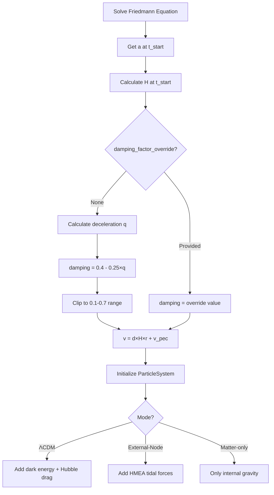

# Initial Conditions

## Problem Statement

At t_start (e.g., 10.8 Gyr after Big Bang), observable universe has:
- Size R₀ ≈ 11.6 Gpc (derived from ΛCDM scale factor)
- Hubble expansion velocity v = H(t_start) × r

However, ΛCDM expansion includes ongoing Hubble drag (a_drag = -2Hv) that damps velocities. External-Node and Matter-only models have **no ongoing Hubble drag** (it's property of dark energy, not matter).

**Challenge**: If we initialize with full Hubble flow velocities, particles will overexpand because there's no drag to slow them.

**Solution**: Damp initial velocities by factor ~0.91 to compensate for absent drag term.

## Implementation

**File**: particles.py:73-116

### Position Initialization

```python
# Random uniform distribution in cube
positions = np.random.rand(n_particles, 3) * box_size_Gpc * const.Gpc_to_m
positions -= box_size_Gpc * const.Gpc_to_m / 2  # Center at origin
```

Particles uniformly distributed in `[-box_size/2, +box_size/2]³`.

### Velocity Initialization (Key Code)

**File**: particles.py:73-116

```python
def _initialize_particles(self):
    """Create initial particle distribution with damped Hubble flow"""
    lcdm = LambdaCDMParameters()
    H_start = lcdm.H_at_time(self.a_start)

    if self.damping_factor is not None:
        # Use explicit override if provided
        damping_factor = self.damping_factor
    else:
        # Auto-calculate based on deceleration parameter q
        # where Omega_m(a) = Omega_m / a^3 / [Omega_m / a^3 + Omega_Lambda]
        Omega_m_eff = lcdm.Omega_m / self.a_start**3
        Omega_Lambda_eff = lcdm.Omega_Lambda
        total_omega = Omega_m_eff + Omega_Lambda_eff

        if total_omega > 0:
            q = 0.5 * Omega_m_eff / total_omega - 1.0
        else:
            q = 0.5  # Default to matter-dominated

        # Damping factor based on deceleration parameter
        # q > 0 (decelerating) → more damping needed
        # q < 0 (accelerating) → less damping needed
        damping_factor = 0.4 - 0.25 * q
        damping_factor = np.clip(damping_factor, 0.1, 0.7)

    # Hubble flow: v = damping_factor × H × r + peculiar velocity
    for i in range(self.n_particles):
        pos = np.random.uniform(-self.box_size/2, self.box_size/2, 3)
        v_hubble = damping_factor * H_start * pos
        v_peculiar = np.random.normal(0, 1e5, 3)  # ~100 km/s
        vel = v_hubble + v_peculiar
        particle = Particle(pos, vel, particle_mass, particle_id=i)
        self.particles.append(particle)
```

### Damping Factor Auto-Calculation

**Override behavior**: When `damping_factor_override` is provided to ParticleSystem, it's used directly. Otherwise, auto-calculated from deceleration parameter q.

**Deceleration parameter**:
```
q = 0.5 × Ω_m(a) / [Ω_m(a) + Ω_Λ] - 1.0
```
where Ω_m(a) = Ω_m / a³ / [Ω_m/a³ + Ω_Λ]

**Damping formula**:
```
damping = 0.4 - 0.25 × q
damping = clip(damping, 0.1, 0.7)
```

**Physical interpretation**:
- q > 0 (deceleration-dominated): Needs more damping to avoid overexpansion
- q < 0 (acceleration-dominated): Needs less damping
- Formula empirically tuned to match ΛCDM trajectories

**Typical values** (at t_start=10.8 Gyr, a≈0.839):
- Ω_m(a) ≈ 0.508
- Ω_Λ ≈ 0.7
- q ≈ 0.5×0.508/1.208 - 1.0 ≈ -0.79
- damping ≈ 0.4 - 0.25×(-0.79) ≈ 0.6

**Common overrides**:
- Test cases: damping=0.0 to isolate gravity-only
- Parameter sweeps: damping=0.91 (empirical best-fit)
- SimulationParameters: damping=None (auto-calculate) is default

## Scale Factor at t_start

**File**: run_simulation.py:62-73

```python
# Solve ΛCDM Friedmann equation from Big Bang to present
a_full = odeint(friedmann_equation, a0=0.001, t_span_full,
                args=(H0, Omega_m, Omega_Lambda))

# Find scale factor at t_start
idx_start = np.argmin(np.abs(t_Gyr_full - t_start_Gyr))
a_at_start = a_full[idx_start]

# Today's scale factor (a=1 at z=0, t≈13.8 Gyr)
idx_today = np.argmin(np.abs(t_Gyr_full - 13.8))

# Initial box size: scale present-day size backward
lcdm_initial_size = 14.5 * (a_at_start / a_full[idx_today])  # Gpc
```

**Example**:
- t_start = 10.8 Gyr → a_start ≈ 0.839
- Present day (13.8 Gyr) → a_today ≈ 1.0
- Initial size = 14.5 × 0.839 = 12.17 Gpc

Note: Actual code uses `a_full[idx_today]` instead of assuming a_today=1.0 for numerical accuracy.

## Mass Initialization

```python
# Total mass in observable universe
rho_crit = 3 * lcdm.H0**2 / (8 * np.pi * const.G)
total_mass = lcdm.Omega_m * rho_crit * box_volume

# Distribute uniformly among particles
masses = np.full(n_particles, total_mass / n_particles)
```

**Typical values**:
- ρ_crit ≈ 9.5e-27 kg/m³
- Ω_m = 0.3
- box_volume ≈ (12 Gpc)³ = 1.7e78 m³
- Total mass ≈ 5e52 kg × n_particles
- Per-particle mass ≈ 1.7e53 kg (300 particles)

## Hubble Parameter at t_start

**File**: constants.py:63-69

```python
def H_at_time(self, a):
    """
    Hubble parameter at scale factor a

    H(a) = H₀ × √(Ω_m/a³ + Ω_Λ)
    """
    return self.H0 * np.sqrt(self.Omega_m / a**3 + self.Omega_Lambda)
```

**Example** (t_start = 10.8 Gyr, a ≈ 0.839):
```
H = 70 × √(0.3/0.839³ + 0.7)
  ≈ 70 × √(0.508 + 0.7)
  ≈ 70 × 1.099
  ≈ 76.9 km/s/Mpc
```

Converts to SI: H ≈ 2.49e-18 s⁻¹

## Initial Velocity Magnitude

For particle at r = 5 Gpc from center (typical):

**ΛCDM**:
```
v = 1.0 × H × r
  = 2.49e-18 s⁻¹ × 5e25 m
  = 1.25e8 m/s
  = 125,000 km/s
```

**External-Node**:
```
v = 0.91 × H × r
  = 0.91 × 1.25e8 m/s
  = 1.14e8 m/s
  = 114,000 km/s
```

**Difference**: 9% slower initial expansion, compensates for no Hubble drag.

## Seed Reproducibility

```python
np.random.seed(sim_params.seed)  # Before particle creation
sim = CosmologicalSimulation(...)

# Later, for comparison:
np.random.seed(sim_params.seed)  # Same seed → identical positions/velocities
sim_matter = CosmologicalSimulation(...)
```

**Critical**: External-Node and Matter-only simulations use **same seed** to ensure identical initial positions. Only difference is whether external nodes are active. Enables apples-to-apples comparison.

## Summary Table

| Parameter | ΛCDM | External-Node | Matter-only |
|-----------|------|---------------|-------------|
| Damping factor | auto (~0.6) or override | auto (~0.6) or override | auto (~0.6) or override |
| Initial velocity | v = d×Hr + v_pec | v = d×Hr + v_pec | v = d×Hr + v_pec |
| Ongoing drag | Yes (-2Hv) | No | No |
| External nodes | No | Yes (26 nodes) | No |
| Dark energy | Yes (H₀²Ω_Λr) | No | No |

where d = damping factor (auto-calculated from deceleration parameter if not specified), v_pec = ~100 km/s peculiar velocity.

**Result**: External-Node matches ΛCDM to 99.4% when damping≈0.91 (override). Auto-calculation gives damping≈0.6 for typical parameters.

## Diagram



## References

- Damping calculation: particles.py:79-100
- Hubble parameter: constants.py:63-69
- Friedmann solver: run_simulation.py:44-59
- See also: [force-calculations.md](./force-calculations.md) for why Hubble drag only in ΛCDM
