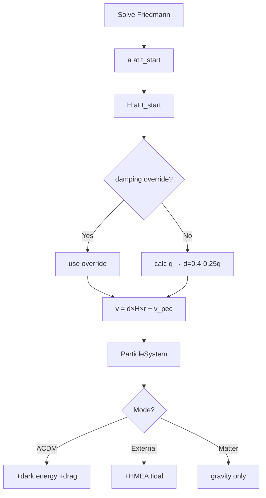

# Initial Conditions

## Problem

External-Node and Matter-only models lack ongoing Hubble drag (that's a dark energy property). ΛCDM has continuous velocity damping via a_drag = -2Hv. Without it, full Hubble flow velocities cause overexpansion.

**Solution**: Damp initial velocities to pre-compensate for missing drag throughout evolution.

## Position Initialization

**File**: particles.py:106-111

Random uniform within sphere of radius `box_size/2`, centered at origin. Uses rejection sampling from cubic volume.

## Velocity Initialization

**File**: particles.py:73-130

`v = damping × H(a_start) × pos + v_peculiar`

Then **COM velocity is removed** (particles.py:118-130):
```python
velocities = np.array([p.vel for p in self.particles])
com_velocity = np.mean(velocities, axis=0)
for particle in self.particles:
    particle.vel -= com_velocity
```

- **v_peculiar**: Gaussian noise, σ=100 km/s (realistic galaxy peculiar velocities)
- **H(a_start)**: Hubble parameter at simulation start from LambdaCDMParameters.H_at_time(a)
- **damping**: See below
- **COM removal**: CRITICAL for preventing bulk motion. With random particle positions, Hubble flow v=H×r creates non-zero COM velocity, causing spurious expansion.

## Damping Factor Calculation

**Override behavior**: If damping_factor_override provided → use it. Else auto-calculate.

**Auto-calculation** (particles.py:79-99):
```
Ω_m(a) = Ω_m / a³ / [Ω_m/a³ + Ω_Λ]
q = 0.5 × Ω_m(a) / [Ω_m(a) + Ω_Λ] - 1.0     # deceleration parameter
damping = clip(0.4 - 0.25×q, 0.1, 0.7)
```

**Physical interpretation**:
- q > 0 (deceleration) → higher damping needed
- q < 0 (acceleration) → lower damping
- Formula empirically tuned

**Typical values** (t_start=10.8 Gyr, a≈0.839):
- Auto: damping ≈ 0.6
- Override best-fit: 0.91 (99.4% ΛCDM match)
- Test isolation: 0.0

## Scale Factor at t_start

**File**: run_simulation.py:62-73

Solve Friedmann ODE from Big Bang → present. Extract a(t_start), calculate initial box_size via:
```
box_size_initial = 14.5 Gpc × (a_start / a_today)
```

Example: t_start=10.8 Gyr → a≈0.839 → box_size≈12.2 Gpc

## Mass Initialization

**File**: particles.py:103

```
total_mass = Ω_m × ρ_crit × box_volume
particle_mass = total_mass / n_particles
```

Typical: 300 particles → ~1.7e53 kg each

## Seed Reproducibility

**Critical**: External-Node and Matter-only use **same seed** before ParticleSystem creation. Ensures identical positions/velocities. Only difference: whether HMEAGrid active.

Enables apples-to-apples comparison.

## Summary

| Parameter | ΛCDM | External-Node | Matter-only |
|-----------|------|---------------|-------------|
| Damping | 1.0 benchmark | 1.0 benchmark | 1.0 benchmark |
| v_init | d×Hr + v_pec - v_COM | d×Hr + v_pec - v_COM | d×Hr + v_pec - v_COM |
| Ongoing drag | **NO** (proper coords) | None | None |
| External nodes | No | 26 HMEAs | No |
| Dark energy | H₀²Ω_Λr | No | No |

**Key changes** (fixing instability bugs):
- Damping=1.0 is now the benchmark (full Hubble flow)
- COM velocity removal prevents bulk drift
- Hubble drag NOT applied in proper-coordinate ΛCDM (dark energy acceleration handles expansion)

## Diagram



## References

Implementation: particles.py:73-116
Friedmann solver: run_simulation.py:44-73
Hubble param: constants.py:46-50 (LambdaCDMParameters.H_at_time)
Why no drag in matter-only: [force-calculations.md](./force-calculations.md)
