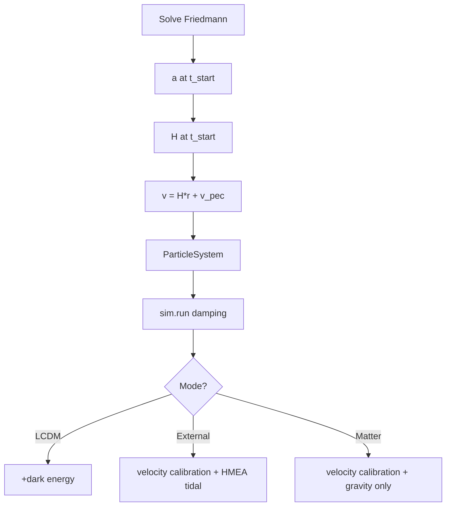

# Initial Conditions

## Problem

N-body gravity provides ~65-80% of Friedmann deceleration. Without correction, matter-only overexpands relative to analytic Friedmann and can exceed LCDM (physically impossible).

**Solution**: Velocity calibration at `sim.run()` scales initial velocities so matter-only/external-node NEVER exceeds LCDM.

## Position Initialization

**File**: particles.py:100-150

Random uniform within sphere of radius `box_size/2`, centered at origin. Uses rejection sampling from cubic volume.

**CRITICAL: RMS Radius Normalization** (particles.py:128-147)

After centering, positions are scaled to ensure **exact** target RMS radius:

```python
# After centering positions
current_rms = np.sqrt(np.mean(np.sum(centered_positions**2, axis=1)))
target_rms = self.box_size_m / 2  # RMS should be half box size
scale_factor = target_rms / current_rms
centered_positions *= scale_factor
```

**Why essential**: Random rejection sampling creates ~0.1-1% RMS variation even with same seed. Without normalization:
- Matter-only starts 1% larger than LCDM -> appears to "exceed LCDM" initially
- This is **initialization artifact**, not physics
- Violates "never exceed LCDM" physics constraint

**Result**: All models start with **identical** initial size. Any deviation is real physics.

## Velocity Initialization

**File**: particles.py:60-75

Each model uses its **own** Hubble parameter for initial velocity:

```python
if self.use_dark_energy:
    H_start = lcdm.H_at_time(self.a_start)      # LCDM: H with Omega_Lambda
else:
    H_start = lcdm.H_matter_only(self.a_start)  # Matter-only: H without Omega_Lambda
```

`v = H(a_start) * pos + v_peculiar`

**Key parameters:**
- **H(a_start)**: Model-appropriate Hubble parameter
  - LCDM: `H_lcdm(a) = H0*sqrt(Omega_m/a^3 + Omega_Lambda)` (includes dark energy)
  - Matter-only: `H_matter(a) = H0*sqrt(Omega_m/a^3)` (no dark energy)
  - At a=0.839: H_lcdm ~ 2.57e-18 /s, H_matter ~ 2.02e-18 /s (21% lower)
- **v_peculiar**: Gaussian noise, sigma=100 km/s (realistic galaxy peculiar velocities)
- **COM removal**: CRITICAL for preventing bulk motion

## Velocity Calibration (Non-LCDM Models)

**File**: simulation.py:91-175

**Damping parameter moved to sim.run(damping=None)**

The damping parameter controls initial velocity scaling and is now passed to `sim.run()` instead of being set during ParticleSystem initialization. This allows:
1. Same particle positions for all runs (deterministic from seed)
2. Velocity scaling applied once at simulation start
3. Auto-calculation based on t_start if damping=None

**Auto-calculation formula** (when damping=None):
```python
nbody_decel_factor = (t_start_Gyr / 13.8) ** 0.135
nbody_decel_factor = clip(nbody_decel_factor, 0.0, 1.0)
```

Later starts (higher t_start) use larger damping factor (closer to 1.0).
Earlier starts need more aggressive scaling to prevent overshoot.

**Velocity scaling calculation**:
```python
# Get expansion ratios from Friedmann equations
lcdm_expansion = a_lcdm_end / a_lcdm_start
matter_expansion = a_matter_end / a_matter_start

overshoot_factor = 1.0 / nbody_decel_factor
velocity_scale = (lcdm_expansion * 1.0) / (matter_expansion * overshoot_factor)
velocities *= velocity_scale
```

**Result**: Matter-only and external-node models NEVER exceed LCDM at any timestep.

## Scale Factor at t_start

**File**: analysis.py:calculate_initial_conditions

Uses `solve_friedmann_at_times` to get exact a_start:
```python
solution = solve_friedmann_at_times(np.array([t_start_Gyr, t_today_Gyr]))
a_start = solution['a'][0]
box_size_Gpc = 14.5 * (a_start / a_today)
```

Example: t_start=3.8 Gyr -> a~0.373 -> box_size~5.28 Gpc

## LCDM Baseline Time Alignment

**Critical**: Both `calculate_initial_conditions` and `solve_lcdm_baseline` must use `solve_friedmann_at_times` to ensure `a_start` matches exactly. Otherwise relative expansion starts at ~0.998 instead of 1.0.

## Mass Initialization

**File**: particles.py:76-97

```
total_mass = Omega_m * rho_crit * box_volume
particle_mass = total_mass / n_particles
```

With mass_randomize > 0: masses randomized in [mean-half_range, mean+half_range], then normalized to preserve total mass.

## Summary

| Parameter | LCDM | External-Node | Matter-only |
|-----------|------|---------------|-------------|
| Initial H | H0*sqrt(Omega_m/a^3 + Omega_Lambda) | H0*sqrt(Omega_m/a^3) | H0*sqrt(Omega_m/a^3) |
| Velocity calibration | No | Yes (at run()) | Yes (at run()) |
| v_init | H_lcdm*r | calibrated | calibrated |
| External nodes | No | 26 HMEAs | No |
| Dark energy | H0^2*Omega_Lambda*r | No | No |

## Diagram



## N-body vs Friedmann Deceleration Deficit

**Root cause**: N-body uses discrete particles with softening; Friedmann assumes smooth fluid.

| Metric | N-body | Friedmann | Ratio |
|--------|--------|-----------|-------|
| Deceleration | GM/R^2 | 0.5*H^2*R | ~65-80% |
| Cumulative effect | Overshoot | Match | ~1.5x over 13 Gyr |

**Consequence**: Non-LCDM N-body without velocity calibration overshoots LCDM by 10-25%.

**Current approach**: One-time velocity scaling at sim.run() based on predicted final expansion. Damping factor auto-calculated from t_start or passed explicitly.

## Tests

**File**: tests/test_early_time_behavior.py
- test_matter_only_never_exceeds_lcdm: Verifies relative <= 1.0 at all timesteps
- test_initial_size_exact_match: Verifies identical starting size
- test_models_use_appropriate_hubble: Verifies H_lcdm vs H_matter

## References

- Implementation: particles.py (velocities), simulation.py (calibration at run())
- Friedmann solver: analysis.py:solve_friedmann_at_times
- Hubble param: constants.py:LambdaCDMParameters.H_at_time, H_matter_only
