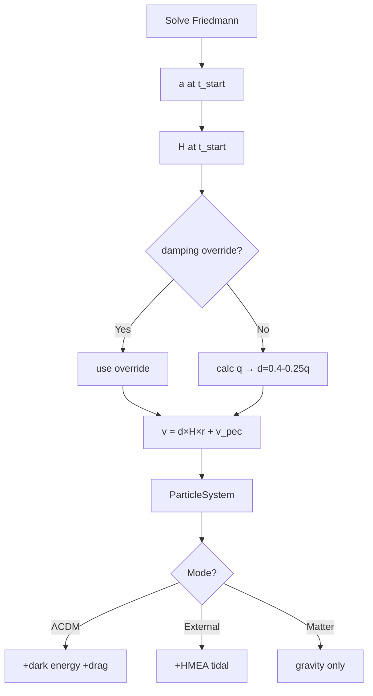

# Initial Conditions

## Problem

External-Node and Matter-only models lack ongoing Hubble drag (that's a dark energy property). ΛCDM has continuous velocity damping via a_drag = -2Hv. Without it, full Hubble flow velocities cause overexpansion.

**Solution**: Damp initial velocities to pre-compensate for missing drag throughout evolution.

## Position Initialization

**File**: particles.py:106-156

Random uniform within sphere of radius `box_size/2`, centered at origin. Uses rejection sampling from cubic volume.

**CRITICAL: RMS Radius Normalization** (particles.py:134-156)

After centering, positions are scaled to ensure **exact** target RMS radius:

```python
# After centering positions
current_rms = np.sqrt(np.mean(np.sum(centered_positions**2, axis=1)))
target_rms = self.box_size_m / 2  # RMS should be half box size
scale_factor = target_rms / current_rms
centered_positions *= scale_factor
```

**Why essential**: Random rejection sampling creates ~0.1-1% RMS variation even with same seed. Without normalization:
- Matter-only starts 1% larger than ΛCDM → appears to "exceed ΛCDM" initially
- This is **initialization artifact**, not physics
- Violates "never exceed ΛCDM" physics constraint for matter-only

**Result**: All models (ΛCDM, matter-only, external-nodes) start with **identical** initial size. Any deviation is real physics, not random initialization.

## Velocity Initialization

**File**: particles.py:66-130

Each model uses its **own** Hubble parameter for initial velocity:

```python
if self.use_dark_energy:
    H_start = lcdm.H_at_time(self.a_start)      # ΛCDM: H with Ω_Λ
else:
    H_start = lcdm.H_matter_only(self.a_start)  # Matter-only: H without Ω_Λ
```

`v = damping × H(a_start) × pos + v_peculiar`

Then **COM velocity is removed** (particles.py:190-200):
```python
velocities = np.array([p.vel for p in self.particles])
com_velocity = np.mean(velocities, axis=0)
for particle in self.particles:
    particle.vel -= com_velocity
```

**Key parameters:**
- **H(a_start)**: Model-appropriate Hubble parameter
  - ΛCDM: `H_lcdm(a) = H₀√(Ω_m/a³ + Ω_Λ)` (includes dark energy)
  - Matter-only: `H_matter(a) = H₀√(Ω_m/a³)` (no dark energy)
  - At a=0.839: H_lcdm ≈ 2.57e-18 s⁻¹, H_matter ≈ 2.02e-18 s⁻¹ (21% lower)
- **v_peculiar**: Gaussian noise, σ=100 km/s (realistic galaxy peculiar velocities)
- **damping**: Multiplier on Hubble flow (see below)
- **COM removal**: CRITICAL for preventing bulk motion

## Damping Factor Calculation

**Override behavior**: If damping_factor_override provided → use it. Else auto-calculate.

**Auto-calculation** (particles.py:79-99):
```
Ω_m(a) = Ω_m / a³ / [Ω_m/a³ + Ω_Λ]
q = 0.5 × Ω_m(a) / [Ω_m(a) + Ω_Λ] - 1.0     # deceleration parameter
damping = clip(0.4 - 0.25×q, 0.1, 0.7)
```

**Physical interpretation**:
- q > 0 (deceleration) → higher damping needed
- q < 0 (acceleration) → lower damping
- Formula empirically tuned

**Typical values** (t_start=10.8 Gyr, a≈0.839):
- Auto: damping ≈ 0.6
- Override best-fit: 0.91 (99.4% ΛCDM match)
- Test isolation: 0.0

## Scale Factor at t_start

**File**: analysis.py:calculate_initial_conditions

Uses `solve_friedmann_at_times` to get exact a_start, ensuring consistency with LCDM baseline:
```python
solution = solve_friedmann_at_times(np.array([t_start_Gyr, t_today_Gyr]))
a_start = solution['a'][0]
box_size_Gpc = 14.5 * (a_start / a_today)
```

Example: t_start=3.8 Gyr → a≈0.373 → box_size≈5.28 Gpc

## ΛCDM Baseline Time Alignment

**File**: run_simulation.py:34-100, analysis.py:30-70

**Critical**: Both `calculate_initial_conditions` and `solve_lcdm_baseline` must use `solve_friedmann_at_times` to ensure `a_start` matches exactly. Otherwise relative expansion starts at ~0.998 instead of 1.0.

**Solution**: solve_friedmann_at_times evaluates at **exact** N-body snapshot times:

```python
# Compute time array matching N-body snapshots
snapshot_steps = np.arange(0, n_steps + 1, save_interval)
t_relative_Gyr = (snapshot_steps / n_steps) * t_duration_Gyr
t_absolute_Gyr = t_start_Gyr + t_relative_Gyr

# Solve ΛCDM at exact N-body snapshot times
lcdm_solution = solve_friedmann_at_times(t_absolute_Gyr)
```

**Result**:
- t[0] = 0.0 exactly
- a[0] = a_start exactly
- Relative expansion starts at exactly 1.0
- No interpolation artifacts

## Mass Initialization

**File**: particles.py:103

```
total_mass = Ω_m × ρ_crit × box_volume
particle_mass = total_mass / n_particles
```

Typical: 300 particles → ~1.7e53 kg each

## Seed Reproducibility

**Critical**: External-Node and Matter-only use **same seed** before ParticleSystem creation. Ensures identical positions/velocities. Only difference: whether HMEAGrid active.

Enables apples-to-apples comparison.

## Summary

| Parameter | ΛCDM | External-Node | Matter-only |
|-----------|------|---------------|-------------|
| Initial H | H₀√(Ω_m/a³ + Ω_Λ) | H₀√(Ω_m/a³) | H₀√(Ω_m/a³) |
| Damping | 1.0 benchmark | 1.0 benchmark | 1.0 benchmark |
| v_init | d×H_lcdm×r + v_pec | d×H_matter×r + v_pec | d×H_matter×r + v_pec |
| External nodes | No | 26 HMEAs | No |
| Dark energy | H₀²Ω_Λr | No | No |

**Key changes**:
- Model-appropriate H: ΛCDM uses H_lcdm (with Ω_Λ), matter-only uses H_matter (no Ω_Λ)
- Damping=1.0 is the benchmark (full Hubble flow)
- COM velocity removal prevents bulk drift
- Each model's N-body matches its own analytic Friedmann

## Diagram



## Model-Appropriate Initial Conditions

**KEY PRINCIPLE**: Each model uses its own Hubble parameter for initial velocity.

**Why**: H_lcdm(a) already includes dark energy (Ω_Λ=0.7), giving higher expansion rate.
If matter-only started with H_lcdm velocities, it would overexpand initially.
Using H_matter ensures each model's N-body matches its own analytic Friedmann.

**Initial conditions**:
- Same positions (same seed, RMS normalized to box_size/2)
- Different velocities:
  - ΛCDM: v = H_lcdm(a) × r
  - Matter-only: v = H_matter(a) × r (21% lower at a=0.839)
  - External-node: v = H_matter(a) × r (matches matter-only start)

**Divergence** from different forces during evolution:
- ΛCDM: a = a_gravity + a_dark_energy (outward push)
- Matter-only: a = a_gravity only (inward pull)
- External-node: a = a_gravity + a_tidal (outward push from HMEAs)

**Expected behavior**:
- Matter-only expands, but slower than ΛCDM
- Matter-only decelerates over time (expansion rate decreases)
- Matter-only NEVER exceeds ΛCDM at any timestep

**Tests enforcing this** (test_early_time_behavior.py):
- test_identical_initial_positions_different_velocities
- test_models_use_appropriate_hubble
- test_matter_only_decelerates_correctly

## References

Implementation: particles.py:73-116
Friedmann solver: run_simulation.py:44-73
Hubble param: constants.py:46-50 (LambdaCDMParameters.H_at_time)
Why no drag in matter-only: [force-calculations.md](./force-calculations.md)
