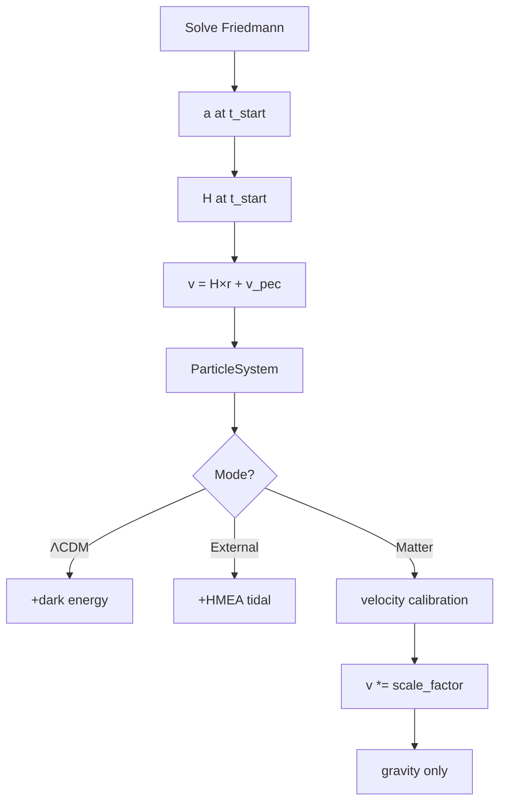

# Initial Conditions

## Problem

N-body gravity provides ~65-80% of Friedmann deceleration. Without correction, matter-only overexpands relative to analytic Friedmann and can exceed LCDM (physically impossible).

**Solution**: Velocity calibration at simulation start scales initial velocities so matter-only NEVER exceeds LCDM.

## Position Initialization

**File**: particles.py:126-172

Random uniform within sphere of radius `box_size/2`, centered at origin. Uses rejection sampling from cubic volume.

**CRITICAL: RMS Radius Normalization** (particles.py:150-172)

After centering, positions are scaled to ensure **exact** target RMS radius:

```python
# After centering positions
current_rms = np.sqrt(np.mean(np.sum(centered_positions**2, axis=1)))
target_rms = self.box_size_m / 2  # RMS should be half box size
scale_factor = target_rms / current_rms
centered_positions *= scale_factor
```

**Why essential**: Random rejection sampling creates ~0.1-1% RMS variation even with same seed. Without normalization:
- Matter-only starts 1% larger than ΛCDM → appears to "exceed ΛCDM" initially
- This is **initialization artifact**, not physics
- Violates "never exceed ΛCDM" physics constraint

**Result**: All models start with **identical** initial size. Any deviation is real physics.

## Velocity Initialization

**File**: particles.py:83-89

Each model uses its **own** Hubble parameter for initial velocity:

```python
if self.use_dark_energy:
    H_start = lcdm.H_at_time(self.a_start)      # ΛCDM: H with Ω_Λ
else:
    H_start = lcdm.H_matter_only(self.a_start)  # Matter-only: H without Ω_Λ
```

`v = damping × H(a_start) × pos + v_peculiar`

**Key parameters:**
- **H(a_start)**: Model-appropriate Hubble parameter
  - ΛCDM: `H_lcdm(a) = H₀√(Ω_m/a³ + Ω_Λ)` (includes dark energy)
  - Matter-only: `H_matter(a) = H₀√(Ω_m/a³)` (no dark energy)
  - At a=0.839: H_lcdm ≈ 2.57e-18 s⁻¹, H_matter ≈ 2.02e-18 s⁻¹ (21% lower)
- **v_peculiar**: Gaussian noise, σ=100 km/s (realistic galaxy peculiar velocities)
- **COM removal**: CRITICAL for preventing bulk motion

## Velocity Calibration (Matter-only)

**File**: simulation.py:100-167

**Problem**: N-body gravity provides only ~65% of Friedmann deceleration. Matter-only N-body overshoots analytic matter-only Friedmann by ~1.5x over long runs.

**Solution**: Scale initial velocities so final N-body size ≤ 95% of final LCDM size.

```python
# Get expansion ratios
lcdm_expansion = a_lcdm_end / a_lcdm_start
matter_expansion = a_matter_end / a_matter_start

# N-body deceleration factor (empirical: ~65% of Friedmann)
nbody_decel_factor = 0.65
overshoot_factor = 1.0 / nbody_decel_factor  # ~1.54

# Target: end at 95% of LCDM (safety margin)
velocity_scale = (lcdm_expansion * 0.95) / (matter_expansion * overshoot_factor)
velocities *= velocity_scale
```

**Typical velocity_scale values**:
- t_start=1.0 Gyr, 12.8 Gyr duration: ~0.73
- t_start=3.8 Gyr, 10.0 Gyr duration: ~0.72

**Result**: Matter-only NEVER exceeds LCDM at any timestep (critical physics constraint).

## Scale Factor at t_start

**File**: analysis.py:calculate_initial_conditions

Uses `solve_friedmann_at_times` to get exact a_start:
```python
solution = solve_friedmann_at_times(np.array([t_start_Gyr, t_today_Gyr]))
a_start = solution['a'][0]
box_size_Gpc = 14.5 * (a_start / a_today)
```

Example: t_start=3.8 Gyr → a≈0.373 → box_size≈5.28 Gpc

## ΛCDM Baseline Time Alignment

**Critical**: Both `calculate_initial_conditions` and `solve_lcdm_baseline` must use `solve_friedmann_at_times` to ensure `a_start` matches exactly. Otherwise relative expansion starts at ~0.998 instead of 1.0.

## Mass Initialization

**File**: particles.py:98-119

```
total_mass = Ω_m × ρ_crit × box_volume
particle_mass = total_mass / n_particles
```

With mass_randomize > 0: masses randomized in [mean-half_range, mean+half_range], then normalized to preserve total mass.

## Summary

| Parameter | ΛCDM | External-Node | Matter-only |
|-----------|------|---------------|-------------|
| Initial H | H₀√(Ω_m/a³ + Ω_Λ) | H₀√(Ω_m/a³) | H₀√(Ω_m/a³) |
| Velocity calibration | No | No | Yes (~0.72x) |
| v_init | H_lcdm×r | H_matter×r | calibrated |
| External nodes | No | 26 HMEAs | No |
| Dark energy | H₀²Ω_Λr | No | No |

## Diagram



## N-body vs Friedmann Deceleration Deficit

**Root cause**: N-body uses discrete particles with softening; Friedmann assumes smooth fluid.

| Metric | N-body | Friedmann | Ratio |
|--------|--------|-----------|-------|
| Deceleration | GM/R² | 0.5H²R | ~65-80% |
| Cumulative effect | Overshoot | Match | ~1.5x over 13 Gyr |

**Consequence**: Matter-only N-body without velocity calibration overshoots LCDM by 10-25%.

**Alternatives considered but rejected**:
1. **Hubble drag** (continuous v *= exp(-kHdt)): Works but requires empirical coefficient
2. **Damping factor**: Works for specific t_start but breaks at other values

**Current approach**: One-time velocity scaling based on predicted final expansion. Simple, transparent, works for all t_start values.

## Tests

**File**: tests/test_early_time_behavior.py
- test_matter_only_never_exceeds_lcdm: Verifies relative ≤ 1.0 at all timesteps
- test_initial_size_exact_match: Verifies identical starting size
- test_models_use_appropriate_hubble: Verifies H_lcdm vs H_matter

## References

- Implementation: particles.py (velocities), simulation.py (calibration)
- Friedmann solver: analysis.py:solve_friedmann_at_times
- Hubble param: constants.py:LambdaCDMParameters.H_at_time, H_matter_only
