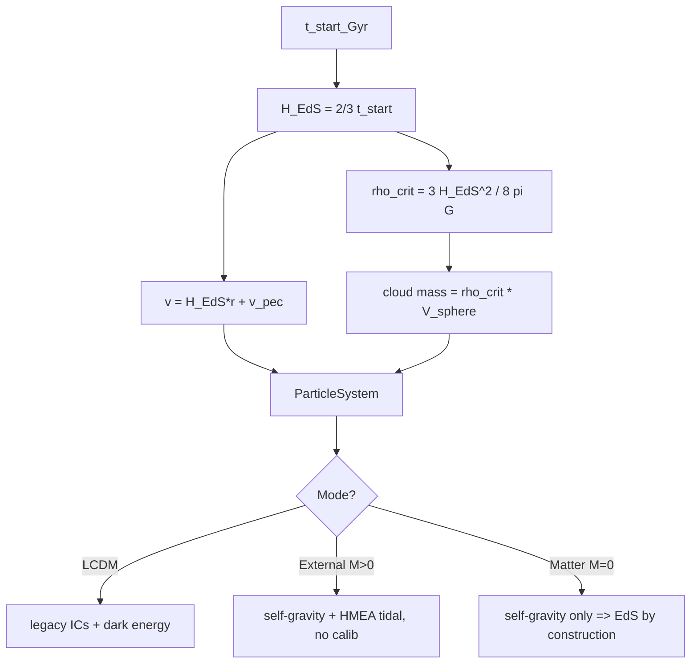

# Initial Conditions

## THE invariant: M_ext=0 == Einstein-de Sitter (self-consistent ICs)

The particle cloud is a Newtonian comoving patch of a homogeneous universe. With
NO external tidal forces (M_ext=0) it MUST reproduce the analytic matter-only
Einstein-de Sitter (EdS, Omega_m=1) expansion. This is the prerequisite for
trusting every downstream number: if M_ext=0 != EdS the expansion is coming from
tuned ICs, not physics.

This holds BY CONSTRUCTION (standard Newtonian cosmology) iff velocity and density
are mutually consistent:
- (i) Hubble flow `v_i = H_EdS(t_start) * r_i`, with `H_EdS = 2/(3 t_start)`
  (EdS a(t) ∝ t^(2/3) ⇒ H = 2/3t). NOTE this uses absolute age t, NOT the
  Omega_m=0.3 `H_matter_only(a)`.
- (ii) cloud total mass = EdS critical mass `rho_crit * V_sphere`, with
  `rho_crit = 3 H_EdS^2 / (8 pi G)` (Omega_m=1). Internal self-gravity then
  supplies the exact EdS deceleration.

Enabled by `SimulationParameters.eds_consistent` (default **True**) whenever dark
energy is OFF (matter-only AND external-node). `CosmologicalSimulation` forwards
`eds_consistent and not use_dark_energy` plus `t_start_Gyr` to `ParticleSystem`.

**Validated**: M_ext=0 reproduces EdS to ~0.2-0.3% in total growth and ~0.02 mag
RMS in mu(z) (residual = N-body discreteness: finite N, softening, peculiar-vel
noise, leapfrog dt). The mu(z) sits ON the EdS null and is ~10x FARTHER from LCDM
— the physically correct ordering. Invariant is t_start-INDEPENDENT (holds at
t_start=2.0 Gyr too). Test: `tests/test_matter_only_consistency.py`.

## Legacy velocity-calibration fudge (now superseded, still selectable)

Earlier code set `v = H_matter_only(a)*r` (Omega_m=0.3) with a tiny cloud mass
(1 x M_obs ≈ 8.6x BELOW EdS critical), so self-gravity barely decelerated and the
cloud nearly free-expanded at ~LCDM rate. To hide this, `_calibrate_velocity_for_
lcdm_match` SCALED the initial velocities at `sim.run()` so matter-only/external
"never exceeds LCDM". That made M_ext=0 track LCDM, NOT EdS — the core bug.

With `eds_consistent=True` (default) the calibration is SKIPPED (printed: "EdS-
consistent ICs ... no calibration"). `_calibrate_velocity_for_lcdm_match` still
exists and runs only if `eds_consistent=False` OR an explicit `damping` override
is passed to `run()`. The auto-damping formula `(t_start/13.8)^0.135` lives there.

## Selectable init_distribution

`SimulationParameters.init_distribution` (default `"uniform_sphere"`) selects the position sampler.
An optional `init_kwargs` dict passes sampler-specific knobs (e.g. `Ng` for `"grf"`).

Sampler | Description
--------|------------
`"uniform_sphere"` | Rejection-sampling uniform sphere (default, backward-compatible)
`"grf"` | Gaussian random field + Zel'dovich displacement; BBKS LCDM P(k); deterministic via seed

The sampler selection is threaded through `SimulationParameters` → `CosmologicalSimulation.__init__`
→ `ParticleSystem.__init__` → `_initialize_particles`. The shared COM-centering and RMS-normalisation
post-processing block is unchanged and applies to BOTH modes.

GRF recipe (`cosmo/initial_distributions.py`):
1. Gaussian white noise on Ng³ grid → FFT → multiply by `sqrt(P(k))` (BBKS transfer function).
2. Inverse-FFT → density contrast δ(x); Zel'dovich displacement Psi = -∇∇⁻²δ in k-space.
3. Displace regular Lagrangian grid; subsample to N particles; clip to box.
4. Hand raw positions to shared centering + RMS-norm (identical to uniform_sphere path).

CLI: `--init-distribution {uniform_sphere,grf}` (forwarded via `args_to_sim_params`).

## Position Initialization (uniform_sphere detail)

**File**: particles.py (method `_init_uniform_sphere`)

Random uniform within sphere of radius `box_size/2`, centered at origin. Uses rejection sampling from cubic volume.

**CRITICAL: RMS Radius Normalization** (particles.py:128-147)

After centering, positions are scaled to ensure **exact** target RMS radius:

```python
# After centering positions
current_rms = np.sqrt(np.mean(np.sum(centered_positions**2, axis=1)))
target_rms = self.box_size_m / 2  # RMS should be half box size
scale_factor = target_rms / current_rms
centered_positions *= scale_factor
```

**Why essential**: Random rejection sampling creates ~0.1-1% RMS variation even with same seed. Without normalization:
- Matter-only starts 1% larger than LCDM -> appears to "exceed LCDM" initially
- This is **initialization artifact**, not physics
- Violates "never exceed LCDM" physics constraint

**Result**: All models start with **identical** initial size. Any deviation is real physics.

## Velocity Initialization

**File**: particles.py (`_initialize_particles`)

Three branches; the EdS branch is the default for no-dark-energy runs:

```python
if self.eds_consistent:                       # default for use_dark_energy=False
    H_start = lcdm.H_eds_at_time(self.t_start_Gyr)   # 2/(3 t_start), Omega_m=1
elif self.use_dark_energy:
    H_start = lcdm.H_at_time(self.a_start)            # LCDM: H with Omega_Lambda
else:                                                  # legacy non-EdS matter-only
    H_start = lcdm.H_matter_only(self.a_start)        # H0*sqrt(0.3/a^3)
```

`v = H_start * pos + v_peculiar`, then COM-velocity removed.

**Key points:**
- **EdS H** (`constants.py:LambdaCDMParameters.H_eds_at_time`): `2/(3 t_start)` in
  s^-1. The only rate mutually consistent with the EdS critical density below.
- **v_peculiar**: Gaussian sigma=100 km/s (~negligible vs H*r ~ 5e5 km/s at edge).
- **COM removal**: CRITICAL for preventing bulk motion.
- `t_start_Gyr <= 0` (e.g. Big-Bang t=0 size-semantics tests) has no finite H_EdS,
  so `eds_consistent` silently falls back to the legacy path there.

## Scale Factor at t_start

**File**: analysis.py:calculate_initial_conditions

Uses `solve_friedmann_at_times` to get exact a_start:
```python
solution = solve_friedmann_at_times(np.array([t_start_Gyr, t_today_Gyr]))
a_start = solution['a'][0]
box_size_Gpc = 14.5 * (a_start / a_today)
```

Example: t_start=3.8 Gyr -> a~0.373 -> box_size~5.28 Gpc

## LCDM Baseline Time Alignment

**Critical**: Both `calculate_initial_conditions` and `solve_lcdm_baseline` must use `solve_friedmann_at_times` to ensure `a_start` matches exactly. Otherwise relative expansion starts at ~0.998 instead of 1.0.

## Mass Initialization

**File**: particles.py (`ParticleSystem.__init__` + `_initialize_particles`)

**EdS-consistent mode (default, dark energy OFF)**: `total_mass_kg` passed in
(from `center_node_mass_kg`) is OVERRIDDEN with the EdS critical mass:
```
H_eds    = 2/(3 t_start)
rho_crit = 3 H_eds^2 / (8 pi G)          # Omega_m=1
r_sphere = (box_size/2) / sqrt(3/5)      # RMS = R*sqrt(3/5) for a uniform ball
total_mass_kg = rho_crit * (4/3) pi r_sphere^3
```
For t_start=2.9 Gyr (box ≈ 4.39 Gpc, RMS ≈ 2.19 Gpc) this is ≈ 8.65e53 kg
(≈ 8.6 x M_obs) — vs the legacy 1e53 kg, the ~8.6x deficit that broke M=0==EdS.

**Legacy mode** (`eds_consistent=False` or LCDM): `total_mass_kg` used as-is.

`particle_mass = total_mass_kg / n_particles`. With mass_randomize > 0: masses
randomized in [mean-half_range, mean+half_range], normalized to preserve total.
Softening scales as mean_particle_mass^(1/3) (integrator.py), so it adapts to the
larger EdS mass automatically.

## Summary

Default modes (`eds_consistent=True` for dark-energy-off runs):

| Parameter | LCDM | External-Node (M>0) | Matter-only (M=0) |
|-----------|------|---------------------|-------------------|
| Initial H | H0*sqrt(Omega_m/a^3 + Omega_Lambda) | H_EdS = 2/(3 t_start) | H_EdS = 2/(3 t_start) |
| Cloud mass | center_node_mass (as-is) | EdS critical mass | EdS critical mass |
| Velocity calibration | No | No (skipped) | No (skipped) |
| v_init | H_lcdm*r | H_EdS*r | H_EdS*r |
| External nodes | No | 26 HMEAs | No |
| Dark energy | H0^2*Omega_Lambda*r | No | No |
| Expansion target | LCDM Friedmann | EdS + tidal push | **EdS (by construction)** |

## Mechanism direction (honest, post-fix)

With self-consistent ICs and no calibration, increasing M_ext / shrinking S
pushes a(t) AWAY from EdS toward LCDM and beyond. Measured (N=300, t_start=2.9,
EdS growth 2.829, LCDM growth 3.304; mu RMS offset-removed):

| M_ext | S Gpc | OL_eff | growth | RMS vs EdS | RMS vs LCDM |
|-------|-------|--------|--------|------------|-------------|
| 0     | -     | 0      | 2.836  | 0.019      | 0.180       |
| 855   | 37.8  | 0.70   | 2.839  | 0.022      | 0.177       |
| 3000  | 30    | 4.9    | 2.967  | 0.184      | 0.066       |
| 9000  | 25    | 25.4   | 742    | (runaway — growth-anchor rejects) |

KEY HONEST FINDING: at the paper's nominal config (M=855, S=37.8, OL_eff=0.70)
the symmetric 26-node tidal field is TOO WEAK to mimic Lambda — it stays on EdS.
Single-node linear tidal accel is ~27% of self-gravity there, but the 3x3x3
lattice nearly cancels it at cloud scale. The old "LCDM-like fit at M=855" was an
artifact of the velocity-calibration fudge, NOT the tidal mechanism. You must
push to OL_eff ~ 5 (M=3000, S=30) before a(t) visibly bends toward LCDM. See
[pantheon-comparison-results.md](./pantheon-comparison-results.md).

## Diagram


```mermaid
graph TD
    A[t_start_Gyr] --> C[H_EdS = 2/3 t_start]
    C --> RHO[rho_crit = 3 H_EdS^2 / 8 pi G]
    RHO --> M[cloud mass = rho_crit * V_sphere]
    C --> D[v = H_EdS*r + v_pec]
    D --> E[ParticleSystem]
    M --> E
    E --> F{Mode?}
    F -->|LCDM| H[legacy ICs + dark energy]
    F -->|External M>0| I[self-gravity + HMEA tidal, no calib]
    F -->|Matter M=0| J[self-gravity only => EdS by construction]
```

## N-body vs Friedmann Deceleration Deficit

**Root cause**: N-body uses discrete particles with softening; Friedmann assumes smooth fluid.

| Metric | N-body | Friedmann | Ratio |
|--------|--------|-----------|-------|
| Deceleration | GM/R^2 | 0.5*H^2*R | ~65-80% |

NOTE: with self-consistent EdS ICs the residual matter-only deviation from EdS is
~0.2-0.3% (not 10-25%) — the deficit the legacy calibration was compensating for
was dominated by the 8.6x mass shortfall, not an intrinsic N-body/Friedmann gap.
Carrying the true critical mass removes nearly all of it.

## Validated t_start Range (Stage 2)

The auto-damping formula and physics constraints were validated via sweep
across t_start ∈ {5.8, 4.8, 3.8, 3.3, 2.9} Gyr with n_steps=ceil(duration/0.04):

| t_start | a_start | damping | max_excess% | runaway ok |
|---------|---------|---------|-------------|-----------|
| 5.8 Gyr | 0.503   | 0.890   | 0.000       | yes       |
| 4.8 Gyr | 0.439   | 0.867   | 0.000       | yes       |
| 3.8 Gyr | 0.373   | 0.840   | 0.000       | yes       |
| 3.3 Gyr | 0.339   | 0.824   | 0.000       | yes       |
| 2.9 Gyr | 0.310   | 0.810   | 0.000       | yes       |

The 2.9 Gyr floor was a CONSTRAINT OF THE LEGACY CALIBRATION (earlier starts
overshot before the velocity scaling could rein them in). With self-consistent
EdS ICs that constraint is GONE: M=0==EdS holds at t_start=2.0 Gyr to <3% (no
damping, no calibration), so t_start can be lowered freely subject only to the
leapfrog dt<0.05 Gyr stability limit (`n_steps = ceil((13.8-t_start)/0.04)`). The
old auto-damping table above only applies in legacy (`eds_consistent=False`) mode.

## Tests

**File**: tests/test_matter_only_consistency.py (THE invariant)
- test_matter_only_growth_matches_eds: M=0 growth == EdS (t_today/t_start)^(2/3) <2%
- test_matter_only_mu_matches_eds_not_lcdm: mu(z) RMS <0.05 vs EdS, and >2x closer
  to EdS than LCDM (guards the inverted-ordering bug)
- test_eds_invariant_holds_at_lower_t_start: invariant holds at t_start=2.0 Gyr

**File**: tests/test_early_time_behavior.py (legacy-path, constructs ParticleSystem
directly so eds_consistent defaults False)
- test_matter_only_never_exceeds_lcdm / test_initial_size_exact_match / etc.

**File**: tests/test_early_start_validation.py — Stage-2 legacy auto-damping checks.

## References

- Implementation: particles.py (EdS ICs in __init__ + velocities),
  simulation.py (eds_consistent wiring + calibration skip)
- EdS helpers: constants.py:LambdaCDMParameters.H_eds_at_time / eds_critical_density
- Flag: constants.py:SimulationParameters.eds_consistent (default True)
- Friedmann solver: analysis.py:solve_friedmann_at_times
- EdS null curve: distances.py:model_distance_modulus(z, "einstein_de_sitter")
