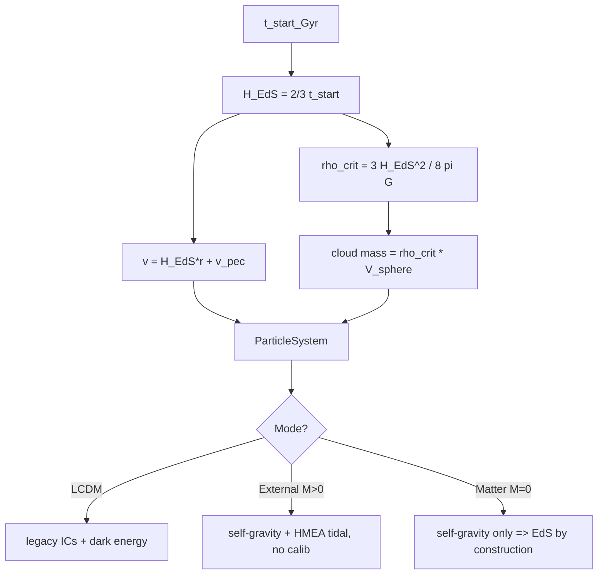

# Initial Conditions

## THE invariant: M_ext=0 == Einstein-de Sitter (self-consistent ICs)

The particle cloud is a Newtonian comoving patch of a homogeneous universe. With
NO external tidal forces (M_ext=0) it MUST reproduce the analytic matter-only
Einstein-de Sitter (EdS, Omega_m=1) expansion. This is the prerequisite for
trusting every downstream number: if M_ext=0 != EdS the expansion is coming from
tuned ICs, not physics.

This holds BY CONSTRUCTION (standard Newtonian cosmology) iff velocity and density
are mutually consistent:
- (i) Hubble flow `v_i = H_EdS(t_start) * r_i`, with `H_EdS = 2/(3 t_start)`
  (EdS a(t) ∝ t^(2/3) ⇒ H = 2/3t). NOTE this uses absolute age t, NOT the
  Omega_m=0.3 `H_matter_only(a)`.
- (ii) cloud total mass = EdS critical mass `rho_crit * V_sphere`, with
  `rho_crit = 3 H_EdS^2 / (8 pi G)` (Omega_m=1). Internal self-gravity then
  supplies the exact EdS deceleration.

Enabled by `SimulationParameters.eds_consistent` (default **True**) whenever dark
energy is OFF (matter-only AND external-node). `CosmologicalSimulation` forwards
`eds_consistent and not use_dark_energy` plus `t_start_Gyr` to `ParticleSystem`.

**Validated**: M_ext=0 reproduces EdS to ~0.2-0.3% in total growth and ~0.02 mag
RMS in mu(z) (residual = N-body discreteness: finite N, softening, peculiar-vel
noise, leapfrog dt). The mu(z) sits ON the EdS null and is ~10x FARTHER from LCDM
— the physically correct ordering. Invariant is t_start-INDEPENDENT (holds at
t_start=2.0 Gyr too). Test: `tests/test_matter_only_consistency.py`.

## start_size_scale — a falsifiable initial-size / density lever

`start_size_scale` (SimulationParameters/SweepConfig/CLI, default **1.0**)
multiplies the LCDM-implied INITIAL cloud size in `CosmologicalSimulation.__init__`
(`box_size_Gpc *= start_size_scale`) BEFORE particles are built. It is a REAL
physical lever on the a(t) SHAPE, NOT a normalization offset:

- **Why it's NOT a no-op offset:** a(t) is computed as an RMS RATIO
  (rms(t)/rms(0)) and the mu(z) pipeline divides out absolute size, so a UNIFORM
  rescale of the whole cloud would cancel — IF nothing else broke scale invariance.
- **M=0 == EdS at ANY size:** under `eds_consistent` the cloud mass = EdS-critical
  density × V(box), so scaling the box scales the mass with VOLUME ⇒ the DENSITY
  stays critical ⇒ at M_ext=0 the dynamics are identical EdS for any size. (PF1
  holds; validated to <3% growth at scale ∈ {0.5,1.0,2.0}, byte-identical at 1.0.)
- **The falsifiable effect is at M_ext>0:** the HMEA nodes keep their UNSCALED
  spacing S (and softening is frozen), so a bigger/smaller cloud spans a DIFFERENT
  fraction of S ⇒ a different differential tidal shear across it ⇒ the a(t) SHAPE
  moves (not just an offset). In one test cell the total growth a[-1]/a[0] tracks
  ~3.07 / 3.38 / 4.73 at scale 0.8 / 1.0 / 1.2.

`start_size_scale <= 0` raises ValueError. Cache slug `{start_size_scale}ssz` only
when != 1.0 (default keys byte-unchanged, no PHYSICS_CACHE_VERSION bump). It is the
density/size counterpart to the M/S tidal-strength knobs — a way to vary the
tidal-to-self-gravity ratio WITHOUT changing M or S. Tests:
`tests/test_start_size.py` (20). Pinned in
[../plans/pinned-findings.md](../plans/pinned-findings.md) PF10.

## Pre-t_start HMEA tidal velocity boost (the physical pre-history term)

The EdS baseline sets `v_i = H_EdS*r_i` — pure matter-only Hubble flow, i.e. the
cloud arrives at t_start as if NOTHING external had touched it. But for M_ext>0
the HMEA nodes have been pulling on the cloud since the Big Bang, so it should
ARRIVE at t_start moving slightly FASTER (a net outward boost). The
`pre_start_tidal_boost` term (SimulationParameters, default **True**) restores
that pre-history. This REPLACES the old LCDM-rescaling calibration cleanly — it is
NOT a fit knob.

**Where**: `CosmologicalSimulation._apply_pre_start_tidal_boost` (simulation.py),
called in `__init__` right after the particles + HMEA grid exist. Active ONLY when
`pre_start_tidal_boost AND use_external_nodes AND eds_consistent AND t_start>0`.

**Derivation** (linear / early-time, S >> cloud size). Per particle at displacement
`r`, the HMEA tidal accel is the SAME node sum the integrator uses,
`g_tid = Σ_nodes G m_node (r-r_node)/|r-r_node|³`. At early times the cloud is small
so g_tid is ~linear in r and node distances ~constant; positions track the EdS
background `r(t)=r_start·a(t)/a_start`, hence `g_r(t) ≈ g_r(t_start)·a(t)/a_start`.
The extra radial velocity from t_i to t_start (proper coords, same frame as
v=H_EdS*r) is `dv_r = ∫ g_r dt = g_r(t_start)/a_start · ∫ a_EdS dt`. With EdS
`a(t)=a_start (t/t_start)^(2/3)` and **t_i→0 (full Big-Bang pre-history)**:

```
dv_r(particle) = g_r(t_start) * (3/5) * t_start_seconds
```

applied along each particle's radial unit vector; COM velocity removed after.

**Invariants** (test: tests/test_pre_start_tidal_boost.py):
- VANISHES as M_ext→0 (g_tid linear in node mass) AND is only applied when external
  nodes are on ⇒ **M_ext=0 == EdS preserved EXACTLY** (boost ON==OFF at M=0, byte-
  identical velocities).
- Monotone-increasing in M_ext, increasing as S shrinks. RMS boost (fraction of
  Hubble flow) at t_start=2.9: M=855/S=37.8 → 0.06%; M=3000/S=30 → 0.69%;
  M=6000/S=28 → 1.95%; M=9000/S=25 → 5.2%.

**Honest magnitude**: the EFFECT ON GROWTH is small. Boost ON vs OFF (t_start=2.9):
M=855 +0.01%, M=3000 +0.35% growth; chi2/dof vs Pantheon+ moves <0.003. The boost
is real, correctly signed, and physically derived — but it does NOT materially
change the capability story. Configs near the runaway edge (e.g. M=6000/S=28) can
be tipped INTO runaway by the extra outward velocity (expected, it is real physics).
NOTE the earlier "isolated boost g/g(M=0)=1.053" reading conflated the WHOLE-sim
tidal effect with the pre-history; the correct pre-history-only number is ~0.35%.

### Why Approach B (analytic boost), not Approach A (start earlier)

Measured: starting the integration EARLIER does not help. The M_ext=0 control
DRIFTS off EdS at early start — g/EdS = 1.001 (t=2.9), 1.005 (t=2.0), 1.028 (t=1.0),
1.104 (t=0.5) — and this drift is **dt-INDEPENDENT** (identical at dt=0.04/0.02/0.01),
so it is a continuum discreteness floor (finite N + softening + 100 km/s peculiar
noise as a larger fractional perturbation on the smaller/faster early cloud), NOT a
leapfrog artifact finer dt could fix. So t_start<~2.0 breaks the M=0==EdS invariant,
and even the clean t=2.0 start adds only +0.4pp boost over the t=2.9 default. The
analytic boost (B) captures the pre-history at fixed t_start=2.9 without touching the
invariant, so it is the chosen implementation.

## Legacy velocity-calibration fudge (now superseded, still selectable)

Earlier code set `v = H_matter_only(a)*r` (Omega_m=0.3) with a tiny cloud mass
(1 x M_obs ≈ 8.6x BELOW EdS critical), so self-gravity barely decelerated and the
cloud nearly free-expanded at ~LCDM rate. To hide this, `_calibrate_velocity_for_
lcdm_match` SCALED the initial velocities at `sim.run()` so matter-only/external
"never exceeds LCDM". That made M_ext=0 track LCDM, NOT EdS — the core bug.

With `eds_consistent=True` (default) the calibration is SKIPPED (printed: "EdS-
consistent ICs ... no calibration"). `_calibrate_velocity_for_lcdm_match` still
exists and runs only if `eds_consistent=False` OR an explicit `damping` override
is passed to `run()`. The auto-damping formula `(t_start/13.8)^0.135` lives there.

## Selectable init_distribution

`SimulationParameters.init_distribution` (default `"uniform_sphere"`) selects the position sampler.
An optional `init_kwargs` dict passes sampler-specific knobs (e.g. `Ng` for `"grf"`).

Sampler | Description
--------|------------
`"uniform_sphere"` | Rejection-sampling uniform sphere (default, backward-compatible)
`"grf"` | Gaussian random field + Zel'dovich displacement; BBKS LCDM P(k); deterministic via seed

The sampler selection is threaded through `SimulationParameters` → `CosmologicalSimulation.__init__`
→ `ParticleSystem.__init__` → `_initialize_particles`. The shared COM-centering and RMS-normalisation
post-processing block is unchanged and applies to BOTH modes.

GRF recipe (`cosmo/initial_distributions.py`):
1. Gaussian white noise on Ng³ grid → FFT → multiply by `sqrt(P(k))` (BBKS transfer function).
2. Inverse-FFT → density contrast δ(x); Zel'dovich displacement Psi = -∇∇⁻²δ in k-space.
3. Displace regular Lagrangian grid; subsample to N particles; clip to box.
4. Hand raw positions to shared centering + RMS-norm (identical to uniform_sphere path).

CLI: `--init-distribution {uniform_sphere,grf}` (forwarded via `args_to_sim_params`).

## Position Initialization (uniform_sphere detail)

**File**: particles.py (method `_init_uniform_sphere`)

Random uniform within sphere of radius `box_size/2`, centered at origin. Uses rejection sampling from cubic volume.

**CRITICAL: RMS Radius Normalization** (particles.py:128-147)

After centering, positions are scaled to ensure **exact** target RMS radius:

```python
# After centering positions
current_rms = np.sqrt(np.mean(np.sum(centered_positions**2, axis=1)))
target_rms = self.box_size_m / 2  # RMS should be half box size
scale_factor = target_rms / current_rms
centered_positions *= scale_factor
```

**Why essential**: Random rejection sampling creates ~0.1-1% RMS variation even with same seed. Without normalization:
- Matter-only starts 1% larger than LCDM -> appears to "exceed LCDM" initially
- This is **initialization artifact**, not physics
- Violates "never exceed LCDM" physics constraint

**Result**: All models start with **identical** initial size. Any deviation is real physics.

## Velocity Initialization

**File**: particles.py (`_initialize_particles`)

Three branches; the EdS branch is the default for no-dark-energy runs:

```python
if self.eds_consistent:                       # default for use_dark_energy=False
    H_start = lcdm.H_eds_at_time(self.t_start_Gyr)   # 2/(3 t_start), Omega_m=1
elif self.use_dark_energy:
    H_start = lcdm.H_at_time(self.a_start)            # LCDM: H with Omega_Lambda
else:                                                  # legacy non-EdS matter-only
    H_start = lcdm.H_matter_only(self.a_start)        # H0*sqrt(0.3/a^3)
```

`v = H_start * pos + v_peculiar`, then COM-velocity removed.

**Key points:**
- **EdS H** (`constants.py:LambdaCDMParameters.H_eds_at_time`): `2/(3 t_start)` in
  s^-1. The only rate mutually consistent with the EdS critical density below.
- **v_peculiar**: Gaussian sigma=100 km/s (~negligible vs H*r ~ 5e5 km/s at edge).
- **COM removal**: CRITICAL for preventing bulk motion.
- `t_start_Gyr <= 0` (e.g. Big-Bang t=0 size-semantics tests) has no finite H_EdS,
  so `eds_consistent` silently falls back to the legacy path there.

## Scale Factor at t_start

**File**: analysis.py:calculate_initial_conditions

Uses `solve_friedmann_at_times` to get exact a_start:
```python
solution = solve_friedmann_at_times(np.array([t_start_Gyr, t_today_Gyr]))
a_start = solution['a'][0]
box_size_Gpc = 14.5 * (a_start / a_today)
```

Example: t_start=3.8 Gyr -> a~0.373 -> box_size~5.28 Gpc

## LCDM Baseline Time Alignment

**Critical**: Both `calculate_initial_conditions` and `solve_lcdm_baseline` must use `solve_friedmann_at_times` to ensure `a_start` matches exactly. Otherwise relative expansion starts at ~0.998 instead of 1.0.

## Mass Initialization

**File**: particles.py (`ParticleSystem.__init__` + `_initialize_particles`)

**EdS-consistent mode (default, dark energy OFF)**: `total_mass_kg` passed in
(from `center_node_mass_kg`) is OVERRIDDEN with the EdS critical mass:
```
H_eds    = 2/(3 t_start)
rho_crit = 3 H_eds^2 / (8 pi G)          # Omega_m=1
r_sphere = (box_size/2) / sqrt(3/5)      # RMS = R*sqrt(3/5) for a uniform ball
total_mass_kg = rho_crit * (4/3) pi r_sphere^3
```
For t_start=2.9 Gyr (box ≈ 4.39 Gpc, RMS ≈ 2.19 Gpc) this is ≈ 8.65e53 kg
(≈ 8.6 x M_obs) — vs the legacy 1e53 kg, the ~8.6x deficit that broke M=0==EdS.

**Legacy mode** (`eds_consistent=False` or LCDM): `total_mass_kg` used as-is.

`particle_mass = total_mass_kg / n_particles`. With mass_randomize > 0: masses
randomized in [mean-half_range, mean+half_range], normalized to preserve total.

**centerM > 1 (outer-mass multiplier, WS4)**: under eds_consistent, the inner
EdS-critical mass / per-particle mass is unchanged; `N_outer = round((centerM-1)·
N_inner·outer_density_ceiling)` extra particles are appended OUTSIDE R_obs at the SAME
per-particle mass (total cloud mass = centerM × inner). a(t) is measured on the inner
observable subset only (see
[observable-mask-and-outer-mass.md](./observable-mask-and-outer-mass.md)). Softening
is now FROZEN at `1.0*Gpc` (independent of centerM) — it does NOT scale with the EdS
mass or centerM anymore (the old `mean_mass^(1/3)` integrator scaling still applies
relative to that frozen per-M_obs base).

## Summary

Default modes (`eds_consistent=True` for dark-energy-off runs):

| Parameter | LCDM | External-Node (M>0) | Matter-only (M=0) |
|-----------|------|---------------------|-------------------|
| Initial H | H0*sqrt(Omega_m/a^3 + Omega_Lambda) | H_EdS = 2/(3 t_start) | H_EdS = 2/(3 t_start) |
| Cloud mass | center_node_mass (as-is) | EdS critical mass | EdS critical mass |
| Velocity calibration | No | No (skipped) | No (skipped) |
| Pre-start tidal boost | No | **Yes** (+(3/5)t_start·g_r) | No (vanishes, M=0) |
| v_init | H_lcdm*r | H_EdS*r + boost·r̂ | H_EdS*r |
| External nodes | No | 26 HMEAs | No |
| Dark energy | H0^2*Omega_Lambda*r | No | No |
| Expansion target | LCDM Friedmann | EdS + tidal push | **EdS (by construction)** |

## Mechanism direction + capability (honest, boost ON)

With self-consistent ICs + the pre-start tidal boost, increasing M_ext / shrinking
S pushes a(t) AWAY from EdS toward LCDM. Coarse capability sweep (N=400, t_start=2.9,
uniform nodes, growth anchor = 3.304, chi2/dof vs REAL Pantheon+ offset-marginalized,
on the SAME in-range SNe so the analytic EdS/LCDM rows are directly comparable):

| M_ext | S Gpc | growth | g/anchor | chi2/dof sim | EdS null | LCDM |
|-------|-------|--------|----------|--------------|----------|------|
| 855   | 37.8  | 2.858  | 0.865    | 0.671        | 0.859    | 0.435 |
| 1500  | 30.0  | 2.898  | 0.877    | **0.511**    | 0.848    | 0.431 |
| 3000  | 30.0  | 3.008  | 0.910    | 0.900        | 0.812    | 0.433 |
| 3000  | 28.0  | 3.165  | 0.958    | 2.018        | 0.779    | 0.424 |
| 5000  | 30.0  | 3.300  | 0.999    | 3.051        | 0.750    | 0.422 |
| 5000  | 28.0  | 27.48  | 8.318    | (runaway — anchor rejects) |

KEY HONEST FINDINGS:
- BEST physical config: **M=1500, S=30 → chi2/dof 0.511**, sitting BETWEEN the EdS
  null (0.85, decisively disfavored by SNe) and LCDM (0.43). So the tidal mechanism
  + boost produces genuine effective dark energy — far from no-dark-energy — but
  still does NOT reach LCDM. The boost helps marginally; it cannot close the gap.
- NON-MONOTONIC in strength: pushing M/S harder to hit the growth anchor (M=5000/S=30,
  growth≈3.30≈anchor) makes chi2/dof WORSE (3.05), because matching total growth with
  the WRONG a(t) SHAPE is penalized by the SNe. Best SHAPE is at intermediate strength
  (undershooting the anchor at growth 2.90).
- At the paper's nominal M=855/S=37.8 the symmetric 26-node field is too weak to bend
  far off EdS (chi2/dof 0.67). The old "LCDM-like fit at M=855" was the velocity-
  calibration fudge, NOT the mechanism. NOTE: 0.67 here ≠ the STALE 0.50 in
  [pantheon-comparison-results.md](./pantheon-comparison-results.md) (that file predates
  the current kernel/anchor; the boost itself changes M=855 chi2 by <0.003).

## Runaway boundary (small-S regime)

Runaway IS the small-S regime: nodes get close enough that the nearest-node
(S-R)^-2 attraction overwhelms bound expansion. growth/anchor map (boost ON, t=2.9):

| M\S    | 40 | 35 | 30 | 27 | 24 | 21 |
|--------|----|----|----|----|----|----|
| 855    |0.86|0.87|0.87|0.88|0.90|1.01|
| 1500   |0.87|0.87|0.88|0.90|0.98| R  |
| 3000   |0.87|0.88|0.91|1.01| R  | R  |
| 5000   |0.87|0.89|1.00| R  | R  | R  |
| 8000   |0.88|0.93| R  | R  | R  | R  |

The bound/runaway boundary scales roughly **S_crit ∝ M^(1/3)** (constant
Ω_Λ_eff = GM/(S³H₀²) contour): 855→S_crit~21, 3000→~24, 5000→~27, 8000→~30.

## Diagram


```mermaid
graph TD
    A[t_start_Gyr] --> C[H_EdS = 2/3 t_start]
    C --> RHO[rho_crit = 3 H_EdS^2 / 8 pi G]
    RHO --> M[cloud mass = rho_crit * V_sphere]
    C --> D[v = H_EdS*r + v_pec]
    D --> E[ParticleSystem]
    M --> E
    E --> F{Mode?}
    F -->|LCDM| H[legacy ICs + dark energy]
    F -->|External M>0| I[self-gravity + HMEA tidal, no calib]
    F -->|Matter M=0| J[self-gravity only => EdS by construction]
```

## N-body vs Friedmann Deceleration Deficit

**Root cause**: N-body uses discrete particles with softening; Friedmann assumes smooth fluid.

| Metric | N-body | Friedmann | Ratio |
|--------|--------|-----------|-------|
| Deceleration | GM/R^2 | 0.5*H^2*R | ~65-80% |

NOTE: with self-consistent EdS ICs the residual matter-only deviation from EdS is
~0.2-0.3% (not 10-25%) — the deficit the legacy calibration was compensating for
was dominated by the 8.6x mass shortfall, not an intrinsic N-body/Friedmann gap.
Carrying the true critical mass removes nearly all of it.

## Validated t_start Range (Stage 2)

The auto-damping formula and physics constraints were validated via sweep
across t_start ∈ {5.8, 4.8, 3.8, 3.3, 2.9} Gyr with n_steps=ceil(duration/0.04):

| t_start | a_start | damping | max_excess% | runaway ok |
|---------|---------|---------|-------------|-----------|
| 5.8 Gyr | 0.503   | 0.890   | 0.000       | yes       |
| 4.8 Gyr | 0.439   | 0.867   | 0.000       | yes       |
| 3.8 Gyr | 0.373   | 0.840   | 0.000       | yes       |
| 3.3 Gyr | 0.339   | 0.824   | 0.000       | yes       |
| 2.9 Gyr | 0.310   | 0.810   | 0.000       | yes       |

The 2.9 Gyr floor was a CONSTRAINT OF THE LEGACY CALIBRATION (earlier starts
overshot before the velocity scaling could rein them in). With self-consistent
EdS ICs that constraint is GONE: M=0==EdS holds at t_start=2.0 Gyr to <3% (no
damping, no calibration), so t_start can be lowered freely subject only to the
leapfrog dt<0.05 Gyr stability limit (`n_steps = ceil((13.8-t_start)/0.04)`). The
old auto-damping table above only applies in legacy (`eds_consistent=False`) mode.

## Tests

**File**: tests/test_matter_only_consistency.py (THE invariant)
- test_matter_only_growth_matches_eds: M=0 growth == EdS (t_today/t_start)^(2/3) <2%
- test_matter_only_mu_matches_eds_not_lcdm: mu(z) RMS <0.05 vs EdS, and >2x closer
  to EdS than LCDM (guards the inverted-ordering bug)
- test_eds_invariant_holds_at_lower_t_start: invariant holds at t_start=2.0 Gyr

**File**: tests/test_pre_start_tidal_boost.py (the pre-history boost term)
- test_boost_vanishes_at_M0: boost ON==OFF velocities at M=0 (byte-identical)
- test_boost_increases_initial_radial_speed_and_grows_with_M: RMS radial speed
  M=855<M=3000<M=6000, all > the M=0 EdS value
- test_boost_off_matches_pure_eds_flow: flag actually gates the term

**File**: tests/test_early_time_behavior.py (legacy-path, constructs ParticleSystem
directly so eds_consistent defaults False)
- test_matter_only_never_exceeds_lcdm / test_initial_size_exact_match / etc.

**File**: tests/test_early_start_validation.py — Stage-2 legacy auto-damping checks.

## Symmetry-breaking levers — TESTED, do NOT reach LCDM isotropically

The user's "break the lattice symmetry to reach LCDM" hypothesis was tested
empirically (lever experiment). **Verdict: NO** — the discriminating signal is the
ANISOTROPY, not the isotropic Hubble fit. Full table + physics in
[force-calculations.md](./force-calculations.md#lever-experiment--can-breaking-lattice-symmetry-reach-lcdm-honest-verdict-no).

- **node_s_amplitude** — IMPLEMENTED (per-node RADIAL position perturbation,
  mean-scale-preserving, reuses node_mass_seed; see force-calculations.md). Like
  node_mass_amplitude it raises SHEAR strongly but only nudges the isotropic growth
  via a 2nd-order nonlinear near-node (S-R)^-2 term, and tips into RUNAWAY at modest
  amplitude near the bound edge. Min physical chi2 ~0.48, never crosses LCDM 0.44.
- **node_mass_amplitude** — same story (already documented): shear/dipole knob, not
  an isotropic-chi2 knob.
- **centerM > 1** — REPURPOSED (WS4). No longer a softening knob. centerM is now the
  OUTER-MASS multiplier: extra Big-Bang matter OUTSIDE the inner observable sphere at
  the same density; a(t) is measured on the inner region ONLY; softening is FROZEN at
  the centerM=1 baseline. It is NOT a symmetry-breaking lever (outer matter is added
  isotropically). Honest result: outer matter alone barely moves the isotropic chi2
  (~0.012). Full mechanism + result:
  [observable-mask-and-outer-mass.md](./observable-mask-and-outer-mass.md).

## References

- Implementation: particles.py (EdS ICs in __init__ + velocities),
  simulation.py (eds_consistent wiring + calibration skip +
  _apply_pre_start_tidal_boost)
- Boost flag: constants.py:SimulationParameters.pre_start_tidal_boost (default True)
- EdS helpers: constants.py:LambdaCDMParameters.H_eds_at_time / eds_critical_density
- Flag: constants.py:SimulationParameters.eds_consistent (default True)
- Friedmann solver: analysis.py:solve_friedmann_at_times
- EdS null curve: distances.py:model_distance_modulus(z, "einstein_de_sitter")
