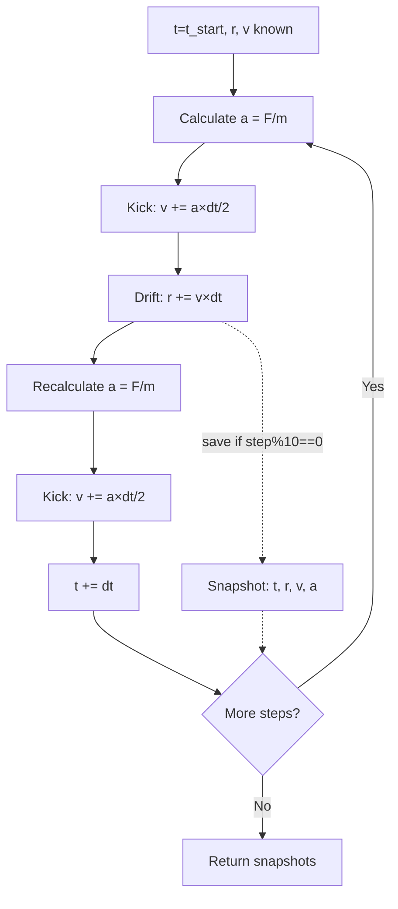

# Integration

## Leapfrog Algorithm

**Type**: Symplectic integrator (conserves phase space volume → good energy conservation)

**Order**: Second-order accurate (error ∝ dt²)

**Nickname**: Kick-Drift-Kick (KDK)

**File**: integrator.py:223-308

## Algorithm

### Single Timestep

```python
def step(self, dt):
    """
    Leapfrog: Kick-Drift-Kick

    v(t+dt/2) = v(t) + a(t) × dt/2        # Half kick
    r(t+dt) = r(t) + v(t+dt/2) × dt       # Full drift
    a(t+dt) = F(r(t+dt)) / m              # Recompute forces
    v(t+dt) = v(t+dt/2) + a(t+dt) × dt/2  # Half kick
    """
    # Kick (half step)
    accelerations = self.calculate_total_forces()
    self.particles.set_accelerations(accelerations)
    self.particles.update_velocities(dt / 2)

    # Drift (full step)
    self.particles.update_positions(dt)

    # Kick (half step)
    accelerations = self.calculate_total_forces()
    self.particles.set_accelerations(accelerations)
    self.particles.update_velocities(dt / 2)

    # Update time
    self.particles.time += dt
```

### Velocity Update

```python
def update_velocities(self, dt):
    for particle in self.particles:
        particle.velocity += particle.acceleration * dt
```

### Position Update

```python
def update_positions(self, dt):
    for particle in self.particles:
        particle.position += particle.velocity * dt
```

## Properties

**Symplectic**: Preserves Hamiltonian structure
- Energy may drift slightly but doesn't systematically grow
- Phase space volume conserved (Liouville's theorem)
- Reversible: running backward in time recovers initial state

**Time-reversible**: If you swap v → -v and integrate, you return to start

**Second-order**: Error per step ∝ dt³, total error ∝ dt²

**Explicit**: No matrix inversion or iteration needed

## Full Evolution

**File**: integrator.py:254-298

```python
def evolve(self, t_end, n_steps, save_interval=10):
    """
    Evolve from current time to t_end

    Parameters:
    -----------
    t_end : float
        Final time [seconds]
    n_steps : int
        Number of timesteps
    save_interval : int
        Save snapshot every N steps

    Returns:
    --------
    snapshots : list of dict
        Saved snapshots (time, positions, velocities, accelerations)
    """
    dt = (t_end - self.particles.time) / n_steps

    snapshots = []
    snapshots.append(self._save_snapshot())  # Initial state

    for step in tqdm(range(n_steps)):
        self.step(dt)

        if (step + 1) % save_interval == 0:
            snapshots.append(self._save_snapshot())

        if (step + 1) % (n_steps // 10) == 0:
            self.time_history.append(self.particles.time)
            self.energy_history.append(self.total_energy())

    return snapshots
```

## Timestep Sizing

**Typical values**:
- Duration: 6 Gyr = 1.89e17 s
- n_steps: 150
- dt = 1.26e15 s ≈ 40 Myr

**Rule of thumb**: dt should be < 1% of dynamical timescale

**Dynamical timescale**:
```
t_dyn = 1 / √(G × ρ) ≈ 1 / H ≈ 13.8 Gyr
```

**Our timestep**: 40 Myr << 13,800 Myr ✓

**Too large**: Energy conservation breaks down, particles escape
**Too small**: Wasted computation, no accuracy gain

## Snapshot Structure

```python
def _save_snapshot(self):
    return {
        'time': self.particles.time,                           # float [s]
        'positions': self.particles.get_positions().copy(),    # (N,3) [m]
        'velocities': self.particles.get_velocities().copy(),  # (N,3) [m/s]
        'accelerations': self.particles.get_accelerations().copy(), # (N,3) [m/s²]
    }
```

**Saved every**: `save_interval` steps (default 10)
- 150 steps / 10 = 15 snapshots + 1 initial = 16 total
- Memory: 16 × 300 particles × 3 vectors × 3 components × 8 bytes ≈ 350 KB

## Energy Tracking

```python
# Every 10% of simulation
if (step + 1) % (n_steps // 10) == 0:
    self.time_history.append(self.particles.time)
    self.energy_history.append(self.total_energy())
```

**Total energy**:
```python
def total_energy(self):
    KE = self.particles.kinetic_energy()  # ½Σmv²
    PE = self.potential_energy()          # -ΣΣGm_im_j/r_ij
    return KE + PE
```

**Expected behavior**:
- ΛCDM: Energy increases (dark energy adds energy)
- Matter-only: Energy nearly conserved (small drift <1%)
- External-Node: Energy changes due to external work

**Not used for validation** (only monitoring), because:
- External forces do work (not conservative system)
- Dark energy injects energy
- Only in isolated matter-only case should E = const

## Comparison to Other Integrators

| Integrator | Order | Symplectic | Energy Drift | Cost |
|------------|-------|------------|--------------|------|
| Euler | 1st | No | Systematic growth | 1× |
| Leapfrog | 2nd | Yes | Bounded | 2× |
| RK4 | 4th | No | Systematic growth | 4× |
| Velocity Verlet | 2nd | Yes | Bounded | 2× |

**Why not RK4?**: Higher order but not symplectic. Long-term energy conservation worse than Leapfrog for Hamiltonian systems.

**Velocity Verlet vs Leapfrog**: Mathematically equivalent, just different variable staggering.

## Performance

**Force calculation bottleneck**:
- Internal: O(N²) = 90,000 pairs for N=300
- External: O(26N) = 7,800 operations
- Total per step: ~100k operations
- 150 steps × 2 force calls/step = 30M operations
- Runtime: ~10 seconds (Python overhead dominates, not computation)

**Optimization opportunities**:
1. Tree methods (Barnes-Hut, FMM): O(N log N) internal forces
2. GPU parallelization: Pairwise forces embarrassingly parallel
3. Adaptive timesteps: dt = C / max(|a|) for stability

Not needed for N~300, but essential for N>10,000.

## Numerical Stability

**CFL condition** (from fluid dynamics, approximate guide):
```
dt < C × min(Δx / |v|)
```

Where Δx ≈ box_size / N^(1/3) ≈ 1 Gpc, |v| ≈ 1e5 m/s

```
dt < 1 Gpc / 1e5 m/s ≈ 3e17 s ≈ 10 Gyr
```

Our dt ≈ 40 Myr << 10 Gyr ✓ (very safe)

**Acceleration-based criterion**:
```
dt < √(ε / |a_max|)
```

Where ε = softening = 1 Mpc, |a_max| ≈ 1e-10 m/s²

```
dt < √(3e22 m / 1e-10 m/s²) ≈ 5e15 s ≈ 160 Myr
```

Our dt ≈ 40 Myr ✓ (safe)

## Diagram



## Usage Example

```python
from cosmo.integrator import LeapfrogIntegrator
from cosmo.particles import ParticleSystem, HMEAGrid

# Set up system
particles = ParticleSystem(n=300, box_size_Gpc=12.0, ...)
hmea_grid = HMEAGrid(M_ext=8e55, S=24.0)

# Create integrator
integrator = LeapfrogIntegrator(
    particle_system=particles,
    hmea_grid=hmea_grid,
    softening=1e21,  # 1 Mpc
    use_external_nodes=True,
    use_dark_energy=False
)

# Run for 6 Gyr, 150 steps
t_end = 6.0 * 1e9 * 365.25 * 24 * 3600  # Convert Gyr to seconds
snapshots = integrator.evolve(t_end, n_steps=150, save_interval=10)

# Analyze results
for snap in snapshots:
    t_Gyr = snap['time'] / (1e9 * 365.25 * 24 * 3600)
    positions = snap['positions']
    # ... analyze expansion
```

## References

- Leapfrog implementation: integrator.py:229-252
- Evolution loop: integrator.py:254-298
- Force calculations: [force-calculations.md](./force-calculations.md)
- Timestep selection: Empirically tested, dt ≈ t_duration / 150 works well
