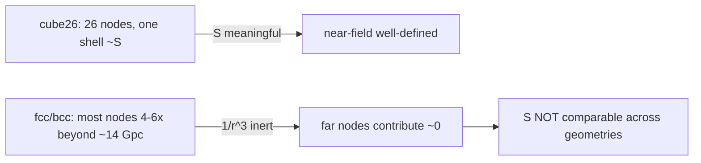

# Node placement vs perturbation — why the virialized grid exists

STATUS: **VERIFIED FINDING**. Explains the physics motivation for the
`virialized` node geometry and records the HONEST section-1 result that the
per-node mass/position PERTURBATION machinery was never buggy — the issue is
node PLACEMENT, not perturbation. Geometry implementation lives in
[../plans/node-geometries.md](../plans/node-geometries.md) (WS3, "Virialized geometry").

## The 1/r³ near-field rule

Tidal stretch from a point node falls off as ~1/r³ (the differential of the
~1/r² acceleration across the cloud). So the NEAREST nodes dominate utterly and
far nodes are effectively inert. The observable cloud sits at the centre; the
characteristic horizon scale is ~14 Gpc.

## Multi-layer lattices park most nodes far beyond the horizon

The dense lattices (`fcc`, `bcc`) are enumerated by unit-cell layers, so at a
given spacing they place MOST of their nodes 4–6× beyond ~14 Gpc, where 1/r³
makes them contribute almost nothing:

| geometry | inner reach | outer reach (verified) |
|----------|-------------|------------------------|
| `cube26` | clean single 26-node shell at ~S | ~√3·S |
| `fcc` (n_shells=2) | ~S | ~86 Gpc out (most nodes far) |
| `bcc` (n_shells=2) | ~S | ~386 nodes out to ~83 Gpc |

Consequence: **a single number "S" is NOT comparable across geometries.** For a
multi-layer lattice the realized characteristic spacing and the effective near-field
are dominated by the few nearest nodes, not by the "S" that parametrized the lattice.
`cube26` is the clean single-shell case where S means what it says. This is why the
fair cross-geometry control is "per-node mass fixed + nearest node at S"
(`normalize_nearest`), NOT equal total mass (see node-geometries.md), and it is why
the cross-geometry sweep found no lattice beats the cube (WS3 result; PF2/PF3).

## Why the virialized grid

A physically-motivated alternative to "add more lattice layers": a RELAXED-CLUSTER
configuration where node mass and radius are COUPLED (mass segregation) and the node
count + radial RANGE are EXACT free parameters (`vir_n_nodes`, `vir_extent`) instead
of being dictated by lattice enumeration. The realized spacing is pinned to a target S
via `nearest_neighbour_spacing` so S is well-defined per a chosen metric
(median/mean). Smaller M can then pair with smaller S and a bigger radial multiplier.
This lets us probe whether a segregated, controlled-extent structure changes the
near-field / growth story that the far-parked lattice nodes cannot. Implementation +
parameters: [../plans/node-geometries.md](../plans/node-geometries.md).

## HONEST section-1 finding: the perturbation machinery is CORRECT

When generalizing the unit tests from cube26-only to ALL geometries
(`tests/test_node_geometry_anisotropy.py`, 128 tests over
cube26/cube_dense/fcc/bcc with each geometry's actual N), the per-node
PERTURBATION knobs were verified correct on EVERY geometry:

- `node_mass_amplitude` (mass perturbation): mean-preserving for ANY N
  (mean == M_ext_kg, rtol 1e-12), strictly positive, genuinely spread,
  seeded-deterministic, independent of global np.random.
- `node_s_amplitude` (radial position perturbation): per-node UNIT direction
  unchanged (ray preserved generically, not just for cube26's axis-aligned rays),
  mean radial scale preserved (mean(r_pert/r_unpert) == 1.0), no node crosses the
  origin, seeded-deterministic.
- The two knobs are SEPARATE `default_rng` draws (cross-knob independence holds
  per geometry).

**There is NO multi-layer perturbation bug.** The amplitude machinery behaves
identically and correctly on cube_dense/fcc/bcc as on cube26. What differs between
geometries is the unperturbed PLACEMENT (where the nodes sit, and hence the
near-field that 1/r³ weights), not how the perturbation acts on them. The
discriminating lever remains anisotropy (PF2), and no volume-filling lattice beats
the cube on the isotropic fit (PF3 / node-geometries.md).

## References

- [../plans/node-geometries.md](../plans/node-geometries.md) — WS3 factory + virialized geometry (IMPLEMENTED)
- [../plans/pinned-findings.md](../plans/pinned-findings.md) — PF1 (M=0==EdS), PF2 (anisotropy), PF3 (M/S³)
- [force-calculations.md](./force-calculations.md) — tidal 1/r³, per-node mass/position knobs
- [observable-mask-and-outer-mass.md](./observable-mask-and-outer-mass.md) — WS4 outer-mass (related "horizon" framing)
