# Observable Mask + centerM-as-Outer-Mass (WS4)

STATUS: **IMPLEMENTED**. Describes the CURRENT behaviour of `centerM`
(`center_node_mass`), the observable inner-region mask on a(t), and the frozen
softening. Design rationale that led here is in
[../plans/centerm-reconception.md](../plans/centerm-reconception.md).

## centerM is an OUTER-MASS multiplier (NOT a softening knob)

`center_node_mass` / `centerM` = **total simulated mass / inner observable mass**
(>= 1.0, clipped up to 1.0 in `SimulationParameters`; default 1.0).

- `centerM = 1.0` (default) → NO outer particles → inner cloud is **byte-identical**
  to the pre-WS4 code (positions, masses, softening all unchanged).
- `centerM > 1.0` adds extra Big-Bang matter OUTSIDE the inner observable sphere,
  at the SAME number density and SAME per-particle mass as the inner region:
  - `N_outer = round((centerM - 1) * N_inner * outer_density_ceiling)`
  - `N_total = round(centerM * N_inner)` at ceiling=1 → **LINEAR in centerM**
    (centerM=2 → 2× particles; centerM=3 → 3×). The old `factor^3` cost framing is GONE.
  - `R_sim = R_obs * centerM**(1/3)` is a DERIVED internal radius (mass ×2 → radius
    ×1.26). The user-set axis is the MASS multiplier, not the radius.
- The inner R_obs, inner density, and per-particle mass are EXACTLY unchanged when
  outer particles are added — only outer particles are appended (inner drawn first
  from the RNG, so inner draws are never disturbed).

Constraints (raise `NotImplementedError`):
- centerM > 1 requires `eds_consistent=True` (the WS4 path). centerM>1 on the
  non-EdS / LCDM path is unsupported.
- centerM > 1 requires `init_distribution="uniform_sphere"` (GRF outer-shell
  sampling is a TODO).

`outer_density_ceiling` (default 1.0 = outer density == inner EdS-critical) raises
the outer number density; clipped to `SimulationParameters.MAX_OUTER_DENSITY_CEILING
= 2.0` with a `UserWarning`. Inner density is NEVER raised. No effect at centerM=1.

Implementation: `cosmo/particles.py` (`ParticleSystem._initialize_particles`,
`_init_outer_shell`), `cosmo/constants.py` (`SimulationParameters.center_node_mass` /
`outer_density_ceiling`, clip + ceiling warning).

## Softening is FROZEN at the centerM=1 baseline (the correctness gate)

Pre-WS4, `softening_m = center_node_mass * 1.0 * Gpc` AND, under `eds_consistent`,
the cloud mass was OVERRIDDEN to EdS critical — so old centerM added NO self-gravity;
it ONLY set the softening/resolution scale. The old centerM→chi2 shift (1→10:
0.85→0.63) was therefore a softening ARTIFACT, not added physics.

Now `softening_m = 1.0 * Gpc` UNCONDITIONALLY (simulation.py `__init__`), independent
of centerM. So (a) centerM=1 stays byte-identical (baseline was 1.0*Gpc), and (b)
centerM>1 changes a(t) ONLY via real added outer-mass gravity. Test gate:
`tests/test_observable_mask.py::TestSofteningFrozen`.

## THE HARD INVARIANT: a(t) measured on the inner observable region only

The mask lives in ONE place. `ParticleSystem._initialize_particles` sets
`self.observable_mask` (bool, length N_total): True for inner indices `0..N_inner-1`,
False for outer. `CosmologicalSimulation._calculate_expansion_history` applies this
mask to every snapshot's positions before `calculate_system_size`, so the masked a(t)
propagates to H(z), mu(z), and the growth anchor automatically — one seam, no
duplicated masking.

The snapshot still stores ALL positions; the integrator is UNTOUCHED, so outer
particles keep exerting gravity. The mask is applied ONLY at the a(t)/size
MEASUREMENT step. COM for size is computed on the MASKED subset. At centerM=1 the
mask is all-True → numerically byte-identical to pre-WS4.

```mermaid
graph TD
    P[ParticleSystem._initialize_particles] -->|inner drawn first| M[observable_mask: True=inner]
    P --> S[snapshots: ALL positions]
    S --> I[integrator: ALL particles exert gravity]
    M --> E[_calculate_expansion_history: mask applied]
    S --> E
    E --> A[a_curve = R_inner&#40;t&#41; / R_inner&#40;0&#41;]
    A --> MU[sim_to_distance_modulus -> mu&#40;z&#41;]
    A --> G[growth anchor a&#91;-1&#93;/a&#91;0&#93;]
```

## Cache (PHYSICS_CACHE_VERSION = v3) + slug fix

`cosmo/parameter_sweep.PHYSICS_CACHE_VERSION = "v3"` (was v2). Because centerM>1 a(t)
now differs from the old softening-only a(t), the bump retires all v2 entries (the
token is ALWAYS appended via `physics_cache_token`). centerM=1 a(t) is byte-identical
but the bump is applied uniformly (safe). See cache-version history comment at
`parameter_sweep.py` (`PHYSICS_CACHE_VERSION`).

`build_cache_name` slug fixes:
- `f"{float(centerM)}centerM"` (was `int(centerM)` which truncated 1.5→1 and collided
  cache keys). Now 1.0/1.5/2.0/3.0 get distinct keys.
- `outer_density_ceiling != 1.0` appends a `{ceiling}ceil` slug; ceiling=1.0 adds
  nothing (keeps default keys stable).

Wiring: `centerM` and `outer_density_ceiling` flow through `SweepConfig`, `sweep.py`,
`cosmo/cli.py` (`--center-node-mass`, `--outer-density-ceiling`,
`args_to_sim_params`), and `hubble_diagram_nbody.load_best_config` (centerM parsed as
float). Selection is unchanged: minimum `chi2_dof` vs Pantheon+ ascending; LCDM/EdS
are reference lines only.

## Honest WS4 result (the deliverable, either way)

Reduced sweep (`_generate_ws4_figs.py` / `sweeps/ws4_centerm.json`): M∈{1,2,5,20},
centerM∈{1.0,1.5,2.0,3.0}, S co-fit 18–40 Gpc, 400 particles, t_start=2.9, 273 steps.
Best chi2/dof vs Pantheon+ per centerM (all best at **M=20, S=39**):

| centerM | best chi2/dof |
|---------|---------------|
| 1.0     | 0.6921        |
| 1.5     | 0.7030        |
| 2.0     | **0.6801** (best) |
| 3.0     | 0.6844        |
| LCDM ref| 0.436         |
| EdS ref | 0.843         |

- Outer matter helped only **marginally** (~0.012 chi2/dof from centerM=1 to the
  centerM=2 best). Outer mass alone did NOT move the isotropic fit toward LCDM.
- The small-M (M=1–2) hypothesis corner produced **NO anchor_ok rows** (too weak to
  reach the growth anchor) — the hypothesis that small M + outer mass approaches the
  Pantheon best fit is NOT supported by this grid.
- **CAVEAT — not the model's global best.** This reduced grid did NOT include the
  prior known corner ~M=50/S=20 (~0.52 in earlier sweeps, see PF4). So "best=0.68" is
  the best of the SMALL-M hypothesis grid, not the model's global best. A fuller sweep
  including M~50/S~20 (and the full JSON M∈{50,200}) is still OPEN. Do not overstate.

Figures: `results/figures/ws4/` — (A) best-config inner mu(z) over real Pantheon+
with LCDM/EdS reference curves + chi2/dof; (B) inner a(t) growth and chi2/dof vs
centerM at fixed (M,S).

## Tests

- `tests/test_observable_mask.py` (Section 1 + 2): centerM=1 byte-identical inner
  positions/masses/mask; N_total LINEAR (round(centerM·N_inner)); inner RMS == box/2;
  outer per-particle mass == inner mean; R_sim/R_obs == centerM**(1/3) (cube-root, not
  linear); softening FROZEN/independent of centerM; ceiling clip + warning; centerM>1
  non-EdS / grf raise NotImplementedError; centerM<1 clipped to 1; centerM=1 masked
  a(t) byte-identical + matches EdS; outer particles excluded from size measurement but
  still exert gravity; M=0/centerM=2 inner a(t) still ≈ EdS (shell theorem, <5%).
- `tests/test_ws4_cache_slug.py` (Section 3): centerM slug distinguishes 1.0/1.5/2.0/3.0;
  v3 token present; ceiling slug only when !=1.0; CLI round-trip of `--center-node-mass`
  / `--outer-density-ceiling`; `load_best_config` returns centerM as float and selects
  min chi2_dof.
- `tests/test_matter_only_consistency.py`: unchanged, still pins M=0==EdS at centerM=1.

## References

- [../plans/centerm-reconception.md](../plans/centerm-reconception.md) — design rationale (implemented)
- [initial-conditions.md](./initial-conditions.md) — EdS ICs + centerM semantics summary
- [../plans/pinned-findings.md](../plans/pinned-findings.md) — PF1 (M=0==EdS), PF6 (WS4 honest result)
- [pantheon-comparison-results.md](./pantheon-comparison-results.md) — from-sim mu(z) chi2 context
