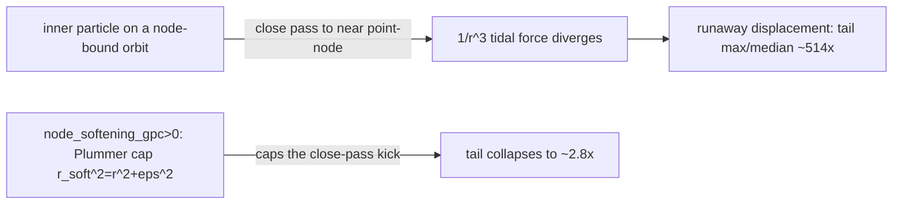

# Particle slingshots and node softening (the taming fix)

STATUS: **VERIFIED + IMPLEMENTED**. Root-caused the runaway particle "slingshot",
pinned the lever, and shipped the taming knob `node_softening_gpc`. Preserves
M=0==EdS (PF1) and the default is byte-identical (no PHYSICS_CACHE_VERSION bump).
Related: [node-placement-vs-perturbation.md](./node-placement-vs-perturbation.md),
[force-calculations.md](./force-calculations.md), [initial-conditions.md](./initial-conditions.md).

## The slingshot

At strong-tidal / small-S configs a few inner particles acquire a RUNAWAY
displacement — a heavy-tailed distribution where one particle moves orders of
magnitude farther than the median. Quantified by `slingshot_metrics(disp)` in
`_generate_ws8_figs.py` (max/median, p99/median, tail_fraction beyond 5x median).

Measured (seed=42, N=200, t_start=5.8, M=1000, S=10):

| config | max/median | tail_fraction |
|--------|-----------:|--------------:|
| cube26, nodes ON (runaway) | ~514 | 0.285 |
| cube26, nodes OFF (matter-only) | ~1.3 | 0.0 |
| tame (M=5, S=20) nodes ON | ~1.3 | 0.0 |
| virialized, nodes ON | ~23 | 0.06 |

## Root cause: a near-point-NODE close pass (NOT particle-particle)

Pinned by unit test (`tests/test_slingshot.py`): re-running the SAME runaway config
with external HMEA nodes OFF collapses the tail from ~514x to ~1.3x. So the
slingshot is a particle making a very close pass to a near-point HMEA node (the
unsoftened `1/r^3` tidal force diverges), NOT a particle-particle encounter.

**n_steps and n_particles do NOT tame it** (S3 knob-sweep diagnostic): finer time
resolution / more particles do not reduce the tail — the close-pass kick is a force
issue, not a resolution issue. The lever is NODE SOFTENING.

## The fix: node_softening_gpc (Plummer node softening)

`node_softening_gpc` (param) / `node_softening_m` (derived, meters) adds a Plummer
softening on the TIDAL force path, in BOTH the numba kernel
(`cosmo.tidal_forces_numba.calculate_tidal_forces_numba(..., softening_m)`) and the
numpy fallback (`HMEAGrid.calculate_tidal_acceleration_batch`):

- `node_softening_gpc == 0.0` (DEFAULT): the LEGACY hard `r < 1e10 m` floor
  (~3e-13 Gpc — effectively no softening at Gpc scales). BYTE-IDENTICAL to the
  pre-softening force, so cube26 a(t) and every existing cache entry are unchanged.
  Slug is omitted ⇒ `PHYSICS_CACHE_VERSION` stays `v3` (no bump).
- `node_softening_gpc > 0.0`: `r_soft^2 = r^2 + (node_softening_gpc*Gpc_to_m)^2`
  (same Plummer convention as the internal particle-particle force in
  `cosmo.integrator`). The 1e10 m floor is dropped in this branch (Plummer already
  keeps the force finite at r→0). Cache slug `{node_softening_gpc}nsoft`.

The fix is GEOMETRY-AGNOSTIC (it caps the per-node force regardless of layout), so
it tames cube26 AND virialized.

## "Doubly tamed"

At `node_softening_gpc=1.0` (matches the 1 Gpc internal particle softening):

| geometry | OFF max/median | ON (1 Gpc) max/median |
|----------|---------------:|----------------------:|
| cube26 | ~514 | ~2.8 (tail_fraction → 0) |
| virialized | ~23 | ~7.0 |

The virialized (force-balanced) geometry already lowers the tail vs cube26
(~23 vs ~514), and node softening collapses it further — hence "doubly tamed"
(GEOMETRY + SOFTENING). This is the configuration of `sweeps/virialized_final.json`.

## Invariants preserved

- **M=0 == EdS (PF1):** softening only RESHAPES the per-node force; with all node
  masses 0 (M_ext=0) the tidal sum is identically 0 for ANY `node_softening_gpc`
  (asserted on both numba + numpy paths).
- **Far-field unchanged:** for a particle ≫ 1 Gpc from a node the 1 Gpc softening
  changes the tidal force < 5% (asserted), so a(t) for non-runaway clouds is barely
  affected; the effect is concentrated on the close-pass tail.
- **Default byte-identical:** `node_softening_gpc=0` ⇒ the grid's tidal batch EXACTLY
  equals the legacy numba call with `softening_m=0` (`np.array_equal`).

## Tests (all green)

`tests/test_slingshot.py` (13):
- runaway config DOES slingshot; tame config does NOT (contrast).
- ROOT CAUSE: nodes ON ≫ nodes OFF (≥10x tail and ≥10x max) — the node close-pass.
- diagnostic softened-node-force monkeypatch tames the tail; pure-helper tests for
  `softened_node_acceleration` (far-field Newtonian, finite at node, larger eps →
  smaller close force).
- PRODUCT path: `node_softening_gpc=1.0` tames cube26 AND virialized; default 0.0 is
  byte-identical to the legacy hard-floor force; close-pass kick bounded with
  softening on; far-field < 5% change; M_ext=0 ⇒ zero tidal for any softening.

Threading + cache: `tests/test_overarching_sweep.py::TestNodeSofteningThreading`
(keyed==run guard: the SweepConfig the cache keys off AND the SimulationParameters
the sim runs both carry the requested softening; `1.0nsoft` slug present, absent at
default).
