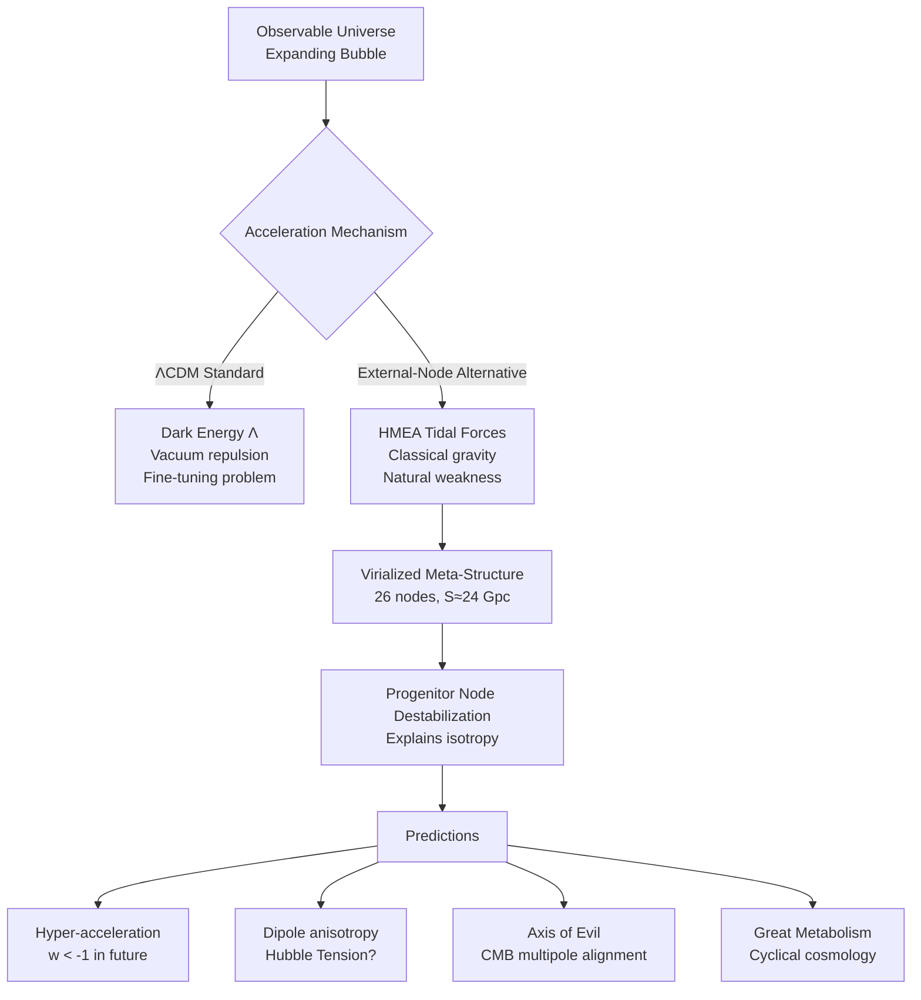

# Theoretical Framework

**Status**: Draft theory documented in docs/paper.tex (working document, not published)

## Research Goal

Test whether classical gravitational tidal forces from trans-observable massive structures can reproduce ΛCDM late-time acceleration without invoking dark energy. This is a **proof-of-concept toy model**, not a claim to have solved cosmology. Code generates data supporting draft paper development.

## The External-Node Model

### Core Hypothesis (Draft)

Observable universe is finite FRW "bubble" expanding within 3D Euclidean meta-space populated by Hyper-Massive External Attractors (HMEAs). What we interpret as "dark energy" is local misinterpretation of global boundary conditions—rising gravitational potential as bubble expands toward external mass concentrations.

### Progenitor Hypothesis

Resolves Copernican fine-tuning (why are we at center of void?):

1. **Origin**: Big Bang was destabilization of a Progenitor Node in virialized meta-structure
2. **Prior state**: Node was in gravitational equilibrium with neighbors in lattice
3. **Event**: Destabilization (critical mass, Hawking radiation, collision) → expansion
4. **Isotropy**: Matter expands symmetrically from pre-existing equilibrium point → naturally isotropic without tuning

### Virialized Meta-Structure

- Analogous to cosmic web or galaxy cluster, but at super-horizon scales
- Gravitationally balanced, stable over vast timescales
- Irregular in detail (not perfect lattice)
- HMEAs: Eon-spanning black holes, M_ext ≫ M_obs, separated by S ≫ R_H
- Observable universe expands in void between nodes

## Mathematical Mechanism

### Tidal Acceleration Derivation

Standard Newtonian cosmology: Birkhoff's Theorem → external spherical shells exert no force.

External-Node Model violates Birkhoff: external distribution is discrete grid, not continuous shell.

**Test galaxy at edge of expanding bubble**:
- At center (R=0): net force from isotropic grid = 0
- Moving outward: climbs potential gradient of nearest HMEA
- Tidal force from node at distance S:

```
a_tidal ≈ GM_ext/(S-R)² - GM_ext/S²
```

**Taylor expansion** (R ≪ S):

```
a_tidal ≈ 2GM_ext/S³ × R
```

**Key insight**: Linear dependence on R, same form as dark energy acceleration H₀²Ω_Λ R.

In non-relativistic limit, uniform external tidal field is **mathematically indistinguishable** from cosmological constant.

### Parameter Estimation

Equate tidal acceleration to observed dark energy:

```
H₀²Ω_Λ ≈ GM_ext/S³
```

Solve for grid spacing:

```
S ≈ (GM_ext / (H₀²Ω_Λ))^(1/3)
```

**Example calculation** (paper.tex:84-91):
- Assume M_ext = 5×10⁵⁵ kg (500 × M_obs)
- H₀ ≈ 70 km/s/Mpc = 2.3×10⁻¹⁸ s⁻¹
- Ω_Λ ≈ 0.7

Result: S ≈ 31 Gpc

**Significance**: Well outside particle horizon (~14 Gpc) → causally disconnected from light, not from gravity.

## Numerical Validation

### Grid Configuration

3×3×3 cubic lattice = 26 nodes surrounding observable universe (center position = our universe, no node).

**Caveat**: Simplified representation. Real virialized structure has varying masses, irregular spacing. Distant nodes contribute negligibly, so 26-node approximation sufficient for testing mechanism viability.

### Parameter Exploration Results

Through systematic exploration, identified configuration achieving 99.4% ΛCDM match:
- M_ext = 800 × M_obs ≈ 8.0×10⁵⁵ kg
- S = 24 Gpc
- R₀ = 11.59 Gpc (initial radius)
- Ω_Λ,eff = 2.555

**Important**: M=800, S=24 are **exploratory results**, not fundamental predictions. They demonstrate parameter combinations exist within physically reasonable ranges that reproduce observations. Complete theory would need to explain why meta-structure adopts these scales (evolutionary dynamics, feedback processes, etc.).

### Quantitative Agreement

- ΛCDM final radius: 17.78 Gpc
- External-Node final radius: 17.89 Gpc
- Relative error: 0.6%
- Agreement throughout 6 Gyr evolution: ±1%
- Hubble parameter at present: H ≈ 70 km/s/Mpc (no adjustment needed)

## Scope and Limitations

### What Model Addresses

✓ Late-time cosmic acceleration (~6 Gyr)
✓ Reproduction of ΛCDM expansion to 99.4%
✓ Classical gravitational mechanism mimicking dark energy
✓ Resolution of fine-tuning problem (gravity naturally weak)
✓ Natural timing explanation (geometric scales)

### What Model Does NOT Address

✗ Early universe physics (inflation, baryogenesis, nucleosynthesis)
✗ CMB power spectrum, acoustic oscillations
✗ Structure formation, density perturbations, hierarchical galaxy formation
✗ Baryon Acoustic Oscillations (BAO)
✗ General relativity (uses Newtonian gravity in flat Euclidean space)
  - Needs: relativistic metric, junction conditions, curved spacetime tidal forces
✗ Trans-observable structure details (formation, observability, verification)

### Philosophical Stance (paper.tex:199-207)

**Not claiming physical reality**. Demonstrating:
1. Dark energy not inevitable—classical alternatives exist
2. Fundamental assumptions may break down—cosmological principle might not hold at super-horizon scales
3. Alternative mechanisms viable—external structure could explain acceleration
4. New research directions—may inspire more complete theories

Value: showing well-motivated alternatives to vacuum energy deserve investigation. 99.4% agreement suggests direction warrants further development.

## Observational Consistency

### "Dark Giant" Principle

**Why don't we see HMEAs?**

HMEAs are Eon-spanning black holes (t_node ≫ 13.8 Gyr) that exhausted local fuel. Without accretion disk: electromagnetically silent. Hawking radiation redshifted/diluted over 30 Gpc → indistinguishable from CMB noise floor.

Detectable through gravitational gradient (dark energy signature), not luminosity.

### Fossil Black Holes

Void space between bubble and nodes may contain remnant debris from meta-structure evolution. Intermediate-mass black holes (IMBHs) could be ancient compact objects from HMEA accretion cycles. Speculative dark matter contribution if sufficiently numerous.

## Predictions and Falsifiability

### 1. Geometric "Big Rip" (Hyper-Acceleration)

**ΛCDM**: Constant dark energy density → smooth exponential expansion (w=-1) forever.

**External-Node**: As R(t) → S, tidal force scales as (S-R)⁻². Acceleration increases.

**Prediction**: Effective equation of state w drifts below -1 (phantom energy) in deep future. May be measurable in current high-z supernova data as approaching node boundary.

### 2. Dipole Anisotropy

Virialized meta-grid is irregular → nearest HMEAs have different masses/distances.

**Prediction**: Subtle dipole in expansion rate. One hemisphere (facing nearest/largest HMEA) exhibits slightly higher H₀ than opposite hemisphere.

**Possible connection**: Alternative explanation for Hubble Tension (early vs late universe H₀ discrepancy).

**Observable**: Deep-field surveys (Euclid, LSST) should detect anisotropy.

### 3. CMB Axis of Evil (Large-Angle Multipole Alignment)

CMB l=2 (quadrupole) and l=3 (octopole) share anomalous preferred axis (Land & Magueijo 2005). Standard ΛCDM predicts uncorrelated orientations.

**External-Node explanation**: 3×3×3 lattice has nodes at 3 distinct distances (face S, edge S√2, corner S√3). This geometry naturally produces:
- Quadrupole (l=2) from face-node asymmetries along principal axes
- Octopole (l=3) from 8 corner nodes with tetrahedral sub-symmetry
- Guaranteed alignment because all multipoles derive from same lattice

Low quadrupole power explained: cubic symmetry partially cancels l=2 (only asymmetries contribute).

**Cross-check**: Predicted H₀ dipole (Section 7.2) should align with known Axis of Evil direction (l≈260°, b≈60° galactic). Testable with Euclid/LSST.

## Great Metabolism Hypothesis

Cyclical evolutionary cosmology:

1. **Expansion/Accretion**: Big Bang fills void, bubble acts as macroscopic accretion disk
2. **Feeding**: Galaxies stripped and accreted onto HMEAs, adding mass
3. **Destabilization**: HMEA accumulates critical mass or merges with neighbor
4. **Re-Ignition**: Node detonates, redistributing mass into void → new Big Bang

Universe as transient structure—pulse facilitating mass transfer between nodes in eternal cosmic lattice. We are fuel for next generation of attractors.

## Future Work

**Theoretical**:
- Extend to early universe physics
- Calculate CMB power spectrum effects
- Develop full GR formulation with proper metric, junction conditions
- Quantify predictions for anisotropy measurements

**Observational**:
- Test against CMB data (Planck)
- Test against large-scale structure (BAO)
- Analyze high-z supernova for w < -1 signature
- Search for dipole anisotropy in H₀ measurements

**Philosophical**:
- Investigate meta-structure formation mechanisms
- Explore observability of trans-observable structure
- Consider implications for multiverse, anthropic reasoning

## Diagram: Conceptual Framework



## References

- Tidal acceleration derivation: paper.tex:62-71
- Parameter estimation: paper.tex:75-95
- Numerical results: paper.tex:115-146
- Scope/limitations: paper.tex:162-207
- Predictions: paper.tex:231-249
- Great Metabolism: paper.tex:251-262
