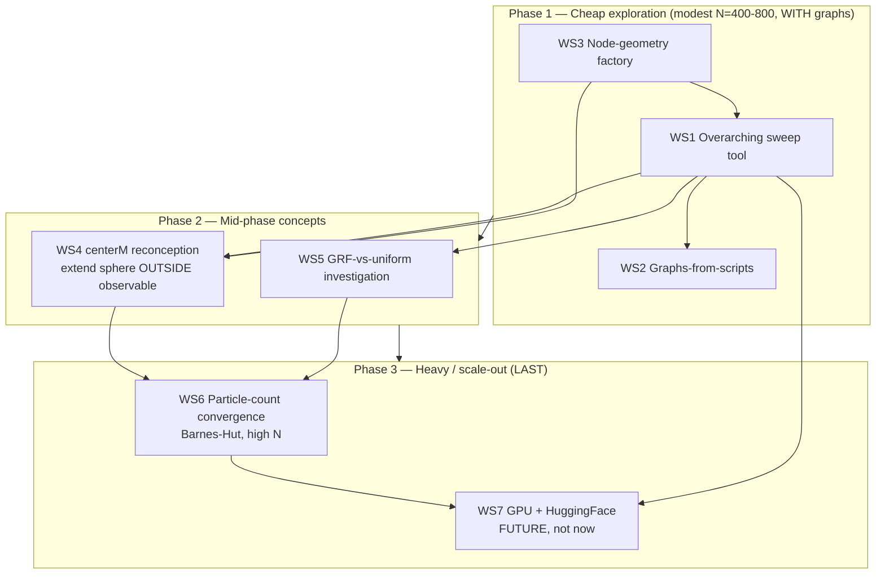

# Deeper Exploration Roadmap (hub)

Forward plan for the project's next, DEEPER exploration phase. This is a PLAN
only — no exploration code is implemented yet. Each workstream lives in a focused
sub-file (kebab-case, < 250 lines). This hub holds the pinned findings, the phase
diagram, and the sequencing.

Sub-files:
- [pinned-findings.md](./pinned-findings.md) — the verified anchors every workstream builds on
- [overarching-sweep.md](./overarching-sweep.md) — WS1: one config-driven multi-param sweep tool
- [graphs-from-scripts.md](./graphs-from-scripts.md) — WS2: every claim gets a saved PNG
- [node-geometries.md](./node-geometries.md) — WS3: geometry factory (denser/more-node volume-filling lattices; hollow shells excluded)
- [centerm-reconception.md](./centerm-reconception.md) — WS4: extend the sim sphere OUTSIDE the observable region
- [grf-vs-uniform.md](./grf-vs-uniform.md) — WS5: why init_distribution moved the isotropic chi2
- [particle-convergence.md](./particle-convergence.md) — WS6: high-N convergence (LAST/slowest)
- [scale-out-gpu-hf.md](./scale-out-gpu-hf.md) — WS7: future HuggingFace + GPU scale-out (NOT now)

Related current-state Lode (read these first, do NOT duplicate them here):
- [../physics/initial-conditions.md](../physics/initial-conditions.md) — EdS invariant, pre-start boost, runaway map, centerM caveat
- [../physics/pantheon-comparison-results.md](../physics/pantheon-comparison-results.md) — canonical chi2 numbers + honest verdict
- [../physics/anisotropy-diagnostic.md](../physics/anisotropy-diagnostic.md) — shear/dipole = the discriminating signal
- [../physics/force-calculations.md](../physics/force-calculations.md) — lever experiment verdict, traceless-in-vacuum
- [../scripts/parameter-sweep.md](../scripts/parameter-sweep.md) — current sweep machinery + knob harness
- [../physics/realistic-initial-conditions.md](../physics/realistic-initial-conditions.md) — GRF/Zel'dovich, convergence ladder

## Why this phase

The mechanism is now physically honest (EdS invariant holds; the boost is derived,
not fitted). The open questions are no longer "is it a fudge?" but "how far can a
HONEST toy model go, and where is its falsifiable edge?". That demands: pin the
landscape with FINE sweeps + GRAPHS (current numbers are config/init-sensitive and
must be re-pinned), test whether ALTERNATIVE geometries beat the traceless 26-node
cancellation, fix the conceptually-wrong centerM, explain the GRF chi2 swing, and
only THEN spend the compute on high-N convergence and a GPU scale-out.

## Guiding principles (apply to every workstream)

- **Graphs are first-class deliverables.** Numbers alone are insufficient — "a graph
  can show something is wrong that the number hides." Every claimed result emits a
  SAVED PNG (see [graphs-from-scripts.md](./graphs-from-scripts.md)). A workstream is
  not done until its figures exist on disk.
- **Honesty over advocacy.** Report near-LCDM AND far-from-EdS-null; report runaway;
  report degeneracy. Do not over-claim in either direction.
- **Preserve the invariants.** M=0 must stay == EdS exactly. Mean-preserving knobs
  stay mean-preserving. New geometries/knobs must not silently break these.
- **Cheap first, expensive last.** Modest-N exploration → mid-phase concepts →
  heavy convergence → GPU/HF scale-out.

## Phase / sequencing diagram

## Sequencing rationale

1. **Phase 1** is everything that runs fast at N=400-800 and produces figures: build
   the one sweep tool (WS1) and the figure layer (WS2) so all later work inherits
   them; add the geometry factory (WS3) since it is just a node-position function and
   feeds the sweep cheaply.
2. **Phase 2** is the two conceptual reworks that need the tool + graphs in place to
   judge: centerM (WS4) changes what "more mass" means physically; GRF-vs-uniform
   (WS5) is a targeted diagnosis of a known anomaly.
3. **Phase 3** spends real compute: high-N convergence (WS6) confirms the Phase-1/2
   conclusions survive resolution, and only when scripts + numbers are trustworthy do
   we scale out to a paid GPU via HuggingFace (WS7).

## Cross-workstream deliverable: the figures directory

All workstreams write PNGs under `results/figures/<workstream>/` (proposed; see
[graphs-from-scripts.md](./graphs-from-scripts.md) for the full naming scheme). These
are generated artifacts (git-ignored alongside `results/*.csv`), regenerated by the
scripts, never hand-edited. Paper-final figures are promoted into `docs/` by hand as
today (`docs/fig*.png`).
