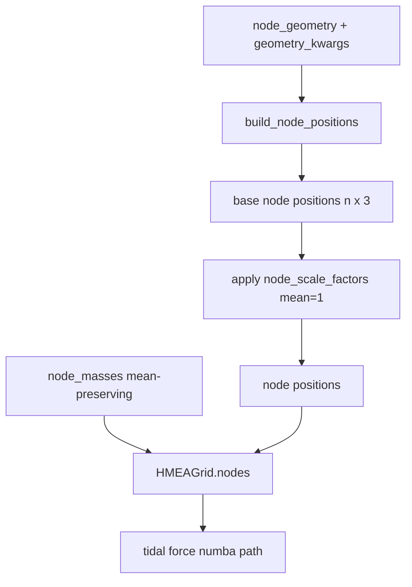

# WS3 — Alternative Node Geometries

Back to [deeper-exploration-roadmap.md](./deeper-exploration-roadmap.md). Phase 1.
Feeds the sweep ([overarching-sweep.md](./overarching-sweep.md)) and the anisotropy
diagnostic; figures via [graphs-from-scripts.md](./graphs-from-scripts.md).

## Motivation

The current external structure is a 26-node 3×3×3−1 cubic lattice (`HMEAGrid._create_
grid` in `cosmo/particles.py`): perfectly symmetric, so the tidal forces CANCEL at the
origin (traceless). PF2 says this traceless cancellation is exactly why symmetry-
breaking can't move the isotropic fit. The question: does a DIFFERENT geometry — more
nodes or a denser lattice — yield a larger NET effect while staying honest about the
vacuum-traceless constraint?

**PHYSICS REQUIREMENT — geometries must be VOLUME-FILLING (virialized).** The HMEA nodes
represent a *virialized meta-structure*: relaxed mass distributed throughout a 3D volume.
The cube lattice is the simplest such approximation. **Hollow spherical SHELLS are
explicitly excluded** — concentrating all mass on a sphere surface with an empty interior
is the OPPOSITE of a virialized structure (and, by Birkhoff, a continuous shell exerts no
interior force at all; see [../physics/theoretical-framework.md](../physics/theoretical-framework.md)).
Valid geometries: `cube26` (default), `cube_dense`, `fcc`, `bcc` — all volume-filling.

**Honesty constraint up front:** for masses in vacuum the tidal tensor is traceless for
ANY arrangement, so no geometry will magically produce a large net isotropic
acceleration at the origin. The realistic gains are (a) a DIFFERENT shear/dipole pattern
(the PF2 signal), and (b) a different 2nd-order growth coupling at finite cloud size /
strong field. Judge geometries on those, not on a hoped-for isotropic-chi2 breakthrough.

## Plan: a node-geometry abstraction / factory

Replace the hard-coded `_create_grid` cube loop with a geometry FACTORY that returns
base node positions (before the existing per-node mass + radial-scale perturbations are
applied). HMEAGrid keeps applying `node_masses()` and `node_scale_factors()` on top, so
the symmetry-breaking knobs compose with ANY geometry.

```
def build_node_positions(geometry: str, S: float, **kwargs) -> np.ndarray:
    # returns (n_nodes, 3) base positions, all at characteristic scale ~S
```

### Geometries to support

All VOLUME-FILLING (virialized). Hollow shells are excluded (see Motivation).

| id | Description | Key kwargs |
|----|-------------|-----------|
| `cube26` | current 3×3×3−1 cubic lattice (DEFAULT, backward-compatible) | — |
| `cube_dense` | denser cubic lattice, e.g. 5×5×5−1 (124 nodes) | `n_per_side` |
| `fcc` / `bcc` | denser close-packed lattices | `n_shells` |

### Parametrization that threads cleanly

- `ExternalNodeParameters` / `SimulationParameters` gain a `node_geometry: str` (default
  `"cube26"`) + `geometry_kwargs: dict`. n_nodes becomes geometry-derived, not the fixed
  26, so `node_masses(n)` / `node_scale_factors(n)` already take `n` and still apply.
- `HMEAGrid._create_grid` calls `build_node_positions(...)` for base positions, then
  applies scale factors + masses exactly as now (order preserved so position/scale/mass
  vectors stay aligned).
- Numba tidal force path (`calculate_tidal_forces_numba`) already takes arbitrary
  `node_positions` / `node_masses` arrays — geometry is transparent to it.
- WS1 sweep adds geometry as an axis; cache key gains a geometry slug (see
  [overarching-sweep.md](./overarching-sweep.md)).
- Anisotropy diagnostic (`anisotropy_report.py`) runs per geometry so F7/F8/F12 show how
  shear/dipole differ by geometry.



## Invariants to preserve (per PF1/PF2)

- M=0 still == EdS for EVERY geometry (the geometry only sets node positions; at M=0 the
  tidal sum is zero regardless).
- Mean-preserving knobs stay mean-preserving for any n_nodes.
- A symmetric geometry (e.g. cube26) must keep shear ≈ noise at amplitude=0
  (sanity check: the geometry alone, with uniform masses, should not create spurious
  anisotropy beyond discreteness).
- Fair-comparison normalization (DECIDED — see Mass bookkeeping below): hold PER-NODE mass
  fixed AND put each geometry's NEAREST node at the same S (`normalize_nearest`). Equal-
  TOTAL-mass rescaling is REJECTED: tidal stretch ~1/d³ is near-field dominated, so far
  nodes barely matter and dividing per-node mass by n/26 would wrongly weaken the near
  nodes that do the work.

## Implementation status (COMPLETE as of WS3 coding pass)

### Files added / modified
- **NEW `cosmo/node_geometry.py`** — `build_node_positions(geometry, S, **kwargs)` factory
  + `list_geometries()` + `effective_M_ext_kg()` helper. Registry-based; four
  volume-filling geometries (hollow `shell`/`shell_multi` were removed — not virialized).
- **`cosmo/particles.py`** — `HMEAGrid._create_grid` replaced hard-coded cube loop with
  `build_node_positions` call; `n_nodes` set from actual geometry count.
- **`cosmo/constants.py`** — `node_geometry: str = "cube26"` + `geometry_kwargs: dict = {}`
  added to both `ExternalNodeParameters` and `SimulationParameters`; threaded into
  `external_params` in `_calculate_derived`.
- **`cosmo/parameter_sweep.py`** — `SweepConfig` gains `node_geometry` / `geometry_kwargs`;
  `build_cache_name` appends `{geo}geo` slug only when geometry != `"cube26"`.
- **`cosmo/cli.py`** — `--node-geometry` argument + threaded in `args_to_sim_params`.
- **NEW `tests/test_node_geometry.py`** — node-count, byte-identical-cube26, volume-filling,
  mass-bookkeeping, cache-slug, threading, and shells-excluded tests; all pass.
- **`visualize_geometries.py`** — 3D scatter of all geometries →
  `results/figures/ws3/node_geometries.png`.

### Geometries implemented (all volume-filling / virialized)
| id | nodes | kwargs |
|----|-------|--------|
| `cube26` | 26 | — (DEFAULT, byte-identical to old loop) |
| `cube_dense` | (n³-1), default n=5 → 124 | `n_per_side` (odd ≥3) |
| `fcc` | ~86 (n_shells=2) | `n_shells` |
| `bcc` | ~386 (n_shells=2) | `n_shells` |

`shell` / `shell_multi` were implemented then REMOVED: a hollow sphere of nodes is the
opposite of a virialized meta-structure (and Birkhoff → no interior force). Geometries
must fill the volume.

### Fair-comparison normalization (DECIDED: per-node mass fixed + nearest node at S)
`M_ext_kg` is the per-node mass; it is held FIXED across geometries (NOT rescaled to equal
total mass). To match the dominant near-field, `build_node_positions(..., normalize_nearest=
True)` rescales each geometry so its NEAREST node sits at S (cube26 is already there → no-op;
cube_dense ×2, fcc rescaled, bcc already at S). Pass it via `geometry_kwargs={"normalize_
nearest": True}` (threads through HMEAGrid + the sweep). Rationale: tidal stretch ~1/d³ is
near-field dominated, so the right control is "same per-node mass + same nearest distance",
NOT same total mass. `effective_M_ext_kg()` still exists but is NOT the chosen normalization
(kept only for an equal-total-mass view if ever wanted).

### Cross-geometry result (HONEST — sweeps/geometry_compare.json, 400p, isotropic, normalize_nearest)
**No geometry beats the cube.** F12 figure `results/figures/ws3/geometry_comparison_chi2.png`:
- `cube26` ≈ `cube_dense` everywhere (the denser cube's extra nodes barely change the fit).
- `fcc` is consistently the WORST (highest chi2); `bcc` between cube and fcc.
- Geometry only matters in the STRONG-field regime (small S): at M=1500/S=30 cube reaches
  chi2/dof≈0.52 (nearest LCDM 0.436) vs fcc 0.68, bcc 0.57; at S=40/50 all converge to
  ~0.66–0.69 (geom range <0.03) — far nodes don't matter, confirming the near-field argument.
- Growth factor is nearly geometry-independent (2.835–2.880); M/S set it, not geometry.
Conclusion: the cube (simplest virialized approximation) is also the best-fitting; alternative
volume-filling lattices give no isotropic improvement. The anisotropy (shear/dipole) per
geometry is a separate, still-open question (F7/F8 per geometry).

### Remaining
- F12 isotropic geometry comparison: DONE (above). Open: shear/dipole PER geometry (the PF2
  signal) — run anisotropy_report.py per geometry to see if any geometry changes the
  anisotropic signature even though it doesn't change the isotropic fit.
- Honest verdict on geometry vs cube26 on shear/dipole signal.

## Deliverables

- A geometry factory + registry, threaded through HMEAGrid + sweep + anisotropy.
- F12 geometry-comparison figures (net effect + shear per geometry).
- An honest verdict: does any geometry beat cube26 on the anisotropy signal / net
  effect, given the vacuum-traceless constraint?
