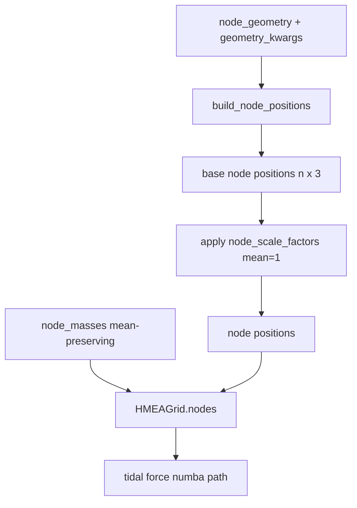

# WS3 — Alternative Node Geometries

Back to [deeper-exploration-roadmap.md](./deeper-exploration-roadmap.md). Phase 1.
Feeds the sweep ([overarching-sweep.md](./overarching-sweep.md)) and the anisotropy
diagnostic; figures via [graphs-from-scripts.md](./graphs-from-scripts.md).

## Motivation

The current external structure is a 26-node 3×3×3−1 cubic lattice (`HMEAGrid._create_
grid` in `cosmo/particles.py`): perfectly symmetric, so the tidal forces CANCEL at the
origin (traceless). PF2 says this traceless cancellation is exactly why symmetry-
breaking can't move the isotropic fit. The question: does a DIFFERENT geometry — more
nodes, a spherical SHELL (more sphere-like), denser lattices — yield a larger NET effect
while staying honest about the vacuum-traceless constraint?

**Honesty constraint up front:** for masses in vacuum the tidal tensor is traceless for
ANY arrangement, so no geometry will magically produce a large net isotropic
acceleration at the origin. The realistic gains are (a) a DIFFERENT shear/dipole pattern
(the PF2 signal), and (b) a different 2nd-order growth coupling at finite cloud size /
strong field. Judge geometries on those, not on a hoped-for isotropic-chi2 breakthrough.

## Plan: a node-geometry abstraction / factory

Replace the hard-coded `_create_grid` cube loop with a geometry FACTORY that returns
base node positions (before the existing per-node mass + radial-scale perturbations are
applied). HMEAGrid keeps applying `node_masses()` and `node_scale_factors()` on top, so
the symmetry-breaking knobs compose with ANY geometry.

```
def build_node_positions(geometry: str, S: float, **kwargs) -> np.ndarray:
    # returns (n_nodes, 3) base positions, all at characteristic scale ~S
```

### Geometries to support

| id | Description | Key kwargs |
|----|-------------|-----------|
| `cube26` | current 3×3×3−1 cubic lattice (DEFAULT, backward-compatible) | — |
| `cube_dense` | denser cubic lattice, e.g. 5×5×5−1 (124 nodes) | `n_per_side` |
| `shell` | nodes on a sphere of radius S (e.g. Fibonacci / icosahedral sphere points) | `n_nodes` |
| `shell_multi` | several concentric shells at radii ~S | `n_nodes`, `n_shells` |
| `fcc` / `bcc` | denser close-packed lattices | `n_shells` |

### Parametrization that threads cleanly

- `ExternalNodeParameters` / `SimulationParameters` gain a `node_geometry: str` (default
  `"cube26"`) + `geometry_kwargs: dict`. n_nodes becomes geometry-derived, not the fixed
  26, so `node_masses(n)` / `node_scale_factors(n)` already take `n` and still apply.
- `HMEAGrid._create_grid` calls `build_node_positions(...)` for base positions, then
  applies scale factors + masses exactly as now (order preserved so position/scale/mass
  vectors stay aligned).
- Numba tidal force path (`calculate_tidal_forces_numba`) already takes arbitrary
  `node_positions` / `node_masses` arrays — geometry is transparent to it.
- WS1 sweep adds geometry as an axis; cache key gains a geometry slug (see
  [overarching-sweep.md](./overarching-sweep.md)).
- Anisotropy diagnostic (`anisotropy_report.py`) runs per geometry so F7/F8/F12 show how
  shear/dipole differ by geometry.



## Invariants to preserve (per PF1/PF2)

- M=0 still == EdS for EVERY geometry (the geometry only sets node positions; at M=0 the
  tidal sum is zero regardless).
- Mean-preserving knobs stay mean-preserving for any n_nodes.
- A symmetric geometry (cube26, full shell) must keep shear ≈ noise at amplitude=0
  (sanity check: the geometry alone, with uniform masses, should not create spurious
  anisotropy beyond discreteness).
- Ω_Λ_eff bookkeeping: total external mass = n_nodes · M_ext_kg changes with node count;
  decide whether to hold TOTAL external mass fixed (rescale per-node mass by 26/n) or
  hold PER-NODE mass fixed, and document which, so geometry comparisons are apples-to-
  apples on Ω_Λ_eff. (Recommend holding total external mass fixed so Ω_Λ_eff stays
  comparable across geometries.)

## Implementation status (COMPLETE as of WS3 coding pass)

### Files added / modified
- **NEW `cosmo/node_geometry.py`** — `build_node_positions(geometry, S, **kwargs)` factory
  + `list_geometries()` + `effective_M_ext_kg()` helper. Registry-based; six geometries.
- **`cosmo/particles.py`** — `HMEAGrid._create_grid` replaced hard-coded cube loop with
  `build_node_positions` call; `n_nodes` set from actual geometry count.
- **`cosmo/constants.py`** — `node_geometry: str = "cube26"` + `geometry_kwargs: dict = {}`
  added to both `ExternalNodeParameters` and `SimulationParameters`; threaded into
  `external_params` in `_calculate_derived`.
- **`cosmo/parameter_sweep.py`** — `SweepConfig` gains `node_geometry` / `geometry_kwargs`;
  `build_cache_name` appends `{geo}geo` slug only when geometry != `"cube26"`.
- **`cosmo/cli.py`** — `--node-geometry` argument + threaded in `args_to_sim_params`.
- **NEW `tests/test_node_geometry.py`** — 53 tests, all pass.

### Geometries implemented
| id | nodes | kwargs |
|----|-------|--------|
| `cube26` | 26 | — (DEFAULT, byte-identical to old loop) |
| `cube_dense` | (n³-1), default n=5 → 124 | `n_per_side` (odd ≥3) |
| `shell` | default 50 | `n_nodes` |
| `shell_multi` | default 150 (50×3) | `n_nodes`, `n_shells` |
| `fcc` | ~54 (n_shells=2) | `n_shells` |
| `bcc` | ~26 (n_shells=2) | `n_shells` |

### Mass bookkeeping (DECIDED: hold per-node mean fixed)
`M_ext_kg` is the per-node mean mass. Total external mass = `n_nodes * M_ext_kg`.
For cross-geometry Ω_Λ_eff comparisons, use `effective_M_ext_kg(M_ref, n, ref_nodes=26)`
to rescale so total stays equal to 26 * M_ref. `node_masses(n)` and `node_scale_factors(n)`
already adapt to any n; no other change needed.

### Remaining (deferred to WS2 / graphs agent)
- F12 geometry-comparison figures (anisotropy diagnostic per geometry).
- Honest verdict on geometry vs cube26 on shear/dipole signal.

## Deliverables

- A geometry factory + registry, threaded through HMEAGrid + sweep + anisotropy.
- F12 geometry-comparison figures (net effect + shear per geometry).
- An honest verdict: does any geometry beat cube26 on the anisotropy signal / net
  effect, given the vacuum-traceless constraint?
