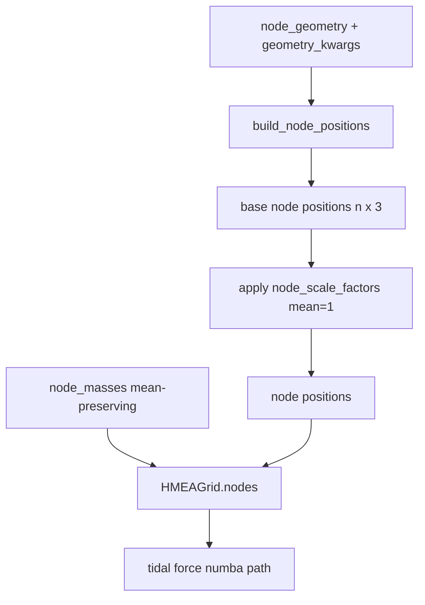

# WS3 — Alternative Node Geometries

Back to [deeper-exploration-roadmap.md](./deeper-exploration-roadmap.md). Phase 1.
Feeds the sweep ([overarching-sweep.md](./overarching-sweep.md)) and the anisotropy
diagnostic; figures via [graphs-from-scripts.md](./graphs-from-scripts.md).

## Motivation

The current external structure is a 26-node 3×3×3−1 cubic lattice (`HMEAGrid._create_
grid` in `cosmo/particles.py`): perfectly symmetric, so the tidal forces CANCEL at the
origin (traceless). PF2 says this traceless cancellation is exactly why symmetry-
breaking can't move the isotropic fit. The question: does a DIFFERENT geometry — more
nodes or a denser lattice — yield a larger NET effect while staying honest about the
vacuum-traceless constraint?

**PHYSICS REQUIREMENT — geometries must be VOLUME-FILLING (virialized).** The HMEA nodes
represent a *virialized meta-structure*: relaxed mass distributed throughout a 3D volume.
The cube lattice is the simplest such approximation. **Hollow spherical SHELLS are
explicitly excluded** — concentrating all mass on a sphere surface with an empty interior
is the OPPOSITE of a virialized structure (and, by Birkhoff, a continuous shell exerts no
interior force at all; see [../physics/theoretical-framework.md](../physics/theoretical-framework.md)).
Valid geometries: `cube26` (default), `cube_dense`, `fcc`, `bcc`, `virialized` —
all volume-filling. `virialized` is a NEW coupled (positions, masses) mass-segregated
generator (see "Virialized geometry" section below).

**Honesty constraint up front:** for masses in vacuum the tidal tensor is traceless for
ANY arrangement, so no geometry will magically produce a large net isotropic
acceleration at the origin. The realistic gains are (a) a DIFFERENT shear/dipole pattern
(the PF2 signal), and (b) a different 2nd-order growth coupling at finite cloud size /
strong field. Judge geometries on those, not on a hoped-for isotropic-chi2 breakthrough.

## Plan: a node-geometry abstraction / factory

Replace the hard-coded `_create_grid` cube loop with a geometry FACTORY that returns
base node positions (before the existing per-node mass + radial-scale perturbations are
applied). HMEAGrid keeps applying `node_masses()` and `node_scale_factors()` on top, so
the symmetry-breaking knobs compose with ANY geometry.

```
def build_node_positions(geometry: str, S: float, **kwargs) -> np.ndarray:
    # returns (n_nodes, 3) base positions, all at characteristic scale ~S
```

### Geometries to support

All VOLUME-FILLING (virialized). Hollow shells are excluded (see Motivation).

| id | Description | Key kwargs |
|----|-------------|-----------|
| `cube26` | current 3×3×3−1 cubic lattice (DEFAULT, backward-compatible) | — |
| `cube_dense` | denser cubic lattice, e.g. 5×5×5−1 (124 nodes) | `n_per_side` |
| `fcc` / `bcc` | denser close-packed lattices | `n_shells` |

### Parametrization that threads cleanly

- `ExternalNodeParameters` / `SimulationParameters` gain a `node_geometry: str` (default
  `"cube26"`) + `geometry_kwargs: dict`. n_nodes becomes geometry-derived, not the fixed
  26, so `node_masses(n)` / `node_scale_factors(n)` already take `n` and still apply.
- `HMEAGrid._create_grid` calls `build_node_positions(...)` for base positions, then
  applies scale factors + masses exactly as now (order preserved so position/scale/mass
  vectors stay aligned).
- Numba tidal force path (`calculate_tidal_forces_numba`) already takes arbitrary
  `node_positions` / `node_masses` arrays — geometry is transparent to it.
- WS1 sweep adds geometry as an axis; cache key gains a geometry slug (see
  [overarching-sweep.md](./overarching-sweep.md)).
- Anisotropy diagnostic (`anisotropy_report.py`) runs per geometry so F7/F8/F12 show how
  shear/dipole differ by geometry.



## Invariants to preserve (per PF1/PF2)

- M=0 still == EdS for EVERY geometry (the geometry only sets node positions; at M=0 the
  tidal sum is zero regardless).
- Mean-preserving knobs stay mean-preserving for any n_nodes.
- A symmetric geometry (e.g. cube26) must keep shear ≈ noise at amplitude=0
  (sanity check: the geometry alone, with uniform masses, should not create spurious
  anisotropy beyond discreteness).
- Fair-comparison normalization (DECIDED — see Mass bookkeeping below): hold PER-NODE mass
  fixed AND put each geometry's NEAREST node at the same S (`normalize_nearest`). Equal-
  TOTAL-mass rescaling is REJECTED: tidal stretch ~1/d³ is near-field dominated, so far
  nodes barely matter and dividing per-node mass by n/26 would wrongly weaken the near
  nodes that do the work.

## Implementation status (COMPLETE as of WS3 coding pass)

### Files added / modified
- **NEW `cosmo/node_geometry.py`** — `build_node_positions(geometry, S, **kwargs)` factory
  + `list_geometries()` + `effective_M_ext_kg()` helper. Registry-based; four
  volume-filling geometries (hollow `shell`/`shell_multi` were removed — not virialized).
- **`cosmo/particles.py`** — `HMEAGrid._create_grid` replaced hard-coded cube loop with
  `build_node_positions` call; `n_nodes` set from actual geometry count.
- **`cosmo/constants.py`** — `node_geometry: str = "cube26"` + `geometry_kwargs: dict = {}`
  added to both `ExternalNodeParameters` and `SimulationParameters`; threaded into
  `external_params` in `_calculate_derived`.
- **`cosmo/parameter_sweep.py`** — `SweepConfig` gains `node_geometry` / `geometry_kwargs`;
  `build_cache_name` appends `{geo}geo` slug only when geometry != `"cube26"`.
- **`cosmo/cli.py`** — `--node-geometry` argument + threaded in `args_to_sim_params`.
- **NEW `tests/test_node_geometry.py`** — node-count, byte-identical-cube26, volume-filling,
  mass-bookkeeping, cache-slug, threading, and shells-excluded tests; all pass.
- **`visualize_geometries.py`** — 3D scatter of all geometries →
  `results/figures/ws3/node_geometries.png`.

### Geometries implemented (all volume-filling / virialized)
| id | nodes | kwargs |
|----|-------|--------|
| `cube26` | 26 | — (DEFAULT, byte-identical to old loop) |
| `cube_dense` | (n³-1), default n=5 → 124 | `n_per_side` (odd ≥3) |
| `fcc` | ~86 (n_shells=2) | `n_shells` |
| `bcc` | ~386 (n_shells=2) | `n_shells` |
| `virialized` | exact `vir_n_nodes` (default 26) | `vir_*` (coupled positions+masses, mass-segregated — see Virialized section) |

`shell` / `shell_multi` were implemented then REMOVED: a hollow sphere of nodes is the
opposite of a virialized meta-structure (and Birkhoff → no interior force). Geometries
must fill the volume.

## Virialized geometry — COUPLED (positions, masses), mass-segregated (IMPLEMENTED)

`node_geometry="virialized"` is fundamentally different from the four lattices above:
it is the ONE geometry that returns POSITIONS AND MASSES TOGETHER, already paired
(mass i ↔ radius i), so it models a relaxed cluster where **more massive nodes sit
FURTHER from the centre** (mass segregation) and small nodes cluster near it. Every
other geometry gets positions from `build_node_positions` and masses INDEPENDENTLY from
`node_masses(n)`; virialized cannot use that path (it would lose the coupling), so:

- **`cosmo/node_geometry.py::build_virialized_grid(S, *, n_nodes, M_ext_kg, vir_extent,
  vir_mass_rule, vir_mass_spread, vir_segregation, vir_s_metric, seed) -> (positions
  (N,3), masses (N,))`** is the entry point. `build_node_positions("virialized", ...)`
  RAISES a `ValueError` pointing callers here (positions-only would be un-coupled).
- **`HMEAGrid._create_grid` branches** on `geometry == "virialized"`: it calls
  `params.build_virialized()` → uses the returned masses DIRECTLY (`node_masses()` /
  `node_mass_amplitude` are IGNORED on this branch; `vir_mass_spread` owns the mass
  distribution). `node_scale_factors()` (the `node_s_amplitude` radial jitter) STILL
  composes on top, mean-preserving, exactly as for every geometry.
- `list_geometries()` includes `"virialized"` (a sentinel builder registers the name).

### Parameters (on ExternalNodeParameters + SimulationParameters + SweepConfig + CLI)

| param | meaning | default |
|-------|---------|---------|
| `vir_n_nodes` | exact node count (NOT derived from lattice radius bounds) | 26 |
| `vir_extent` | continuous radial-RANGE multiplier: radii span `[0.5S, (0.5+extent)·S]` before the NN rescale, so range ratio = `1+2·extent` (extent=1→3, extent=2→5) | 1.0 |
| `vir_mass_rule` | `"radial"` (mass ~ f(r)) or `"massfunc"` (log-normal draw + segregate by rank) | `"radial"` |
| `vir_mass_spread` | amplitude of the node-mass distribution. **THE falsifiable knob**: 0 → uniform masses | 0.0 |
| `vir_segregation` | mass↔radius coupling strength [0,1]; 0 → decoupled | 1.0 |
| `vir_s_metric` | `"median"` or `"mean"` — which NN-spacing statistic the layout targets as S | `"median"` |
| `vir_relax_steps` | balance LEVEL in lattice mode (0 → realistic Fibonacci; >=1 → force-balanced lattice) OR the literal step COUNT in gradient mode (see below) | 1 |
| `vir_relax_mode` | `"lattice"` (Option A, analytic balance) or `"gradient"` (Option B, true iterative relaxation toward force equilibrium) | `"lattice"` |
| `vir_relax_rate` | gradient-descent step as a fraction of NN spacing (Option B only) | 0.1 |
| `vir_hold_outer_frac` | fraction of OUTERMOST nodes pinned during gradient descent (Option B only) | 0.3 |
| `vir_extent_couples_nodes` | item-10 coupling (see below). When True, `vir_extent` DRIVES `vir_n_nodes` (density-preserving `N = round(N0·extent³)`), making `vir_extent` meaningful in the force-balanced lattice mode. False = byte-identical; no-op at `vir_extent==1.0` | False |
| seed | `np.random.default_rng(node_mass_seed)` (one-seed coherence, like node_s_amplitude) | node_mass_seed |

### vir_extent_couples_nodes — extent DRIVES node count (item 10, density-preserving)

By default `vir_extent` is a radial-RANGE multiplier that ONLY shapes the realistic
(`vir_relax_steps=0`) Fibonacci layout; in the DEFAULT force-balanced lattice mode it
is a **no-op** (the lattice ball's radius derives from the node count, not the range).
`vir_extent_couples_nodes=True` (item 10: "a higher extent should imply MORE nodes,
like centerM") makes a larger extent auto-raise the node count to hold the ball
**density** constant, which ALSO makes `vir_extent` matter in the lattice mode (it now
changes how far the lattice ball reaches, via node count).

- **Density law (volume-filling ball):** the grid is a 3D ball, density `ρ = N/V`,
  `V = (4/3)π R³`; the realized reach `R` scales ~linearly with `vir_extent` (NN spacing
  is rescaled to S, range ratio `1+2·extent`). Holding `ρ` constant under `R ~ extent`
  ⇒ `N ~ extent³`. So `cosmo.node_geometry.extent_coupled_n_nodes(N0, extent) =
  max(1, round(N0 · extent³))`. Reference extent is the default 1.0, so at `extent=1.0`
  the factor is exactly 1.0 → node count (and the whole grid) UNCHANGED even when ON.
- **Applied at the top of `build_virialized_grid`** (before dispatch), so EVERY mode
  (force-balanced lattice / realistic Fibonacci / gradient Option B) sees the same
  density-preserving count. `_build_relaxed_grid`'s recursive call uses default-OFF
  coupling, so the count is never double-applied.
- **Numbers (base N0=64, lattice mode, coupling ON):** extent 1.0/1.5/2.0/3.0 →
  n_eff 64/216/512/1728; realized reach/S 2.45/3.74/5.10/7.81 (extent now drives reach);
  NN spacing/S == 1.0000 at every extent (spacing contract held); density `N/reach³`
  ≈ 4.35/4.12/3.86/3.63 (~constant, vs a ~27× drop for a fixed-count grid); center-only
  residual (center_k=8) ~1e-7…1e-6 ≪ 0.25 (still virialized at the core). Artifact:
  `_generate_extent_nodecount.py` → `results/figures/ws8/vir_extent_nodecount.{csv,png}`
  (gitignored).
- **Keyed == run:** threaded through BOTH sweep functions (`_make_sweep_config_for_cell`
  AND `_build_sim_params` in `sweep.py`); the coupling changes the BUILT grid's node
  count, not just the key. Cache sub-slug `1vxcouple` is appended ONLY for the
  virialized geometry AND only when the flag is True, so default virialized keys are
  untouched (NO `PHYSICS_CACHE_VERSION` bump). M_ext=0 == EdS preserved (node count
  doesn't matter when all masses are 0).

### vir_relax_mode + vir_relax_steps — Option A (lattice) vs Option B (gradient)

`vir_relax_mode` selects the balance approach (DEFAULT `"lattice"` = Option A,
byte-identical); `vir_relax_steps` is a BALANCE LEVEL in lattice mode and a literal STEP
COUNT in gradient mode.

- **Option A — `vir_relax_mode="lattice"` (DEFAULT):**
  - `vir_relax_steps=0` (REALISTIC): the Fibonacci-sphere segregated layout above
    (directions on a Fibonacci sphere, radii `[0.5S,(0.5+extent)S]`, NN-rescaled to S).
    A plausible *snapshot* of a relaxed cluster but NOT force-balanced — the CENTER-node
    residual is 25..275 and GROWS with grid size (massfunc slightly the lesser offender).
    vir_extent / vir_s_metric only shape THIS mode.
  - `vir_relax_steps>=1` (FORCE-BALANCED): an exact cubic-lattice ball, node AT the origin,
    masses by radius shell (antipodal nodes share a mass). CENTER residual ~1e-29 for BOTH
    `radial` AND `massfunc` → satisfies the criterion. Puts ONE node at r=0, so tests that
    need every node at non-zero radius use relax_steps=0.
- **Option B — `vir_relax_mode="gradient"`:** a TRUE iterative relaxation. Start from the
  realistic segregated blob and move each node down the net-force gradient — descend
  f=Σ|a_i|² (analytic gradient validated vs finite diff ~3e-6) via monotone backtracking
  over `vir_relax_steps` steps, with `vir_relax_rate` (step as a fraction of NN spacing,
  default 0.1) and `vir_hold_outer_frac` (fraction of OUTERMOST nodes pinned, default 0.3).
  Descending the POTENTIAL instead collapses the blob, which is why a naive "+a" step
  diverges.

**PHYSICS FINDING (re-grounded — the "irreducible monopole" hand-wave is DROPPED; this is
now empirical, measured with the CENTER-ONLY metric on a LARGE grid):** Option B genuinely
REDUCES the residual monotonically but does NOT reach center force-balance — radial n=500
275→**95**, massfunc n=500 96→**32**, both ~O(100×) above TOL=0.25, vs Option A's ~1e-29.
So a realistic relaxed blob is NOT virialized at the deep center; only the analytic lattice
is. The HMEA nodes are STATIC boundary conditions (a frozen virialized meta-structure
feeding the Progenitor node), so the symmetric lattice is the physically right realization
of "virialized". BOTH mass rules pass once on the lattice. Center-only metric + criterion +
the full Option A/B table:
[../physics/node-placement-vs-perturbation.md](../physics/node-placement-vs-perturbation.md),
[../plans/pinned-findings.md](../plans/pinned-findings.md) PF8.

### nearest_neighbour_spacing — the S definition

`nearest_neighbour_spacing(positions, metric)` (in `node_geometry.py`) = for each node
the distance to its CLOSEST other node, reduced by `metric` ("median"/"mean"). The
generator builds the raw radial profile then applies a SINGLE global factor so the
realized `nearest_neighbour_spacing(positions, vir_s_metric) == S` exactly. So `S` is the
TARGET characteristic spacing per the chosen metric (a pure global factor would cancel —
which is WHY `vir_extent` widens the RANGE rather than scaling it).

### Mean-preservation + falsifiable reductions (the contracts)

- **Mean-preserving:** raw masses are normalized `masses *= M_ext_kg / masses.mean()` so
  `mean(masses) == M_ext_kg` exactly (rtol 1e-12) → total = `N·M_ext_kg`, Ω_Λ_eff
  comparable (same contract as `node_masses`). `effective_M_ext_kg` is available for
  26·M_ref total parity but not forced.
- **Falsifiable:** `vir_mass_spread == 0` → all masses == M_ext_kg (uniform, both rules);
  `vir_segregation == 0` → mass/radius DECOUPLED (~0 correlation). With both 0 the grid is
  a clean "uniform masses, isotropic-ish positions" null. With spread>0 + segregation>0
  the mass-radius correlation is strongly POSITIVE (bigger mass → larger radius).
- **Directions** are a deterministic Fibonacci sphere (volume-filling, ≥2 distinct radii —
  never a hollow shell).
- **RNG isolation / determinism:** uses `default_rng(seed)` only; independent of global
  np.random and of the particle realization. Same (seed, params) → identical positions AND
  masses; different seed differs.

### M=0 == EdS (PF1) for virialized

Holds: geometry only sets node positions/masses, and at `M_ext_kg=0` all node masses are 0
(mean-preserving of 0), so the tidal sum is identically zero → pure-matter EdS. Asserted at
the force-path level in `tests/test_virialized_grid.py` (zero tidal acceleration on a test
cloud, both numba + numpy paths, both rules).

### Cache slug (NO PHYSICS_CACHE_VERSION bump)

`build_cache_name` appends `virializedgeo` (via the existing `!= "cube26"` branch) PLUS
virialized-only sub-slugs (`{vir_n_nodes}vn`, `{vir_extent}vx`, `{rule}vr`,
`{spread}vsp`, `{seg}vsg`, `{metric}vsm`, `{vir_relax_steps}vrx`), the Option-B slugs
(`{vir_relax_mode}vrm`, `{vir_relax_rate}vrr`, `{vir_hold_outer_frac}vho`) appended only
when NON-DEFAULT (so a default lattice-mode run keeps its existing key), plus `1vxcouple`
ONLY when `vir_extent_couples_nodes` is True. These are appended ONLY for virialized,
so every existing cube26/cube_dense/fcc/bcc key is UNTOUCHED and virialized lives at a
brand-new key → `PHYSICS_CACHE_VERSION` stays `v3`.

### Tests (all green)

- `tests/test_virialization_validation.py` (15) — the force-balance METRIC: `node_net_
  accelerations` shape/dtype + hand checks (symmetric-ring-is-null, 2-node sign, singularity
  floor), `virialization_residual` reads ~null on a symmetric ground truth, THE criterion on
  the big grid (n=100) — default (relax_steps>=1) max_residual << TOL=0.25 for BOTH rules,
  realistic (relax_steps=0) residual O(20-30) >> TOL (contrast), bigger grid stays balanced,
  determinism.
- `tests/test_virialized_grid.py` (88) — generator shapes/dtype/count, mean-preservation
  (both rules, several N), falsifiable reductions, positive segregation correlation,
  vir_extent range scaling (realistic mode), median/mean NN metric (realistic mode),
  determinism + global-RNG isolation, volume-filling, positions-only raises, NN-helper
  sanity, the `vir_relax_steps` BALANCE LEVEL (default force-balanced; balanced<<unbalanced;
  relax_steps=0 has no node at origin, relax_steps=1 puts one at origin), HMEAGrid
  coupled-branch threading (count, mean-preserving masses, masses-not-from-node_masses,
  node_s composition on realistic mode, M=0 zero-tidal EdS invariant), cube26 byte-identical
  opt-in, SimulationParameters / SweepConfig threading (incl. vir_relax_steps), cache-slug
  distinctness (incl. node_softening) + non-virialized-key regression.
- `tests/test_node_geometry_anisotropy.py` (128) — generalizes node POSITIONS + node MASSES
  + node_mass_amplitude + node_s_amplitude invariants (mean-preservation for ANY N, ray
  preservation, seeded determinism, separate-RNG-draw cross-knob independence) across
  cube26/cube_dense/fcc/bcc with each geometry's ACTUAL N, tightly checking the
  AFTER-amplitude node state (the previous tests were cube26-only).
- WS8 figures: `_generate_ws8_figs.py` + `tests/test_ws8_figs.py` (18) — see
  [../scripts/visualization.md](../scripts/visualization.md#ws8--virialized-grid-figures-_generate_ws8_figspy).

### Fair-comparison normalization (DECIDED: per-node mass fixed + nearest node at S)
`M_ext_kg` is the per-node mass; it is held FIXED across geometries (NOT rescaled to equal
total mass). To match the dominant near-field, `build_node_positions(..., normalize_nearest=
True)` rescales each geometry so its NEAREST node sits at S (cube26 is already there → no-op;
cube_dense ×2, fcc rescaled, bcc already at S). Pass it via `geometry_kwargs={"normalize_
nearest": True}` (threads through HMEAGrid + the sweep). Rationale: tidal stretch ~1/d³ is
near-field dominated, so the right control is "same per-node mass + same nearest distance",
NOT same total mass. `effective_M_ext_kg()` still exists but is NOT the chosen normalization
(kept only for an equal-total-mass view if ever wanted).

### Cross-geometry result (HONEST — sweeps/geometry_compare.json, 400p, isotropic, normalize_nearest)
**No geometry beats the cube.** F12 figure `results/figures/ws3/geometry_comparison_chi2.png`:
- `cube26` ≈ `cube_dense` everywhere (the denser cube's extra nodes barely change the fit).
- `fcc` is consistently the WORST (highest chi2); `bcc` between cube and fcc.
- Geometry only matters in the STRONG-field regime (small S): at M=1500/S=30 cube reaches
  chi2/dof≈0.52 (nearest LCDM 0.436) vs fcc 0.68, bcc 0.57; at S=40/50 all converge to
  ~0.66–0.69 (geom range <0.03) — far nodes don't matter, confirming the near-field argument.
- Growth factor is nearly geometry-independent (2.835–2.880); M/S set it, not geometry.
Conclusion: the cube (simplest virialized approximation) is also the best-fitting; alternative
volume-filling lattices give no isotropic improvement. The anisotropy (shear/dipole) per
geometry is a separate, still-open question (F7/F8 per geometry).

### Remaining
- F12 isotropic geometry comparison: DONE (above). Open: shear/dipole PER geometry (the PF2
  signal) — run anisotropy_report.py per geometry to see if any geometry changes the
  anisotropic signature even though it doesn't change the isotropic fit.
- Honest verdict on geometry vs cube26 on shear/dipole signal.

## Deliverables

- A geometry factory + registry, threaded through HMEAGrid + sweep + anisotropy.
- F12 geometry-comparison figures (net effect + shear per geometry).
- An honest verdict: does any geometry beat cube26 on the anisotropy signal / net
  effect, given the vacuum-traceless constraint?
