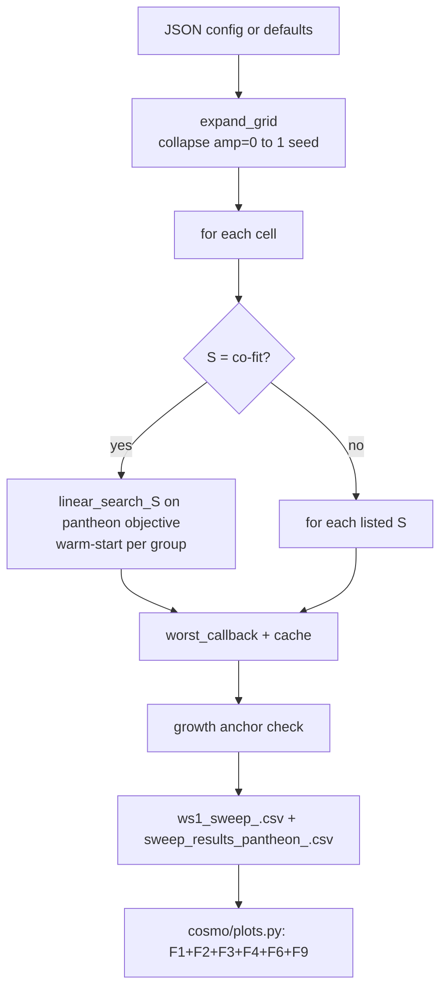

# WS1 — Overarching Multi-Parameter Sweep Tool

Back to [deeper-exploration-roadmap.md](./deeper-exploration-roadmap.md).
Phase 1. Depends on the geometry factory ([node-geometries.md](./node-geometries.md))
for the geometry axis; emits figures via [graphs-from-scripts.md](./graphs-from-scripts.md).

## Status: IMPLEMENTED

`sweep.py` is the single config-driven entrypoint. `pantheon_knob_sweep.py` is
retained as a legacy script for the 2-knob era; the new tool supersedes it.

## Architecture



## Parameters searched (all axes)

| Axis | Config key | Notes |
|------|-----------|-------|
| M_value | `M_values` | list of mass factors |
| S_value (Gpc) | `S_values` | `"co-fit"` => per-M linear search; or list of ints |
| node_mass_amplitude | `node_mass_amplitudes` | amp=0 collapse: single run per M |
| node_s_amplitude | `node_s_amplitudes` | per-node position anisotropy |
| node_mass_seed | `node_mass_seeds` | orientation seed |
| init_distribution | `init_distributions` | `"uniform_sphere"` or `"grf"` |
| particle count | `particle_count` | pinned via `_FixedSweepConfig` |
| node_geometry | `node_geometries` | `"cube26"` default; others add slug to cache key |

## CLI

```bash
python sweep.py                                     # built-in defaults
python sweep.py --config sweeps/coarse.json         # JSON config override
python sweep.py --probe-only                        # time 5 sims then exit
python sweep.py --plots-only results/ws1_sweep.csv  # regenerate figures, no sims
python sweep.py --tag my_run                        # custom CSV/figure prefix
```

## Config shape (JSON, all keys optional)

```json
{
  "M_values":            [100, 500, 1000, 5000],
  "S_values":            "co-fit",
  "s_min_gpc":           20,
  "s_max_gpc":           80,
  "node_mass_amplitudes":[0.0, 0.5],
  "node_s_amplitudes":   [0.0],
  "node_mass_seeds":     [42],
  "init_distributions":  ["uniform_sphere"],
  "node_geometries":     ["cube26"],
  "geometry_kwargs":     {},
  "s_cofit_method":      "linear",
  "particle_count":      400,
  "n_steps":             273,
  "t_start_Gyr":         2.9,
  "centerM":             1,
  "results_dir":         "results",
  "tag":                 "ws1"
}
```

## CSV columns

`results/ws1_sweep_<tag>.csv` — full factorial including all knob rows:
```
M_factor, S_gpc, centerM,
node_mass_amplitude, node_s_amplitude, node_mass_seed, init_distribution, node_geometry,
chi2_dof, chi2, chi2_lcdm, chi2_eds,
R2, n_sne_used, growth_factor, growth_target, anchor_ok, runaway,
match_avg_pct, diff_pct
```

`results/sweep_results_pantheon_<tag>.csv` — best-isotropic (amp=0) subset,
`load_best_config`-compatible (`hubble_diagram_nbody.py --from-best-config` works).

`chi2_lcdm` and `chi2_eds` are analytic reference values stamped on every row
(same value per run; used by the heatmap comparisons F2/F3).

## Figures emitted (ws1)

`results/figures/ws1/`:
- `ms_chi2_dof_heatmap_<tag>.png` — F1: chi2/dof vs Pantheon+ heatmap
- `ms_chi2_lcdm_<tag>.png` — F2: LCDM reference chi2/dof
- `ms_chi2_eds_<tag>.png` — F3: EdS null chi2/dof
- `growth_map_<tag>.png` — F4: growth factor over (M, S)
- `runaway_boundary_<tag>.png` — F9: bound/runaway frontier
- `mu_z_panel_M<M>_S<S>_<tag>.png` — F6: best-config mu(z) panel

## Key implementation notes

- `_FixedSweepConfig` subclass pins `particle_count` and `n_steps` so the
  `build_cache_name` slug always matches the actual sim.
- Grid groups cells by `(geometry, init, s_amplitude, amplitude, nm_seed)` and
  iterates M descending within each group, so the linear S co-fit warm-starts
  from the previous M's best S (fewer evaluations for closely-spaced M values).
- `chi2_lcdm` / `chi2_eds` are computed once analytically (no sim) from
  `cosmo.distances.model_distance_modulus` + `cosmo.hubble_diagram.evaluate_precomputed`.
- Cache is fully reused: existing `data/metrics_400_s42.csv` entries from
  `pantheon_knob_sweep.py` runs are read by `worst_callback` unchanged.

## First-exploration results (first_exploration tag, 2026-06-25)

Config: M=[100..50000], S=co-fit [20..90], amp=[0, 0.5], 400p/273steps/t_start=2.9.

- **LCDM reference**: chi2/dof = 0.4360  (1580 SNe)
- **EdS null**: chi2/dof = 0.8430
- **Best isotropic (amp=0)**: M=50000, S=89, chi2/dof=0.6775 — FLAT across M
  (M/S^3 degeneracy confirmed: chi2/dof range 0.6775..0.6923 across 9 M values)
- **Growth**: realized growth 2.84 vs target 3.30 (below anchor by ~14%)
- **amp=0.5**: runaways at M≥1000/S=20; M=200/S=20 gives 1.16, M=100/S=20 gives 0.83
- **Runaway cells**: 7/18 (all amp=0.5 at M≥1000 fell to s_min and failed anchor)

HONEST OBSERVATION: chi2/dof at 400p/273steps (~0.69) is higher than Stage-3
(2000p/300steps, chi2/dof~0.48). This is particle-count noise sensitivity — 400p
at S≥80 underestimates the effective dark energy. High-N convergence is WS6.
The M/S^3 degeneracy and near-EdS range at these S values (>80 Gpc) confirm the
degeneracy band exists but is displaced from near-LCDM region.

To find the near-LCDM region at 400p, need smaller S range (S=20..50) and/or
more M values in the mid-range (100..5000).

## Tests

`tests/test_overarching_sweep.py` — 33 fast unit tests (no sims):
- Config loading + JSON override
- Grid expansion: amp=0 collapse, total count, required keys
- CSV column contract: SWEEP_CSV_COLS ⊇ BEST_ISO_COLS
- Extra WS1 columns: chi2_lcdm, chi2_eds, growth_target, runaway
- `_FixedSweepConfig`: particle_count and n_steps pinned
- Cache-key uniqueness across geometry/init/amplitude/seed
- S co-fit vs explicit list selection
- --plots-only wiring
- load_best_config compatibility

## Next steps / known limitations

- The linear_search_S early-stop threshold (~0.025% match change) is tuned for
  the LCDM objective; on the pantheon flat landscape it can stop too early at
  large S. For a finer sweep use `--config sweeps/fine_grid.json` with explicit
  `"S_values": [30,35,40,...,70]` instead of "co-fit".
- Re-pin chi2/dof at 2000p to reconcile with Stage-3 numbers (WS6 is the
  high-N convergence workstream).
- Add `--refine` mode: coarse pass → auto-narrow S range → fine pass.
