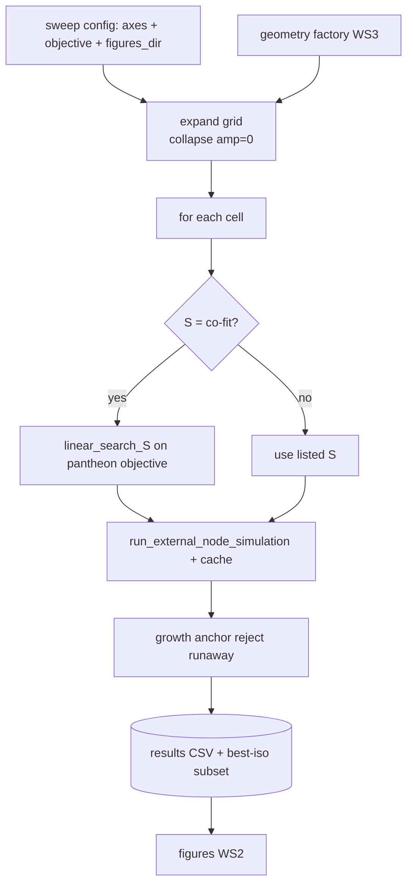

# WS1 — Overarching Multi-Parameter Sweep Tool

Back to [deeper-exploration-roadmap.md](./deeper-exploration-roadmap.md).
Phase 1. Depends on the geometry factory ([node-geometries.md](./node-geometries.md))
for the geometry axis; emits figures via [graphs-from-scripts.md](./graphs-from-scripts.md).

## Problem with today's tooling

Sweeps are ad-hoc and split across two code paths:
- `pantheon_knob_sweep.py` — hard-codes the M/S × amplitude × seed × init grid,
  collapses amplitude=0, writes two CSVs. Good for the 2-knob era.
- `cosmo/parameter_sweep.py` + `parameter_sweep.py` — the older LINEAR_SEARCH /
  TERNARY / BRUTE_FORCE machinery, with the per-M S co-fit that "was good" for the
  lcdm objective but is only partly wired for objective="pantheon".

This was manageable with 2 params (M, S). The deeper phase needs to search MANY params
TOGETHER: M, S, node_mass_amplitude, node_s_amplitude, node_mass_seed,
init_distribution, particle count, AND grid geometry (WS3). Hand-editing grids and
two divergent harnesses will not scale.

## Goal: ONE config-driven sweep tool

A single overarching sweep entry point that supersedes/absorbs the ad-hoc scripts. It
takes a CONFIG (file or CLI) describing the parameter grid and emits a tidy results CSV
(load_best_config-compatible) AND figures.

### Parameters it must search (the full axis set)

| Axis | Source today | Notes |
|------|--------------|-------|
| M_value | SweepConfig / knob sweep | mass factor |
| S_value (Gpc) | LINEAR_SEARCH / knob grid | the co-fit target — see below |
| node_mass_amplitude | SweepConfig.node_mass_amplitude | shear knob (PF2) |
| node_s_amplitude | SimulationParameters.node_s_amplitude | shear knob (PF2) |
| node_mass_seed | SweepConfig.node_mass_seed | orientation only (noisy) |
| init_distribution | SweepConfig.init_distribution | uniform_sphere / grf (WS5) |
| particle count | _SweepConfigFixed override | modest in P1; high in WS6 |
| **grid geometry** | NEW (WS3) | geometry id + geometry kwargs |

### Localized / finer grids (the per-M S co-fit)

The lcdm-objective `linear_search_S` co-fits S per M with adaptive stepping (~10-50x
fewer evals) and "was good". The pantheon-objective Stage-3 sweep already used
LINEAR_SEARCH on S per M (all configs passed the anchor because the S-search co-adjusts
S to keep growth physical). **Plan: bring that per-M S co-fit cleanly onto the
objective="pantheon" path as the DEFAULT inner loop**, so the tool, for each (M,
geometry, knobs), finds the growth-anchored S automatically instead of brute-forcing a
fixed S list. Then expose a "localized refine" mode: after a coarse pass, re-sweep a
FINE grid around the best region (finer M and S steps) to pin numbers — this is what
PF4 needs.

### Requirements

- **Config-driven**: a small config object/file lists each axis's values (or a
  range + step, or "co-fit" for S). No hand-editing of module constants per run.
- **Resumable / cached**: reuse the existing per-sim cache (`build_cache_name`,
  `worst_callback`, cache keys that already include objective + amplitude + init +
  geometry slugs). Skipping completed cells lets a long sweep resume after interruption.
  Cache keys MUST gain a geometry slug (WS3) so geometries never collide.
- **Tidy results CSV**: superset of today's `_KNOB_SUMMARY_COLS` plus geometry columns;
  the best-isotropic subset stays `load_best_config`-compatible (so
  `hubble_diagram_nbody.py --from-best-config` keeps working).
- **Figures**: the tool (or a sibling plotting entry point reading its CSV) emits every
  figure in [graphs-from-scripts.md](./graphs-from-scripts.md). "Produce the graph" is
  part of WS1's definition of done, not an afterthought.

### Proposed CLI / config shape (to be finalized in design)

```
python sweep.py --config sweeps/coarse.yaml          # full grid from config
python sweep.py --config sweeps/coarse.yaml --refine results/sweep.csv  # fine grid around best
python sweep.py --probe-only --config sweeps/coarse.yaml   # time N sims, estimate runtime
python sweep.py --plots-only results/sweep.csv       # regenerate figures from a CSV
```

Config (sketch — YAML or a Python dataclass): each axis is a list, a range spec, or
the literal `co-fit` (S only). `objective: pantheon`, `t_start`, `particles`,
`n_steps`, `geometry`, `figures_dir` live in the same config.



## How it supersedes the ad-hoc scripts

- `pantheon_knob_sweep.py` becomes a thin preset (a config file) over the new tool, or
  is retired once the new tool reproduces its two CSVs. Keep its CSV column contracts.
- The older `parameter_sweep.py` lcdm path stays for the LCDM-R² objective; the new
  tool focuses on objective="pantheon" but reuses `cosmo/parameter_sweep.py` internals
  (SearchMethod, worst_callback, compute_pantheon_metrics, the cache).

## Files this workstream touches

- NEW: an overarching sweep entry point (e.g. `sweep.py`) + a config schema.
- `cosmo/parameter_sweep.py` — wire per-M S co-fit fully onto objective="pantheon";
  add geometry + node_s_amplitude to SweepConfig and the cache key.
- `cosmo/factories.py` — thread the geometry choice into `run_external_node_simulation`.
- `pantheon_knob_sweep.py` — demote to a preset or retire (keep CSV contracts).
- Tests: extend `tests/test_parameter_sweep_pantheon.py` /
  `tests/test_pantheon_knob_sweep.py` for the new axes, co-fit-on-pantheon, geometry
  cache isolation, and CSV superset compatibility.

## Deliverables

- One config-driven sweep tool with resume + caching + co-fit-on-pantheon.
- A tidy results CSV (best-iso subset `load_best_config`-compatible).
- The full figure set (WS2) regenerable via `--plots-only`.
- The re-pinned canonical chi2 numbers (PF4) on ONE consistent kernel/anchor.
