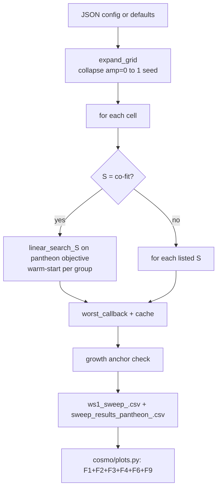

# WS1 — Overarching Multi-Parameter Sweep Tool

Back to [deeper-exploration-roadmap.md](./deeper-exploration-roadmap.md).
Phase 1. Depends on the geometry factory ([node-geometries.md](./node-geometries.md))
for the geometry axis; emits figures via [graphs-from-scripts.md](./graphs-from-scripts.md).

## Status: IMPLEMENTED — the SINGLE sweep driver

`sweep.py` is the ONE config-driven sweep driver. The two old root scripts are DELETED
and their coverage folded into `sweep.py` + JSON configs:
- root `parameter_sweep.py` (LCDM-objective grid) → `sweeps/lcdm_example.json`
  (`"objective": "lcdm"`). The LCDM objective is now a config key, not a separate script.
- `pantheon_knob_sweep.py` (GRF 2-knob factorial) → `sweeps/knob_grf.json`; its tests
  ported into `tests/test_overarching_sweep.py::TestKnobGrfMigration`.

`cosmo/parameter_sweep.py` (the LIBRARY: search algorithms, dataclasses,
`build_cache_name`) is KEPT and consumed by `sweep.py`.

## Architecture



## Parameters searched (all axes)

| Axis | Config key | Notes |
|------|-----------|-------|
| M_value | `M_values` | list of mass factors |
| S_value (Gpc) | `S_values` | `"co-fit"` => per-M linear search; or list of ints |
| node_mass_amplitude | `node_mass_amplitudes` | amp=0 collapse: single run per M |
| node_s_amplitude | `node_s_amplitudes` | per-node position anisotropy |
| node_mass_seed | `node_mass_seeds` | orientation seed |
| init_distribution | `init_distributions` | `"uniform_sphere"` or `"grf"` |
| particle count | `particle_count` | pinned via `_FixedSweepConfig` |
| node_geometry | `node_geometries` | `"cube26"` default; others add slug to cache key |
| virialized knobs | `vir_n_nodes`/`vir_extent`/`vir_mass_rule`/`vir_mass_spread`/`vir_segregation`/`vir_s_metric`/`vir_relax_steps` | consumed only when geometry=="virialized"; keyed==run guarded |
| virialized relax mode | `vir_relax_mode` (lattice/gradient) + `vir_relax_rate`/`vir_hold_outer_frac` | Option A vs Option B (gradient); keyed==run (Option B was UNREACHABLE before Section 7) |
| extent⇒node count | `vir_extent_couples_nodes` | default False; when on, vir_extent drives node count ~extent³ (PF14) |
| node softening | `node_softening_gpc` | 0.0 default (legacy floor, byte-identical); slingshot taming |
| close-encounter law | `node_force_law` (plummer/bounded) + `node_substep_threshold`/`node_substeps` | bounded "can't-cross-midpoint" + adaptive KDK substep; default OFF/byte-identical (PF9) |
| start size | `start_size_scale` | 1.0 default (byte-identical); initial-size/density lever |
| co-fit method | `s_cofit_method` (linear/ternary) | per-M S search; linear can pin at the S boundary |

## CLI

```bash
python sweep.py                                     # built-in defaults
python sweep.py --config sweeps/coarse.json         # JSON config override
python sweep.py --probe-only                        # time 5 sims then exit
python sweep.py --plots-only results/ws1_sweep.csv  # regenerate figures, no sims
python sweep.py --tag my_run                        # custom CSV/figure prefix
```

## Config shape (JSON, all keys optional)

```json
{
  "M_values":            [100, 500, 1000, 5000],
  "S_values":            "co-fit",
  "s_min_gpc":           20,
  "s_max_gpc":           80,
  "node_mass_amplitudes":[0.0, 0.5],
  "node_s_amplitudes":   [0.0],
  "node_mass_seeds":     [42],
  "init_distributions":  ["uniform_sphere"],
  "node_geometries":     ["cube26"],
  "geometry_kwargs":     {},
  "vir_n_nodes":         26,
  "vir_extent":          1.0,
  "vir_mass_rule":       "radial",
  "vir_mass_spread":     0.0,
  "vir_segregation":     1.0,
  "vir_s_metric":        "median",
  "vir_relax_steps":     1,
  "vir_relax_mode":      "lattice",
  "vir_extent_couples_nodes": false,
  "node_softening_gpc":  0.0,
  "node_force_law":      "plummer",
  "start_size_scale":    1.0,
  "s_cofit_method":      "linear",
  "objective":           "pantheon",
  "particle_count":      400,
  "n_steps":             273,
  "t_start_Gyr":         2.9,
  "centerM":             1,
  "results_dir":         "results",
  "tag":                 "ws1"
}
```

(vir_* keys are read only when a geometry is `"virialized"`; node_softening_gpc /
start_size_scale default to byte-identical no-ops.)

## CSV columns

`results/ws1_sweep_<tag>.csv` — full factorial including all knob rows:
```
M_factor, S_gpc, centerM,
node_mass_amplitude, node_s_amplitude, node_mass_seed, init_distribution, node_geometry,
chi2_dof, chi2, chi2_lcdm, chi2_eds,
R2, n_sne_used, growth_factor, growth_target, anchor_ok, runaway,
match_avg_pct, diff_pct
```

`results/sweep_results_pantheon_<tag>.csv` — best-isotropic (amp=0) subset,
`load_best_config`-compatible (`hubble_diagram_nbody.py --from-best-config` works).

`chi2_lcdm` and `chi2_eds` are analytic reference values stamped on every row
(same value per run; used by the heatmap comparisons F2/F3).

## Figures emitted (ws1)

`results/figures/ws1/`:
- `ms_chi2_dof_heatmap_<tag>.png` — F1: chi2/dof vs Pantheon+ heatmap
- `ms_chi2_lcdm_<tag>.png` — F2: LCDM reference chi2/dof
- `ms_chi2_eds_<tag>.png` — F3: EdS null chi2/dof
- `growth_map_<tag>.png` — F4: growth factor over (M, S)
- `runaway_boundary_<tag>.png` — F9: bound/runaway frontier
- `mu_z_panel_M<M>_S<S>_<tag>.png` — F6: best-config mu(z) panel

## Key implementation notes

- `_FixedSweepConfig` subclass pins `particle_count` and `n_steps` so the
  `build_cache_name` slug always matches the actual sim.
- Grid groups cells by `(geometry, init, s_amplitude, amplitude, nm_seed)` and
  iterates M descending within each group, so the linear S co-fit warm-starts
  from the previous M's best S (fewer evaluations for closely-spaced M values).
- `chi2_lcdm` / `chi2_eds` are computed once analytically (no sim) from
  `cosmo.distances.model_distance_modulus` + `cosmo.hubble_diagram.evaluate_precomputed`.
- Cache is fully reused: existing `data/metrics_400_s42.csv` entries (incl. ones from
  the old GRF-knob runs, now `sweeps/knob_grf.json`) are read by `worst_callback`
  unchanged — `PHYSICS_CACHE_VERSION` stays `v3` and all new knobs slug only when
  non-default.

## sweeps/*.json catalog (every config loads + expands — smoke-tested)

| config | purpose |
|--------|---------|
| `sweeps/lcdm_example.json` | LCDM-objective grid (replaces deleted root parameter_sweep.py) |
| `sweeps/knob_grf.json` | GRF 2-knob factorial (replaces deleted pantheon_knob_sweep.py) |
| `sweeps/knob_grf.json` etc. | (other exploration configs as authored) |
| `sweeps/virialized_final.json` | **WS1/W6 HEADLINE** — see below |
| `sweeps/core_v3/` (13 arms) + `core_v3_smoke.json` | the redesigned headline comparison (FEWER, HIGHER quality) — see below (results PENDING) |
| `sweeps/satellite_startsize/` (6) / `satellite_convergence/` (3) / `satellite_extent/` (3) | secondary SHAPE-study satellites — see below |

`tests/test_overarching_sweep.py::TestAllSweepConfigsLoadAndExpand` asserts every
committed top-level `sweeps/*.json` loads via `load_config` + `expand_grid` to >=1 cell
(it globs only top-level; the `core_v3/` and `satellite_*/` subdir arms are covered by the
dedicated `TestCoreV3Family` / `TestSatelliteFamilies`, and each `_manifest.json` is
excluded via the `[0-9]*` glob).

## sweeps/virialized_final.json — the WS1/W6 headline "doubly tamed" run

The big-enough force-balanced virialized + node-softened headline sweep. Selection =
min chi2/dof vs REAL Pantheon+ among anchor_ok rows (objective="pantheon"); chi2_lcdm
≈0.436 / chi2_eds ≈0.843 stamped per row as REFERENCE only.

- geometry `virialized`, `vir_relax_steps=1` (FORCE-BALANCED lattice; CENTER residual
  ~1e-29, both rules virialized), `vir_mass_rule="massfunc"` (log-normal draw +
  segregate-by-rank), `vir_mass_spread=0.8`, `vir_n_nodes=80`, `vir_segregation=1.0`,
  `vir_s_metric="median"`. (`vir_extent` is OMITTED — it is a NO-OP in the force-balanced
  lattice mode; the radial layering comes from `vir_n_nodes`. Use
  `vir_extent_couples_nodes` if you want extent to drive node count instead — PF14.)
- `node_softening_gpc=1.0` → "DOUBLY TAMED" (force-balanced geometry + 1 Gpc Plummer
  node softening collapses the runaway tail). `start_size_scale=1.0`, `centerM=1`.
- TIGHT near-LCDM band (PF4): M∈{200,500,1000,1500,3000}, S co-fit (linear) [20,45]
  (LOW S; high S is the wrong part of the landscape). Isotropic headline:
  `node_mass_amplitudes=[0.0]` (PF2: anisotropy is the falsifiable signal). 400p / 273
  steps / t_start=2.9 (the consistent kernel). RESUMABLE.

Command: `python sweep.py --config sweeps/virialized_final.json` (the orchestrator runs
this; numerical chi2/dof results to be pinned in pinned-findings.md once the run lands).

## Authoritative chi2 — figure == CSV (PF11)

The mu(z) figure annotation and the CSV chi2/dof are now the SAME number. A single
`_build_sim_params` builds SimulationParameters for BOTH the sim-callback and
`_generate_mu_z_panel` (which rebuilds the cell from the CSV row via `_cell_from_best_row`).
Previously the panel omitted node_geometry/vir_*/node_softening/start_size and re-ran a
cube26-no-softening sim, so a virialized cell annotated ~0.52 while the CSV held ~0.90 — a
keyed-but-not-run bug in the figure path. `_emit_chi2_reconciliation` requires CSV==figure
to <0.01 (verified |diff|=0.000000). ALWAYS quote the CSV value. Guarded by
`TestMuZPanelParamsMatchSim`.

## sweeps/core_v3/ — the redesigned headline comparison (config BUILT, results PENDING)

FEWER but HIGHER-quality sims, SUPERSEDING the deleted `comparison_v2/`. Answers the user's
items 2/8/9/10 (isolate variables, include a cube26 control) at production resolution. 13
arms (`NN_*.json` + `_manifest.json`) — one variable per arm, because geometry/softening/
force-law/relax-mode/init/particles are config-WIDE scalars in the driver (only M/geometry/
init are factorial).

**Quality knobs on every arm:** `particle_count=2000`, `n_steps=546` (dt~20 Myr, half the
old 273-step 40 Myr), S co-fit `[3..35]` `s_cofit_method="ternary"` (the B4 validation found
LINEAR was broken on pantheon — it pinned near s_max because `compute_pantheon_metrics`
zero-fills the match keys; ternary == brute; the linear early-stop is also fixed now),
`objective="pantheon"`, `vir_n_nodes=150` (above the 80 floor → finer mass function + deeper
interior).

**12 core arms** = 3 GRF geometries {cube26 control, virialized Option A lattice, Option B
gradient} × 3 MATCHED close-range treatments {none (plummer, no substep) / bounded+substep
(1 Gpc cap, threshold=2.0, substeps=8, Section-4 validated) / Plummer 1 Gpc} (01–09), PLUS
cube26 uniform_sphere × the same 3 treatments (10–12, the attribution control pricing the
GRF clustering cost on the cleanest geometry). M{1,5,10,35,100,300,1000} → **84 core cells**.
**Arm 13** = the B3a geometry-seed sweep (virA GRF bounded+substep, M{35,100,300} × seeds
{42,7,123,2024,99}, one cell per seed with distinct `<seed>virseed` keys) → **15 seed cells**.

### Satellites (secondary SHAPE studies, `sweeps/satellite_*/`)
Split out so they don't bloat the headline; each config-wide scalar is its own small arm,
MATCHED to the core cell otherwise:
- `satellite_startsize/` (6 arms, 18 cells) — `start_size_scale` ∈ {0.5,0.8,1.0,1.2,1.5,2.0}
  on virA GRF bounded+substep, M{35,100,300}, **1000p** (a shape study isolating a(t) vs
  start_size per PF10, NOT a converged band; scale=1.0 byte-identical).
- `satellite_convergence/` (3 arms, 3 cells) — `particle_count` ∈ {1000,2000,4000} on ONE
  cube26 GRF bounded+substep cell M=100. N IS the swept variable (the convergence CHECK), so
  2000+4000 are at FULL production resolution.
- `satellite_extent/` (3 arms, 6 cells) — `vir_extent` ∈ {1.0,1.5,2.0} with
  `vir_extent_couples_nodes=true` (node count ~extent³ per PF14: 150→{150,506,1200}), virA
  GRF bounded+substep, M{35,100}, **1000p** (node-particle force is O(N_part×N_nodes), so
  extent=2.0 at 1200 nodes is the expensive end).

### Runtime calibration — `_calibrate_runtime.py` (NO BLIND LAUNCH)
The user must NOT be surprised by a multi-day run. This script measures REAL per-sim
wall-time at 2000p/546 (cache bypassed) for each geometry {cube26, virA-150, virB-150} ×
treatment {none, plummer1, bounded+substep} (none/plummer have no substep → cheaper), then
PROJECTS hours per arm as `#cells × EVALS_PER_CELL × per-sim-seconds` (`EVALS_PER_CELL=7`, a
conservative upper bound; a ternary co-fit cell averages ~6.4 distinct-S sims). It writes
`results/runtime_projection.csv` (gitignored) + a printed table with CORE / SEED / satellite
/ GRAND-TOTAL subtotals. `--project-only` uses R4 fallback s/sim (no timing). **Run it BEFORE
the launcher.**

### Launch
DETACHED + RESUMABLE: `powershell -ExecutionPolicy Bypass -File .\launch_sweep_detached.ps1`
runs the arms in sequence via `Start-Process` (orphaned from Claude, survives a restart),
static argument vector `@('sweep.py','--config',$cfg)`, per-arm logs in `results/logs/`
(gitignored). **CORE-ONLY by default** (12 core arms + the seed arm); add `-IncludeSatellites`
to append the satellite arms (selected by switching between two hardcoded static arrays — the
flag cannot widen the set beyond literals). Resume = relaunch; `-NoResume` forces recompute.

**Results are a FLAGGED FOLLOW-ON (multi-day).** Until this completes, the cube26-vs-
virialized attribution, the low/fine M/S landscape, start-size/convergence/extent results,
and the final virialized chi2 band are PENDING — do NOT pin "virialized fits worse/better"
(see pinned-findings PF-PENDING). A 120p smoke (`core_v3_smoke.json`) confirmed the pipeline
only (virA M=100 chi2 reconciliation exact, keyed==run through bounded+substep + ternary),
NOT a result.

## First-exploration results (first_exploration tag, 2026-06-25)

Config: M=[100..50000], S=co-fit [20..90], amp=[0, 0.5], 400p/273steps/t_start=2.9.

- **LCDM reference**: chi2/dof = 0.4360  (1580 SNe)
- **EdS null**: chi2/dof = 0.8430
- **Best isotropic (amp=0)**: M=50000, S=89, chi2/dof=0.6775 — FLAT across M
  (M/S^3 degeneracy confirmed: chi2/dof range 0.6775..0.6923 across 9 M values)
- **Growth**: realized growth 2.84 vs target 3.30 (below anchor by ~14%)
- **amp=0.5**: runaways at M≥1000/S=20; M=200/S=20 gives 1.16, M=100/S=20 gives 0.83
- **Runaway cells**: 7/18 (all amp=0.5 at M≥1000 fell to s_min and failed anchor)

HONEST OBSERVATION: chi2/dof at S=80-90 sits at ~0.69 (far from near-LCDM),
because the M/S^3 degeneracy band at S>80 is NOT the near-LCDM band.
Near-LCDM requires smaller S (see targeted_near_lcdm sweep below).
The ~0.50 chi2 in older cache entries (metrics_400_s42.csv) came from a different
code/key format (those entries have n_sne_used=1339, not 1425); they do NOT
correspond to the current amp=0 flat-key. This is a lode correction.

## Targeted near-LCDM results (targeted_near_lcdm tag, 2026-06-25)

Config: M=[50, 200, 855, 1500, 3000], S=[20..60] explicit list,
amp=[0.0, 0.5], 400p/273steps/t_start=2.9. sweeps/targeted_near_lcdm.json.

- **LCDM reference**: chi2/dof = 0.4360  (1580 SNe)
- **EdS null**: chi2/dof = 0.8430
- **Growth target**: 3.304

**Best overall (all knobs, anchor_ok)**:
M=1500, S=55, amp=0.5, chi2/dof=0.4866 — near-LCDM band confirmed!
growth=2.990, anchor_ok=True.

**Best isotropic (amp=0, anchor_ok)**:
M=200, S=20: chi2/dof=0.5195, growth=2.88
M=1500, S=30: chi2/dof=0.5217, growth=2.88
M=3000, S=35: chi2/dof=0.5300, growth=2.87
M=855, S=25: chi2/dof=0.5322, growth=2.91
(M/S^3 degeneracy confirmed: very flat across M at matched S; best band 0.52-0.54)

**amp=0.5 results**:
M=855/S=45: chi2/dof=0.4887, M=1500/S=55: 0.4866 (best). These amplitude
configs sit between LCDM (0.436) and the isotropic floor (0.52). The amplitude
lever is a growth nudge per PF2/PF3 — it does NOT represent a clean independent
fit knob (anisotropy is the primary effect).

**Runaway cells**: 17/90
- M=855 at S=20, S=25: amp=0.5 runaways
- M=1500 at S=20, S=25: both amp=0 and amp=0.5 runaways
- M=3000 at S=20..45 (all amp variants): heavy runaways
- Runaway boundary: S_crit ∝ M^(1/3), confirmed (larger M → larger minimum S needed)

**Near-LCDM band at amp=0**: chi2/dof 0.52–0.54 for M=200-3000 at S=20-35.
Band is at lower S than first-exploration searched (S=20-35 vs S=80-90).

**Particle-count sensitivity (at best isotropic cells, amp=0)**:
M=200/S=20: 400p→0.5195, 1000p→0.5319, 2000p→0.5269 (within ~0.01, stable)
M=1500/S=30: 400p→0.5217, 1000p→0.5350, 2000p→0.5293 (within ~0.01, stable)
CONCLUSION: chi2/dof is stable across N=400..2000 at the low-S best configs.
The previous note "400p gives 0.69 vs 2000p gives 0.48" was a CONFIGURATION
artifact (that comparison used different M/S; the high-S region IS sensitive to N
but the low-S near-LCDM band is NOT). No large particle-count shift here.

**Geometry thread-through**: the earlier "shell vs cube26" comparison here was INVALID
on two counts and has been removed: (1) a bug had `sweep.py` keying cells by geometry
while always running `cube26`, so the "shell" row was actually cube26 physics (fixed —
see [../scripts/parameter-sweep.md](../scripts/parameter-sweep.md)); and (2) hollow
`shell`/`shell_multi` geometries were removed entirely (not virialized — see
[node-geometries.md](./node-geometries.md)). A fair CROSS-GEOMETRY comparison (now over
cube26 / cube_dense / fcc / bcc) still requires `effective_M_ext_kg()` normalization so
total external mass (hence Ω_Λ_eff) is equal across geometries — DEFERRED until that is
wired into the geometry sweep.

**Figures** (results/figures/ws1/):
- ms_chi2_dof_heatmap_targeted_near_lcdm.png
- ms_chi2_lcdm_targeted_near_lcdm.png
- ms_chi2_eds_targeted_near_lcdm.png
- growth_map_targeted_near_lcdm.png
- runaway_boundary_targeted_near_lcdm.png
- mu_z_panel_M1500_S55_targeted_near_lcdm.png  (best all-knobs)
- mu_z_panel_M200_S20_targeted_near_lcdm_iso_400p.png  (best isotropic 400p)
- mu_z_panel_M200_S20_targeted_near_lcdm_iso_2000p.png  (best isotropic 2000p)

## Tests

`tests/test_overarching_sweep.py` — fast unit tests (no sims):
- Config loading + JSON override
- Grid expansion: amp=0 collapse, total count, required keys
- CSV column contract: SWEEP_CSV_COLS ⊇ BEST_ISO_COLS
- Extra WS1 columns: chi2_lcdm, chi2_eds, growth_target, runaway
- `_FixedSweepConfig`: particle_count and n_steps pinned
- Cache-key uniqueness across geometry/init/amplitude/seed
- vir_* keyed==run threading (SweepConfig + SimulationParameters agree; slugs present)
- node_softening_gpc / start_size_scale keyed==run threading (default no-slug byte-identical)
- `TestForceLawSubstepRelaxModeThreading`: node_force_law / node_substep_* / vir_relax_mode
  (Option B) / vir_extent_couples_nodes keyed==run — incl. "Option B builds a different grid
  than Option A" (these four were keyed-but-not-run before Section 7)
- `TestMuZPanelParamsMatchSim`: the mu(z) panel params == the sim-callback params field by
  field for a virialized cell (every dropped knob non-default) — the PF11 figure↔CSV fix
- `TestCoreV3Family`: 12 core arms → 84 cells (+ seed arm → 15), quality knobs (2000p/546,
  M floor 1, S floor 3, ternary), geometry×treatment triad, distinct per-arm cache keys
- `TestSatelliteFamilies`: start_size (6 arms/18 cells) + convergence (3/3) + extent (3/6),
  matched knobs, start_size + vir_extent keyed==run, unique tags
- objective config key + `_select_best_row` (pantheon=min chi2, lcdm=max match)
- knob-grf migration (ported from deleted test_pantheon_knob_sweep.py)
- every committed top-level sweeps/*.json loads + expands (smoke)
- S co-fit vs explicit list selection
- --plots-only wiring
- load_best_config compatibility + reference chi2 (LCDM > 0.3, < 0.6; EdS > LCDM)

## Next steps / known limitations

- The linear_search_S early-stop threshold (~0.025% match change) is tuned for
  the LCDM objective; on the pantheon flat landscape it can stop too early at
  large S. For a finer sweep use `--config sweeps/fine_grid.json` with explicit
  `"S_values": [30,35,40,...,70]` instead of "co-fit".
- Re-pin chi2/dof at 2000p to reconcile with Stage-3 numbers (WS6 is the
  high-N convergence workstream).
- Add `--refine` mode: coarse pass → auto-narrow S range → fine pass.
