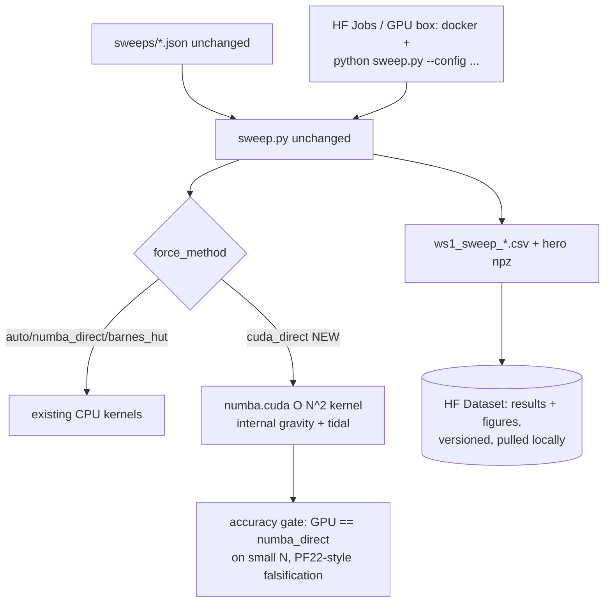

# WS7 — GPU + HuggingFace Scale-Out (TRIGGERED 2026-07-05)

Back to [deeper-exploration-roadmap.md](./deeper-exploration-roadmap.md). Phase 3.

## Status: trigger condition MET — design phase

The original gate ("scripts + numbers good, CPU convergence plateaued") is satisfied:
- WS1 sweep tool stable; figure layer uniform; authoritative chi2 (PF11).
- Headline geometry chosen and converged: the virialized MEDIUM (PF21), fit ~0.44
  converged in N (8k→32k), GRF seed, and mass split (PF23 ladder).
- The remaining questions are pure THROUGHPUT: wider seed × σ × M/S × init sweeps at
  ≥32k particles. One 32k/2500-step cell ≈ 1.5–4 h on the 8-core CPU (no local GPU);
  a meaningful sweep (hundreds of cells) is CPU-infeasible.

## Design (concrete, small-surface)

1. **`force_method="cuda_direct"`** — the knob infrastructure EXISTS (PF22: validated
   force_method on SimulationParameters → factories → SweepConfig → cache slug,
   keyed==run). Add the value + a `numba.cuda` module with the direct O(N²) internal
   kernel + the tidal node kernel. Direct-sum on GPU beats CPU-Barnes-Hut up to
   ~100k+ particles and is bit-checkable; BH stays the CPU fallback. NO sweep/config/
   CSV changes — a cloud runner invokes the same `python sweep.py --config`.
2. **Accuracy gate before trust**: cross-check `cuda_direct` vs `numba_direct` on the
   PF22 harness (identical cell, compare best_obs/growth/core/knot to ~1e-3) — the
   falsification methodology is already built.
3. **HuggingFace**:
   - **Dataset = durable results store** (original WS7 intent): push
     `results/ws1_sweep_*.csv`, `results/hero/*.npz`, figures per run tag; pull
     locally for `--plots-only` / `load_best_config`. Versioned + shareable.
   - **Compute = HF Jobs** (pay-per-use GPU, e.g. T4 ~$0.5/h, A10G ~$1–1.3/h) running
     a small Docker image (python + numba + cudatoolkit + repo). Alternatives if
     preferred: Colab Pro, Modal, Lambda — the runner is provider-agnostic since it
     is just `sweep.py --config` + an HF push at the end.
4. **Cost sanity**: a 32k direct-sum step ≈ 1e9 pair-forces ≈ ms-scale on a modern
   GPU → a 2500-step sim in minutes vs 1.5–4 h CPU → a ~300-cell sweep ≈ tens of
   GPU-hours ≈ $20–50. The cache/CSV resume logic already makes runs restartable.

## Open decisions (user)

- HF account + billing (or preferred provider) — blocks the compute half only; the
  Dataset store + the cuda_direct kernel can be built and gate-tested locally-ish
  (kernel correctness via simulator? numba.cuda.simulator is too slow for real runs
  but fine for unit tests; real GPU validation happens on the first cloud run).
- Which sweep goes first on GPU (proposed: medium seed×σ grid at 32k, the PF23
  follow-on).

## Non-goals

- No BH-on-GPU (complex, unnecessary at N ≤ ~100k for direct-sum GPU).
- No provider lock-in: HF Jobs preferred, but the runner is a plain CLI call.
