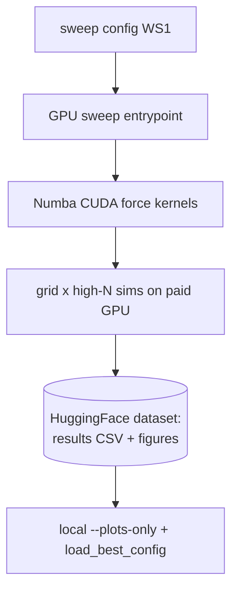

# WS7 — GPU + HuggingFace Scale-Out (FUTURE option, NOT now)

Back to [deeper-exploration-roadmap.md](./deeper-exploration-roadmap.md). Phase 3,
LAST. **Recorded as a future option only — do NOT build until the scripts + numbers are
good** (i.e. WS1-WS6 done, figures trustworthy, conclusions converged at the largest
feasible CPU N).

## When to trigger

Only "when scripts + numbers are good": the overarching sweep tool (WS1) is stable, the
figure layer (WS2) is uniform, the headline configs are chosen, and CPU/Barnes-Hut
convergence (WS6) has plateaued or hit a wall. At that point the remaining work is sheer
throughput — large grids × high N — which is a GPU job, not a code-design job.

## Constraint

The user has NO local GPU. Numba supports CUDA, so the existing JIT force kernels are a
plausible porting target for a rented/paid GPU. The plan is to run the sweep on a paid
GPU and persist results to a HuggingFace dataset.

## Rough shape (to design when triggered, not now)

- **HF dataset for results**: push the WS1 results CSV (+ figures) to a HuggingFace
  dataset so runs are versioned, shareable, and re-loadable locally by the existing
  `load_best_config` / `--plots-only` paths. The dataset is the durable artifact store.
- **GPU sweep entrypoint**: a thin wrapper that reuses the WS1 config + grid expansion +
  cache, but dispatches sims to a Numba-CUDA force path. Same CSV schema out, so local
  analysis/figures are unchanged.
- **Numba CUDA port**: port the hot force kernels (tidal + internal / Barnes-Hut) to
  `numba.cuda`. Cross-check GPU vs CPU `numba_direct` on small N for bit-comparable
  accuracy before trusting large GPU runs (mirror the WS6 θ accuracy gate).

## Explicit non-goals for NOW

- No CUDA code, no HF integration, no cloud entrypoint in this phase.
- This file exists so the option is captured and not re-derived later. Revisit only
  after WS1-WS6.

## Files a future implementation would touch

- NEW: a GPU sweep entrypoint + a `numba.cuda` force module.
- A HuggingFace dataset push/pull helper (results CSV + figures).
- Reuse WS1 config schema, grid expansion, cache, and CSV contracts unchanged.

## Deliverable (future)

- A reproducible large-grid × high-N sweep on a paid GPU, with results + figures in a
  versioned HuggingFace dataset, analyzable locally with the existing tools.
