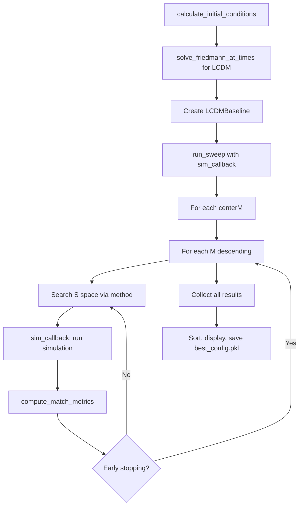

# Parameter Sweep

Grid search over M (mass factor), S (spacing), and centerM (center node mass) to find optimal LCDM match.

## Architecture

Logic split between:
- `cosmo/parameter_sweep.py` - reusable search algorithms, dataclasses, parameter builders
- `parameter_sweep.py` - script handling simulation setup, callback wiring, output formatting

## Core Types (cosmo/parameter_sweep.py)

```python
class SearchMethod(Enum):
    BRUTE_FORCE = 1
    TERNARY_SEARCH = 2
    LINEAR_SEARCH = 3

@dataclass
class SweepConfig:
    quick_search: bool = False      # 150 particles, 250 steps
    many_search: bool = False       # 1000 particles (vs 10000)
    search_center_mass: bool = True # search 3D: M x S x centerM
    t_start_Gyr: float = 3.8
    t_duration_Gyr: float = 10.0
    damping_factor: float = 0.98
    s_min_gpc: int = 15
    s_max_gpc: int = 60             # 100 if many_search
    save_interval: int = 10

@dataclass
class MatchWeights:
    hubble_curve: float = 0.05
    size_curve: float = 0.8
    endpoint: float = 0.1
    max_radius: float = 0.05

@dataclass
class SimResult:
    """Raw simulation output passed from callback"""
    size_curve_Gpc: np.ndarray
    hubble_curve: np.ndarray
    size_final_Gpc: float
    radius_max_Gpc: float
    a_final: float
    t_Gyr: np.ndarray
    params: Any

@dataclass
class LCDMBaseline:
    """Precomputed LCDM reference data"""
    t_Gyr: np.ndarray
    size_Gpc: np.ndarray
    H_hubble: np.ndarray
    size_final_Gpc: float
    radius_max_Gpc: float
    a_final: float

SimCallback = Callable[[int, int, int, int], SimResult]  # (M, S, centerM, seed)
```

## Parameter Space

**M (mass factor)**: 25 -> 25,000 x M_obs (100,000 if many_search)
- Fine increments near low M, coarse at high M
- List built descending (high->low) for optimization

**S (spacing)**: 15 -> 60 Gpc (100 if many_search)
- Integer increments

**centerM (center node mass)**: 1 -> 100 x M_obs
- Searched when search_center_mass=True

## Search Methods

### LINEAR_SEARCH (default)
For each M (descending), sweep S from previous best downward:
1. Start at S_max = prev_best_S (or s_max_gpc initially)
2. Evaluate S, S-1, S-2... until match decreases
3. Skip S values when match change <0.002% (adaptive stepping)
4. Stop M search when best S reaches minimum

Optimization: ~10-50x fewer evaluations than brute force

### TERNARY_SEARCH
Assumes unimodal match quality over S. Warm-starts from previous best S.
Faster than linear but may miss local optima.

### BRUTE_FORCE
Exhaustive grid: all M x all S x all centerM. Most thorough, slowest.

## Match Metric

Weighted average using last-half (5 Gyr) of curves:
```python
match_avg = (hubble_curve * 0.05) + (size_curve * 0.8) + (endpoint * 0.1) + (max_radius * 0.05)
```

Computed by `compute_match_metrics(sim_result, baseline, weights)`.

## Workflow



## Key Functions

**cosmo/parameter_sweep.py:**
- `build_m_list(many_search)` - returns descending M values
- `build_s_list(s_min, s_max)` - returns S range
- `build_center_mass_list(search_center_mass, many_search)` - returns centerM values
- `compute_match_metrics(sim_result, baseline, weights)` - returns match dict
- `ternary_search_S(...)` - ternary search for optimal S
- `linear_search_S(...)` - linear search with early stopping
- `brute_force_search(...)` - exhaustive evaluation
- `run_sweep(config, method, callback, baseline, weights)` - main entry

**parameter_sweep.py:**
- `sim_callback(M, S, centerM, seed)` - runs real simulation, returns SimResult

## Testing

`tests/test_parameter_sweep.py` - 37 tests using dummy callbacks:
- Parameter space builders
- Match metric computation
- Search algorithm correctness with unimodal callbacks
- Early stopping, adaptive skipping, boundary handling

Dummy callbacks create SimResult with predictable quality based on distance from optimal point, enabling search algorithm testing without real simulations.

## Output

**Console**: Progress updates, match percentages per config

**File**: `results/sweep_results.csv` - all evaluated configurations with columns:
- M_factor, S_gpc, centerM
- match_avg_pct, diff_pct, match_curve_pct, match_end_pct, match_max_pct, match_hubble_curve_pct
- a_ext, size_ext, desc

## Usage

```bash
python parameter_sweep.py
```

Edit script constants (SEARCH_METHOD, QUICK_SEARCH, MANY_SEARCH, SEARCH_CENTER_MASS) to change behavior.

## Best Known Configurations

| M x M_obs | S (Gpc) | Match% | Notes |
|-----------|---------|--------|-------|
| 855 | 25 | 99.4% | R^2>0.89 expansion rate |
| 97000 | 65 | 99%+ | High-mass solution |
| 69 | 15 | 99%+ | Low-mass solution |
