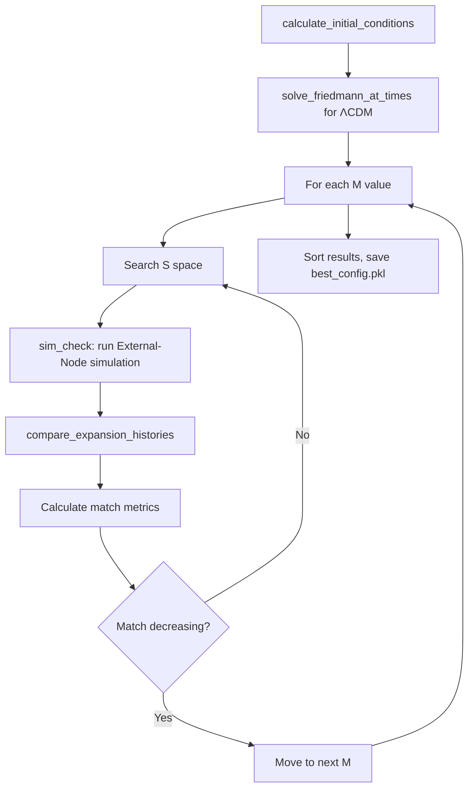

# Parameter Sweep

Grid search over M (mass factor) and S (spacing) to find optimal ΛCDM match.

## Configuration

```python
SEARCH_METHOD = SearchMethod.LINEAR_SEARCH  # Options: BRUTE_FORCE, TERNARY_SEARCH, LINEAR_SEARCH
QUICK_SEARCH = False   # True: 50 particles, 250 steps; False: 200 particles, 300 steps
MANY_SEARCH = True     # True: fine M increments; False: coarse increments
T_START_GYR = 3.8
T_DURATION_GYR = 10.0
DAMPING_FACTOR = 0.98
SAVE_INTERVAL = 10
```

## Parameter Space

**M (mass factor)**: 10 → 100,000 × M_obs
- Fine increments near low M, coarse at high M
- List built in reverse (high→low) for optimization

**S (spacing)**: 10 → 250 Gpc
- Integer increments

## Search Methods

### LINEAR_SEARCH (default)
For each M (descending), sweep S from previous best downward:
1. Start at S_max = prev_best_S (or 250 Gpc initially)
2. Evaluate S, S-1, S-2... until match decreases >0.025%
3. Skip S values when match change <0.002% (adaptive stepping)
4. Stop M search when best S reaches minimum (10 Gpc)

Optimization: ~10-50× fewer evaluations than brute force

### TERNARY_SEARCH
Assumes unimodal match quality over S. Warm-starts from previous best S.
Faster than linear but may miss local optima.

### BRUTE_FORCE
Exhaustive grid: all M × all S. Most thorough, slowest.

## Match Metric

Weighted average of four components:
```python
match_avg = (hubble_curve × 0.1) + (size_curve × 0.6) + (endpoint × 0.2) + (max_radius × 0.1)
```

All comparisons use last-half (5 Gyr) to focus on late-time acceleration.

## Workflow



## Output

**Console**: Progress updates, match percentages per config

**File**: `results/best_config.pkl` - dict with:
- M_factor, S_gpc, desc
- match_avg_pct, match_curve_pct, match_end_pct, match_max_pct, match_hubble_curve_pct
- diff_pct (100 - match_avg)
- params (ExternalNodeParameters object)

## Usage

```bash
python parameter_sweep.py
```

No CLI args. Edit script constants directly to change search behavior.

## Key Functions

- `sim(M, S, desc, seed)`: Run single simulation, return metrics dict
- `sim_check(M, S, desc)`: Wrapper calling sim with seed=42
- `ternary_search_S(M, ...)`: Ternary search for optimal S given fixed M
- Main loop: Iterates M values, searches S space per method

## Best Known Configurations

| M×M_obs | S (Gpc) | Match% | Notes |
|---------|---------|--------|-------|
| 855 | 25 | 99.4% | R²>0.89 expansion rate |
| 97000 | 65 | 99%+ | High-mass solution |
| 69 | 15 | 99%+ | Low-mass solution |
