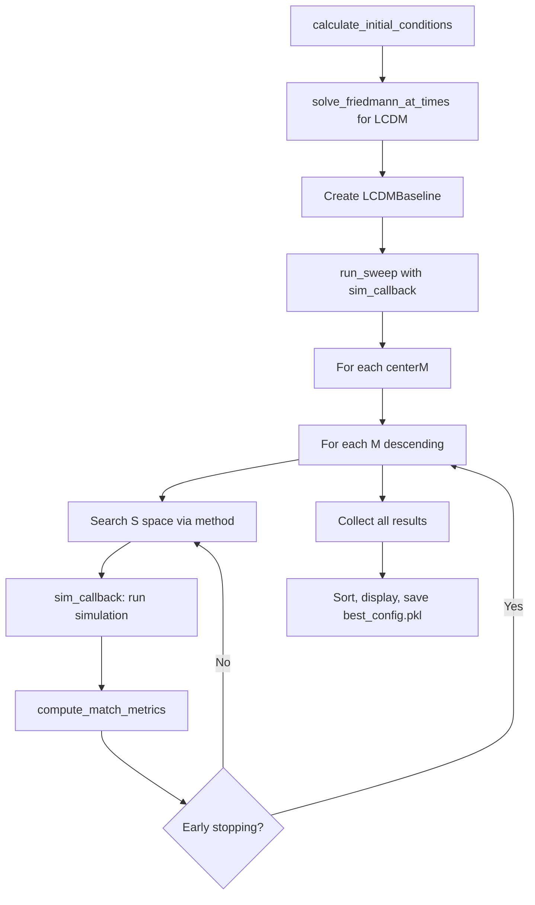

# Parameter Sweep

Grid search over M (mass factor), S (spacing), and centerM (center node mass) to find the best match.
Two scoring modes: `objective="lcdm"` (default, R^2 vs LCDM baseline) and `objective="pantheon"` (chi^2 vs real Pantheon+ data).

## Architecture

Logic split between:
- `cosmo/parameter_sweep.py` - reusable search algorithms, dataclasses, parameter builders
- `cosmo/factories.py` - shared simulation functions (solve_lcdm_baseline, run_external_node_simulation)
- `parameter_sweep.py` - script handling callback wiring, output formatting
- `run_simulation.py` - single-run CLI using same shared functions

Both `parameter_sweep.py` and `run_simulation.py` use shared functions from `cosmo/factories.py` to ensure identical simulation behavior.

## Core Types (cosmo/parameter_sweep.py)

```python
class SearchMethod(Enum):
    BRUTE_FORCE = 1
    TERNARY_SEARCH = 2
    LINEAR_SEARCH = 3

@dataclass
class SweepConfig:
    quick_search: bool = False      # 200 particles, 250 steps (else 2000 / 300)
    many_search: int = 3            # terms-per-decade granularity for M/centerM lists
    leet_search: bool = False       # 668 particles
    search_center_mass: bool = True # search 3D: M x S x centerM
    t_start_Gyr: float = 5.8
    t_duration_Gyr: float = 8.0     # t_start + t_duration = 13.8 (today)
    damping_factor: float = None
    s_min_gpc: int = 15
    s_max_gpc: int = 60
    save_interval: int = 10
    objective: str = "lcdm"         # "lcdm" or "pantheon"

@dataclass
class MatchWeights:  # USED by compute_avg (additive aggregate). Field names map
                     # to MATCH_METRIC_KEYS via key.replace('match_','').replace('_pct','')
    curve: float            # = SIZE_WEIGHT_VS_HUBBLE (250)
    curve_r2: float
    curve_rmse: float
    half_curve: float
    half_rmse: float
    max: float
    curve_error: float
    curve_error_max: float
    hubble_curve: float = 1
    hubble_curve_r2: float = 1
    hubble_rmse: float = 1
    hubble_half_curve: float = 0.5
    hubble_half_rmse: float = 0.5
    end: float              # = 10 * SIZE_WEIGHT_VS_HUBBLE
    hubble_end: float = 10
# NOTE: the old field names (size_curve/size_half_curve/endpoint/max_radius) are
# GONE — stale tests in test_parameter_sweep.py still reference them (pre-existing
# failure, out of scope).

@dataclass
class SimResult:
    """Raw simulation output passed from callback"""
    size_curve_Gpc: np.ndarray
    hubble_curve: np.ndarray
    t_Gyr: np.ndarray
    params: Any
    results: SimSimpleResult
    a_curve: Optional[np.ndarray] = None  # populated by results_to_sim_result; needed for pantheon objective

@dataclass
class LCDMBaseline:
    """Precomputed LCDM reference data"""
    t_Gyr: np.ndarray
    size_Gpc: np.ndarray
    H_hubble: np.ndarray
    size_final_Gpc: float
    radius_max_Gpc: float
    a_final: float

SimCallback = Callable[[int, int, int, List[int]], List[SimResult]]  # (M, S, centerM, seeds)
```

## Parameter Space

**M (mass factor)**: 25 -> 25,000 x M_obs (100,000 if many_search)
- Fine increments near low M, coarse at high M
- List built descending (high->low) for optimization

**S (spacing)**: 15 -> 60 Gpc (100 if many_search)
- Integer increments

**centerM (center node mass)**: 1 -> 100 x M_obs
- Searched when search_center_mass=True

## Search Methods

### LINEAR_SEARCH (default)
For each M (descending), sweep S from previous best downward:
1. Start at S_max = prev_best_S (or s_max_gpc initially)
2. Evaluate S, S-1, S-2... until match decreases
3. Skip S values when match change <0.002% (adaptive stepping)
4. Stop M search when best S reaches minimum

Optimization: ~10-50x fewer evaluations than brute force

### TERNARY_SEARCH
Assumes unimodal match quality over S. Warm-starts from previous best S.
Faster than linear but may miss local optima.

### BRUTE_FORCE
Exhaustive grid: all M x all S x all centerM. Most thorough, slowest.

## Match Metric

`MATCH_METRIC_KEYS` tuple (cosmo/parameter_sweep.py) is the single source of truth for individual metric keys. Used by `compute_match_metrics` return dict, early-stop check in `linear_search_S`, and `CSV_COLUMNS`.

`match_avg_pct` (lcdm objective) = `compute_avg(metrics)`, which defaults to the
ADDITIVE aggregate: weighted mean of `USED_MATCH_METRIC_KEYS` values, weights from
the `MatchWeights` dataclass (so MatchWeights IS used). `compute_avg` also has a
`multiplicative=True` branch (product of values clamped to [0,1]) but it is not
the default. `USED_MATCH_METRIC_KEYS` is currently set to all of `MATCH_METRIC_KEYS`
(several commented-out experimental subsets remain in the file). `diff_pct` = 100 - match_avg_pct.
For the pantheon objective, `match_avg_pct = 100/(1 + chi2_dof)` instead.

Metrics in `MATCH_METRIC_KEYS`:
- `match_curve_pct`: Full size curve match (match_pct from diagnostics)
- `match_half_curve_pct`: Second-half size curve (100 - rmse_pct)
- `match_end_pct`: Endpoint size match (+5 buffer if overshoots)
- `match_max_pct`: Max radius match
- `match_hubble_curve_pct`: Full Hubble curve (100 - rmse_pct from hubble diagnostics)
- `match_hubble_half_curve_pct`: Second-half Hubble curve (100 - rmse_pct)
- `match_curve_rmse_pct`: Full size curve (100 - rmse_pct)
- `match_curve_error_pct`: Full size curve (100 - mean_error_pct)
- `match_curve_r2`: R² coefficient from size curve diagnostics
- `match_curve_error_max`: Full size curve (100 - max_error_pct)

## Workflow


```mermaid
graph TD
    A[calculate_initial_conditions] --> B[solve_friedmann_at_times for LCDM]
    B --> C[Create LCDMBaseline]
    C --> D[run_sweep with sim_callback]
    D --> E[For each centerM]
    E --> F[For each M descending]
    F --> G[Search S space via method]
    G --> H[sim_callback: run simulation]
    H --> I[compute_match_metrics]
    I --> J{Early stopping?}
    J -->|No| G
    J -->|Yes| F
    F --> K[Collect all results]
    K --> L[Sort, display, save best_config.pkl]
```

## Scoring Objectives

### objective="lcdm" (default)
Scores each config by R^2/RMSE vs analytic LCDM baseline. Uses `compute_match_metrics(result, baseline, weights)`.
`match_avg_pct` = weighted aggregate of MATCH_METRIC_KEYS (product or weighted mean).

### objective="pantheon"
Scores each config by chi^2 of sim-derived mu(z) vs real Pantheon+ SNe. Uses `compute_pantheon_metrics(result, pantheon_data, t_start_Gyr)`.
- Requires `sim_result.a_curve` (full scale-factor array from the N-body)
- `match_avg_pct = 100 / (1 + chi2_dof)` — monotone-decreasing so existing max-by-match logic works
- Extra CSV keys: `chi2`, `chi2_dof`, `R2`, `n_sne_used`, `growth_factor`, `growth_target`
- baseline may be None; objective must include t_end=13.8 (t_start+t_duration=13.8)
- **Physical expansion anchor (REQUIRED for a meaningful sweep):** rejects any config whose total expansion `a_curve[-1]/a_curve[0]` deviates from the real `expected_growth_factor(t_start)` (~1+z(t_start)) by more than `GROWTH_ANCHOR_TOL=0.20`. Without it the sweep is degenerate — the floating-"today" renormalization lets runaway configs (e.g. M=100000 expanding ~25000x) fit the z-window and the "best fit" wanders to absurd M. See [../physics/hubble-diagram-nbody.md](../physics/hubble-diagram-nbody.md).
- Edge cases (None a_curve, <2 SNe in range, ValueError from kernel) return worst-case score (match_avg_pct=0, n_sne_used=0), do not raise.
- Cache key includes `lcdmobj` or `pantheonobj` suffix to prevent collisions between objectives.

## From-data sweep results (Stage 3, coarse grid, 200p/250steps, seed=42)
| M | S (Gpc) | chi2_dof | R2 | n_sne | notes |
|---|---------|----------|----|-------|-------|
| 2000 | 15 | 0.431 | 0.989 | 971 | best fit (limited z coverage) |
| 5000 | 15 | 0.434 | 0.991 | 1007 | 2nd best |
| 5000 | 40 | 0.461 | 0.997 | 1393 | good coverage |
Reference: LCDM analytic chi2_dof=0.436, R2=0.997 (1580 SNe); matter-only chi2_dof=0.517.

## Key Functions

**cosmo/parameter_sweep.py:**
- `build_m_list(many_search)` - returns descending M values
- `build_s_list(s_min, s_max)` - returns S range
- `build_center_mass_list(search_center_mass, many_search)` - returns centerM values
- `compute_match_metrics(sim_result, baseline, weights)` - LCDM scoring
- `compute_pantheon_metrics(sim_result, pantheon_data, t_start_Gyr)` - Pantheon+ chi^2 scoring
- `ternary_search_S(...)` - ternary search for optimal S
- `linear_search_S(...)` - linear search with early stopping
- `brute_force_search(...)` - exhaustive evaluation
- `run_sweep(config, method, callback, baseline, weights, pantheon_data)` - main entry

**parameter_sweep.py:**
- `sim_callback(M, S, centerM, seed)` - runs real simulation, returns SimResult

## Testing

`tests/test_parameter_sweep.py` - 36 tests using dummy callbacks (lcdm objective):
- Parameter space builders
- Match metric computation
- Search algorithm correctness with unimodal callbacks
- Early stopping, adaptive skipping, boundary handling

`tests/test_parameter_sweep_pantheon.py` - 15 hermetic tests (pantheon objective,
synthetic fixture + analytic-LCDM a_curve, no real sim):
- SimResult.a_curve optional + populated by results_to_sim_result
- compute_pantheon_metrics finite chi2/R2; worst-case fallback (None a_curve / 0 SNe)
- objective="lcdm" sweep unchanged
- End-to-end objective="pantheon" sweep (covers worst_callback pantheon branch +
  pantheon_data threading through run_sweep)
- Cache-key objective isolation: lcdm and pantheon cache keys are DISJOINT
  (each carries its '<objective>obj' suffix), so the two objectives never collide
  in the shared cache file.

Dummy callbacks create SimResult with predictable quality based on distance from optimal point, enabling search algorithm testing without real simulations.

NOTE (pre-existing, OUT OF SCOPE): `tests/test_parameter_sweep.py` has 3 known
failing tests unrelated to the objectives work — `TestMatchWeights.test_defaults`
and `test_weights_sum_to_one` reference old MatchWeights field names
(size_curve/endpoint/max_radius) that were renamed (curve/curve_r2/end/...), and
`test_build_s_list_range` asserts len 46 while `build_s_list(15,60)` now returns
41. These predate the Stage-3 work (which did not touch this test file).
Hermetic-cache caveat: those tests set a module-LOCAL `SKIP_CACHE = True` which
does NOT disable the real cache (worst_callback reads the module global), so they
do read/write `data/metrics_2000_s42*.csv`; the pantheon tests instead set
`cosmo.parameter_sweep.SKIP_CACHE` on the module object to stay truly hermetic.

## Output

**Console**: Progress updates, match percentages per config

**Files**:
- `results/sweep_results.csv` - all evaluated configurations
- `results/sweep_best_per_S.csv` - best (M, centerM) for each S value

CSV columns defined by `CSV_COLUMNS` constant (cosmo/parameter_sweep.py):
`[M_factor, S_gpc, centerM, match_avg_pct, diff_pct] + MATCH_METRIC_KEYS + [a_ext, size_ext, desc]`

## Usage

```bash
python parameter_sweep.py
```

Edit script constants (SEARCH_METHOD, QUICK_SEARCH, MANY_SEARCH, SEARCH_CENTER_MASS, OBJECTIVE) to change behavior.
Set `OBJECTIVE = "pantheon"` to score against real Pantheon+ data instead of LCDM.
Output CSVs: `results/sweep_results.csv` (lcdm) or `results/sweep_results_pantheon.csv` (pantheon).

## Best Known Configurations

| M x M_obs | S (Gpc) | Match% | Notes |
|-----------|---------|--------|-------|
| 855 | 25 | 99.4% | R^2>0.89 expansion rate |
| 97000 | 65 | 99%+ | High-mass solution |
| 69 | 15 | 99%+ | Low-mass solution |
