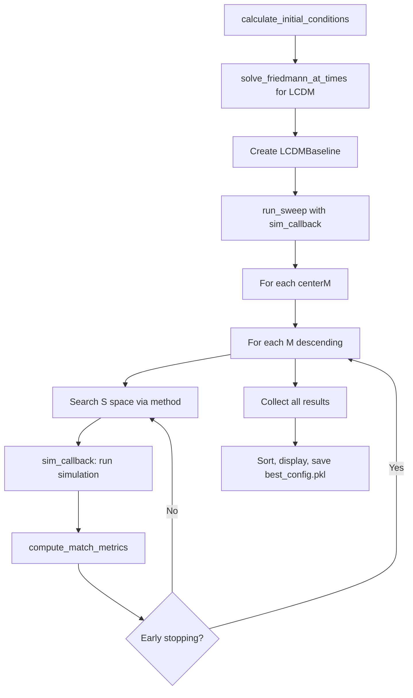

# Parameter Sweep

Grid search over M (mass factor), S (spacing), and centerM (outer-mass multiplier) to
find the best match. Two scoring objectives: `objective="pantheon"` (default in the
driver, chi^2 vs real Pantheon+ data) and `objective="lcdm"` (R^2 vs LCDM baseline).

## THE single driver: `sweep.py`

`sweep.py` (repo root) is the ONE config-driven sweep driver. The two old root
scripts were DELETED and their unique coverage folded into `sweep.py` + JSON configs:
- `parameter_sweep.py` (old LCDM-objective grid script) — DELETED. Its LCDM objective
  is now `"objective": "lcdm"` in a sweep config (`sweeps/lcdm_example.json`).
- `pantheon_knob_sweep.py` (legacy 2-knob GRF factorial) — DELETED. Its grid is now
  `sweeps/knob_grf.json`; its tests ported into `tests/test_overarching_sweep.py`.

`sweep.py` is documented in [../plans/overarching-sweep.md](../plans/overarching-sweep.md).
This file documents the underlying LIBRARY `cosmo/parameter_sweep.py` (search
algorithms, dataclasses, scoring, cache key) that `sweep.py` consumes.

## Architecture

Logic split between:
- `cosmo/parameter_sweep.py` - reusable search algorithms, dataclasses, parameter
  builders, `build_cache_name` (the LIBRARY — KEPT)
- `cosmo/factories.py` - shared simulation functions (solve_lcdm_baseline,
  run_external_node_simulation)
- `sweep.py` - the single config-driven sweep driver (callback wiring, grid expansion,
  resumable per-cell CSV checkpoint, figures)
- `run_simulation.py` - single-run CLI using the same shared functions

Both `sweep.py` and `run_simulation.py` use shared functions from `cosmo/factories.py`
to ensure identical simulation behavior.

## Core Types (cosmo/parameter_sweep.py)

```python
class SearchMethod(Enum):
    BRUTE_FORCE = 1
    TERNARY_SEARCH = 2
    LINEAR_SEARCH = 3

@dataclass
class SweepConfig:
    quick_search: bool = False      # 200 particles, 250 steps (else 2000 / 300)
    many_search: int = 3            # terms-per-decade granularity for M/centerM lists
    leet_search: bool = False       # 668 particles
    search_center_mass: bool = True # search 3D: M x S x centerM
    t_start_Gyr: float = 5.8
    t_duration_Gyr: float = 8.0     # t_start + t_duration = 13.8 (today)
    damping_factor: float = None
    s_min_gpc: int = 15
    s_max_gpc: int = 60
    save_interval: int = 10
    objective: str = "lcdm"         # "lcdm" or "pantheon" (sweep.py default: pantheon)
    node_mass_seed: int = 0         # per-node HMEA mass anisotropy (Deliverable B)
    node_mass_amplitude: float = 0.0  # 0.0 => uniform 26 nodes (backward compatible)
    node_geometry: str = "cube26"   # WS3 geometry axis
    # virialized-geometry knobs (consumed only when node_geometry=="virialized"):
    vir_n_nodes / vir_extent / vir_mass_rule / vir_mass_spread / vir_segregation /
    vir_s_metric / vir_relax_steps   # see node-geometries.md
    vir_relax_mode: str = "lattice"  # "lattice" (Option A) or "gradient" (Option B)
    vir_relax_rate / vir_hold_outer_frac      # gradient-descent knobs (Option B)
    vir_extent_couples_nodes: bool = False    # extent⇒node count (PF14); default off
    node_softening_gpc: float = 0.0  # Plummer node softening (0.0 = legacy hard floor)
    node_force_law: str = "plummer"  # "plummer" or "bounded" close-range law (PF9)
    node_substep_threshold / node_substeps    # adaptive KDK substep (default OFF)
    start_size_scale: float = 1.0    # initial-size/density lever (1.0 = byte-identical)

@dataclass
class MatchWeights:  # USED by compute_avg (additive aggregate). Field names map
                     # to MATCH_METRIC_KEYS via key.replace('match_','').replace('_pct','')
    curve: float            # = SIZE_WEIGHT_VS_HUBBLE (250)
    curve_r2: float
    curve_rmse: float
    half_curve: float
    half_rmse: float
    max: float
    curve_error: float
    curve_error_max: float
    hubble_curve: float = 1
    hubble_curve_r2: float = 1
    hubble_rmse: float = 1
    hubble_half_curve: float = 0.5
    hubble_half_rmse: float = 0.5
    end: float              # = 10 * SIZE_WEIGHT_VS_HUBBLE
    hubble_end: float = 10
# NOTE: the old field names (size_curve/size_half_curve/endpoint/max_radius) are
# GONE; test_parameter_sweep.py was reconciled to these current fields (the 3
# formerly-stale tests now pass).

@dataclass
class SimResult:
    """Raw simulation output passed from callback"""
    size_curve_Gpc: np.ndarray
    hubble_curve: np.ndarray
    t_Gyr: np.ndarray
    params: Any
    results: SimSimpleResult
    a_curve: Optional[np.ndarray] = None  # populated by results_to_sim_result; needed for pantheon objective

@dataclass
class LCDMBaseline:
    """Precomputed LCDM reference data"""
    t_Gyr: np.ndarray
    size_Gpc: np.ndarray
    H_hubble: np.ndarray
    size_final_Gpc: float
    radius_max_Gpc: float
    a_final: float

SimCallback = Callable[[int, int, int, List[int]], List[SimResult]]  # (M, S, centerM, seeds)
```

## Parameter Space

**M (mass factor)**: 25 -> 25,000 x M_obs (100,000 if many_search)
- Fine increments near low M, coarse at high M
- List built descending (high->low) for optimization

**S (spacing)**: 15 -> 60 Gpc (100 if many_search)
- Integer increments

**centerM (outer-mass multiplier, WS4)**: >= 1.0 (e.g. {1.0, 1.5, 2.0, 3.0})
- = total simulated mass / inner observable mass. >1.0 adds extra matter OUTSIDE
  the observable sphere; a(t) is measured on the inner region only. NOT a center
  density. Searched when search_center_mass=True (or via the `centerM` list in a
  sweep JSON). See [../physics/observable-mask-and-outer-mass.md](../physics/observable-mask-and-outer-mass.md).

## Search Methods

### LINEAR_SEARCH (default)
For each M (descending), sweep S from previous best downward:
1. Start at S_max = prev_best_S (or s_max_gpc initially)
2. Evaluate S, S-1, S-2... until match decreases
3. Skip S values when match change <0.002% (adaptive stepping)
4. Stop M search when best S reaches minimum

Optimization: ~10-50x fewer evaluations than brute force

### TERNARY_SEARCH
Assumes unimodal match quality over S. Warm-starts from previous best S.
Faster than linear but may miss local optima.

### BRUTE_FORCE
Exhaustive grid: all M x all S x all centerM. Most thorough, slowest.

### Co-fit early-stop is objective-aware; core sweep uses TERNARY (B4 validated)
`linear_search_S`'s early-stop "all worse" check keys on the metric the co-fit is
ACTUALLY optimizing for the active objective:
- `objective=="lcdm"` -> iterates `USED_MATCH_METRIC_KEYS` (the populated LCDM
  metric keys) — byte-identical to the historical behavior.
- otherwise (pantheon) -> keys on `('match_avg_pct',)`, i.e. `100/(1+chi2_dof)`,
  the same scalar the co-fit RANKS candidates by.

This fixes a prior correctness bug: `compute_pantheon_metrics` ZERO-FILLS
`USED_MATCH_METRIC_KEYS`, so the old key-loop compared `0<0` for every key, trips
the stop on the SECOND S, and linear pinned near `s_max` with an inflated chi2.
Now linear tracks the objective and finds the true optimum on the pantheon path.
(See `cosmo/parameter_sweep.py` `linear_search_S`, the `early_stop_keys` branch.)

VALIDATED one-off `_validate_cofit.py` (cube26/uniform, 400p/273, core range
`build_s_list(3,35)` -> `[3..30]`, authoritative `compute_pantheon_metrics` via
`worst_callback`): for the near-LCDM cell M=100 and stronger-field M=300, BRUTE
(ground truth) finds S=17 (chi2/dof 0.5093) and S=21 (0.5095); TERNARY **and now
LINEAR** both land EXACTLY on brute (dS=0, dchi2=0.0000). No pinning.
The core sweep co-fit method is **ternary** (per decisions-v2: exact here AND
cheaper than brute); the linear fix makes the DEFAULT method safe for legacy/other
configs. `tests/test_cofit_validation.py` guards both: a synthetic convex bowl on
the LCDM path (brute hits the known minimum; the three methods agree within one
grid step) AND a pantheon-objective regression (`TestLinearSearchPantheonEarlyStop`
— a zero-filled-keys convex bowl; linear must hit brute within one step and NOT
pin at s_max; FAILS pre-fix). Note `build_s_list` floors the grid at the first
"nice" value (e.g. (15,60)->starts at 20), which is why a boundary optimum is
reported at `s_list[0]`.

## Match Metric

`MATCH_METRIC_KEYS` tuple (cosmo/parameter_sweep.py) is the single source of truth for individual metric keys. Used by `compute_match_metrics` return dict, early-stop check in `linear_search_S`, and `CSV_COLUMNS`.

`match_avg_pct` (lcdm objective) = `compute_avg(metrics)`, which defaults to the
ADDITIVE aggregate: weighted mean of `USED_MATCH_METRIC_KEYS` values, weights from
the `MatchWeights` dataclass (so MatchWeights IS used). `compute_avg` also has a
`multiplicative=True` branch (product of values clamped to [0,1]) but it is not
the default. `USED_MATCH_METRIC_KEYS` is currently set to all of `MATCH_METRIC_KEYS`
(several commented-out experimental subsets remain in the file). `diff_pct` = 100 - match_avg_pct.
For the pantheon objective, `match_avg_pct = 100/(1 + chi2_dof)` instead.

Metrics in `MATCH_METRIC_KEYS`:
- `match_curve_pct`: Full size curve match (match_pct from diagnostics)
- `match_half_curve_pct`: Second-half size curve (100 - rmse_pct)
- `match_end_pct`: Endpoint size match (+5 buffer if overshoots)
- `match_max_pct`: Max radius match
- `match_hubble_curve_pct`: Full Hubble curve (100 - rmse_pct from hubble diagnostics)
- `match_hubble_half_curve_pct`: Second-half Hubble curve (100 - rmse_pct)
- `match_curve_rmse_pct`: Full size curve (100 - rmse_pct)
- `match_curve_error_pct`: Full size curve (100 - mean_error_pct)
- `match_curve_r2`: R² coefficient from size curve diagnostics
- `match_curve_error_max`: Full size curve (100 - max_error_pct)

## Workflow


```mermaid
graph TD
    A[calculate_initial_conditions] --> B[solve_friedmann_at_times for LCDM]
    B --> C[Create LCDMBaseline]
    C --> D[run_sweep with sim_callback]
    D --> E[For each centerM]
    E --> F[For each M descending]
    F --> G[Search S space via method]
    G --> H[sim_callback: run simulation]
    H --> I[compute_match_metrics]
    I --> J{Early stopping?}
    J -->|No| G
    J -->|Yes| F
    F --> K[Collect all results]
    K --> L[Sort, display, save best_config.pkl]
```

## Scoring Objectives

### objective="lcdm" (default)
Scores each config by R^2/RMSE vs analytic LCDM baseline. Uses `compute_match_metrics(result, baseline, weights)`.
`match_avg_pct` = weighted aggregate of MATCH_METRIC_KEYS (product or weighted mean).

### objective="pantheon"
Scores each config by chi^2 of sim-derived mu(z) vs real Pantheon+ SNe. Uses `compute_pantheon_metrics(result, pantheon_data, t_start_Gyr)`.
- Requires `sim_result.a_curve` (full scale-factor array from the N-body)
- `match_avg_pct = 100 / (1 + chi2_dof)` — monotone-decreasing so existing max-by-match logic works
- Extra CSV keys: `chi2`, `chi2_dof`, `R2`, `n_sne_used`, `growth_factor`, `growth_target`
- baseline may be None; objective must include t_end=13.8 (t_start+t_duration=13.8)
- **Physical expansion anchor (REQUIRED for a meaningful sweep):** rejects any config whose total expansion `a_curve[-1]/a_curve[0]` deviates from the real `expected_growth_factor(t_start)` (~1+z(t_start)) by more than `GROWTH_ANCHOR_TOL=0.20`. Without it the sweep is degenerate — the floating-"today" renormalization lets runaway configs (e.g. M=100000 expanding ~25000x) fit the z-window and the "best fit" wanders to absurd M. See [../physics/hubble-diagram-nbody.md](../physics/hubble-diagram-nbody.md).
- Edge cases (None a_curve, <2 SNe in range, ValueError from kernel) return worst-case score (match_avg_pct=0, n_sne_used=0), do not raise.
- Cache key includes `lcdmobj` or `pantheonobj` suffix to prevent collisions between objectives.

### Physics-version cache token (REQUIRED — guards against stale-physics reuse)
The metrics/results cache (`data/metrics_*.csv`) is keyed on PARAMETERS only, which
is unsafe across a physics change: the SAME (M,S,centerM,particles,steps,seeds,
objective) tuple computed under different sim physics (e.g. EdS-consistent ICs +
pre-start boost vs the legacy calibrated ICs) would silently reuse the old entry and
return STALE chi2/results. `build_cache_name` therefore ALWAYS appends a physics token
`physics_cache_token(config)` as the LAST key part:
- `PHYSICS_CACHE_VERSION` (module constant in `cosmo/parameter_sweep.py`, currently
  `"v3"`) is a MANUALLY-BUMPED token. **Bump it whenever a change alters a(t) for a
  fixed parameter tuple** (ICs, force law, boost, integrator, softening). v1=legacy
  calibrated ICs; v2=EdS-consistent ICs + pre-start tidal boost; v3=WS4 centerM
  repurposed as outer-mass multiplier + softening frozen at the centerM=1 baseline
  (centerM>1 a(t) differs from v2's softening-only centerM; centerM=1 a(t) is
  byte-identical but the bump retires all v2 entries uniformly).
- The centerM slug is `{float(centerM)}centerM` (fixed from the old `int(centerM)`
  truncation that collided 1.5→1); `outer_density_ceiling != 1.0` appends a
  `{ceiling}ceil` slug (default 1.0 adds nothing). See
  [../physics/observable-mask-and-outer-mass.md](../physics/observable-mask-and-outer-mass.md).
- It also folds in the physics-affecting IC flags `eds_consistent` /
  `pre_start_tidal_boost` (now `SweepConfig` fields, default True): a legacy
  `eds_consistent=False` run gets a DISTINCT key (`...physv3noeds`) so it can never
  collide with a current run at the same params.
- Token shape `phys<ver>[<flags>]` (e.g. `physv3`) round-trips cleanly through
  `Cache._split_key`/`_join_key`. SKIP_CACHE still bypasses caching entirely.
- Tests: `tests/test_parameter_sweep_pantheon.py::TestPhysicsCacheVersionToken`
  (token in key, different version → disjoint key, legacy flags → distinct key,
  CSV round-trip) + the objective-isolation test asserts the trailing token.
- The stale pre-token `data/metrics_*.csv` were CLEARED; caches regenerate on demand.

### Sweepable per-node HMEA mass anisotropy (Deliverable B)
`SweepConfig.node_mass_seed` / `node_mass_amplitude` thread to
`ExternalNodeParameters.node_masses()` (mean-preserving log-normal; details in
[../physics/force-calculations.md](../physics/force-calculations.md)). `amplitude=0.0`
(default) => uniform, byte-identical to legacy. Total external mass is fixed exactly
(mean-preserving), and `amplitude`/`node_mass_seed` do NOT perturb the particle
realization (independent default_rng, drawn after the cloud — guarded by
`tests/test_node_masses.py::TestSimPathNodeMassInvariants`).

VERIFIED CAVEAT (corrects an earlier overstatement): `amplitude>0` does NOT leave the
realized expansion fixed. The traceless/shear argument holds only to LINEAR order. When
the tidal field is strong (small S / large M) the mass variance back-reacts on the bulk
RMS-radius a(t) at second order, RAISING the realized growth factor (e.g. M=1000,S=50:
growth 3.078→3.191 as amp 0→0.75). At weak tidal field (e.g. M=50,S=80) growth and
chi2/dof are flat across amplitude — there `amplitude` does select shear/dipole
orientation only. So for the Pantheon objective amplitude is **degenerate with M/S via
growth**, not an independent fit knob; the headline number must stay the best ISOTROPIC
config. See [../physics/pantheon-comparison-results.md](../physics/pantheon-comparison-results.md).
**Cache key:** `build_cache_name` appends `<seed>nmseed_<amp>nmamp` slugs ONLY when
`amplitude != 0.0`, so uniform runs keep their existing cache keys.
**Virialized geometry-seed (B3a):** for `node_geometry=="virialized"` AND
`vir_mass_rule=="massfunc"` AND `vir_mass_spread>0`, `node_mass_seed` ALSO drives the
log-normal mass draw + segregation permutation, so the key gets a `<seed>virseed` slug
EVEN at `amplitude==0` (otherwise two seeds collided on one cache entry and silently
returned the same a(t)). The radial rule, `spread==0`, and non-virialized geometries
add NO virseed slug (deterministic / no RNG -> byte-identical keys). The matching
`expand_grid` branch emits one cell per seed for exactly this case (no amp=0 collapse).

### Sweepable init_distribution
`SweepConfig.init_distribution` (default `"uniform_sphere"`) is threaded into
`SimulationParameters` by `sweep.py::_make_sim_callback`. `build_cache_name` appends `<init>init` slug ONLY when
`init_distribution != "uniform_sphere"`, so existing uniform_sphere cache keys are
unchanged. `"grf"` runs get distinct keys and NEVER collide with uniform_sphere.
Physics (now characterized, PF12): chi2/dof is clustering-INSENSITIVE in the WEAK-field
regime (grf==uniform at M=100/S=60), but in the STRONG-field band clustering genuinely
shifts the bulk a(t) (M=1500/S=30: uniform 0.526 vs grf-sphere 0.84). GRF defaults to
`support="sphere"` so the only difference vs uniform is clustering, not cube-corner mass.
Do NOT claim grf==uniform unconditionally.

**GRF support is its own cache axis (keyed==run).** Because the `sample_grf` default
changed box->sphere (a(t) CHANGED for the fixed tuple `init_distribution="grf"`),
`SweepConfig.grf_support` (default `"sphere"`, JSON key `grf_support`) is threaded into the
sim via `_build_sim_params` as `init_kwargs={"support": ...}` (grf runs only; uniform_sphere
keeps `init_kwargs=None` -> byte-identical). `build_cache_name` encodes support ONLY for grf
AND ONLY for the NEW `"sphere"` support: it appends a `sphsup` token. The LEGACY `"box"`
keeps the pre-existing BARE `..._grfinit_...` key, so any pre-fix on-disk cache (computed
with box support) stays correctly addressed AS box and is NOT served for the new sphere
default; sphere gets a distinct key and recomputes. `PHYSICS_CACHE_VERSION` stays `"v3"` (NO
bump — bumping would needlessly invalidate the byte-identical uniform_sphere caches). The
support value that keys the cache is the SAME value the sampler uses (keyed==run).

### Sweepable node_geometry (WS3) — MUST be threaded into the sim, not just the key
`SweepConfig.node_geometry` / `geometry_kwargs` and `node_s_amplitude` are passed into
`SimulationParameters` by `sweep.py::_make_sim_callback`. `build_cache_name` appends a
`<geom>geo` slug only for non-`cube26` geometries. INVARIANT: anything that
distinguishes the cache key MUST also reach the actual sim — a prior bug had `sweep.py`
keying cells by `node_geometry` while always running `cube26`, so an `fcc`/`bcc` cell
silently produced cube26 physics cached under an `fccgeo` key (now guarded keyed==run).

The `virialized` geometry adds the SAME-pattern threading: `SweepConfig` carries
`vir_n_nodes`/`vir_extent`/`vir_mass_rule`/`vir_mass_spread`/`vir_segregation`/
`vir_s_metric` (defaults matching `SimulationParameters`), and `build_cache_name`
appends `virializedgeo` PLUS virialized-only sub-slugs (`{vir_n_nodes}vn`,
`{vir_extent}vx`, `{rule}vr`, `{spread}vsp`, `{seg}vsg`, `{metric}vsm`,
`{vir_relax_steps}vrx`) — appended ONLY for virialized, so every existing
cube26/cube_dense/fcc/bcc key is byte-unchanged and `PHYSICS_CACHE_VERSION` stays `v3`.
Each distinct vir_* tuple → a distinct key (tested in
`tests/test_virialized_grid.py::TestCacheSlug`). INVARIANT (keyed==run, tested in
`tests/test_overarching_sweep.py::TestVirializedThreading`): the vir_* that distinguish
the cache key ALSO reach the actual SimulationParameters the sim runs — no keyed-but-
not-run cell.

### Sweepable node_softening_gpc + start_size_scale (Section 4 / 6)
Both thread `SweepConfig → _make_sweep_config_for_cell → SimulationParameters` and into
`build_cache_name`, slug appended ONLY when non-default so existing keys are unchanged
and `PHYSICS_CACHE_VERSION` stays `v3`:
- `node_softening_gpc` (default 0.0 = legacy hard floor, byte-identical tidal force):
  slug `{node_softening_gpc}nsoft` when != 0.0. Slingshot taming knob — see
  [../physics/slingshot-and-softening.md](../physics/slingshot-and-softening.md).
- `start_size_scale` (default 1.0 = byte-identical a(t)): slug `{start_size_scale}ssz`
  when != 1.0. Initial-size/density lever — see
  [../physics/initial-conditions.md](../physics/initial-conditions.md).
Both are guarded keyed==run in
`tests/test_overarching_sweep.py::TestNodeSofteningThreading` /
`tests/test_start_size.py::TestThreading`.

### Sweepable close-encounter / relaxation / extent axes (Section 7 — fixed keyed-but-not-run)
Four axes were keyed-but-not-run before Section 7 (slugs/fields existed but no sweep cell
could SET them — `vir_relax_mode`=Option B was ENTIRELY UNREACHABLE from any config).
Now threaded end-to-end through `SweepConfig → _make_sweep_config_for_cell →
_build_sim_params → SimulationParameters`, slug appended only for non-default (no
PHYSICS_CACHE_VERSION bump):
- `node_force_law` ("plummer"|"bounded"), `node_substep_threshold`, `node_substeps` — the
  close-encounter law / adaptive substep (PF9); lower layers already had them.
- `vir_relax_mode` ("lattice"|"gradient"), `vir_relax_rate`, `vir_hold_outer_frac` — Option
  B; cache sub-slugs `vrm`/`vrr`/`vho` appended only for virialized+non-default.
- `vir_extent_couples_nodes` — extent⇒node count (PF14); sub-slug `1vxcouple`.
Guarded keyed==run (incl. "Option-B builds a genuinely different grid than Option A") in
`tests/test_overarching_sweep.py::TestForceLawSubstepRelaxModeThreading`.

### Authoritative chi2 — the figure path == the sim path (PF11)
The chi2/dof in the CSV and the chi2/dof annotated on the mu(z) figure are now the SAME
number by construction. A module-level `_build_sim_params(sweep_cfg, M, S, centerM, seed)`
is the SINGLE place SimulationParameters is built; it is called by BOTH the sim-callback
AND `_generate_mu_z_panel` (via `_cell_from_best_row` → `_make_sweep_config_for_cell` →
`_build_sim_params`). Previously the panel hand-rolled a SimulationParameters that omitted
node_geometry/geometry_kwargs/vir_*/node_softening_gpc/start_size_scale, so for a
non-default-geometry cell it re-ran cube26-no-softening and annotated a DIFFERENT chi2
(~0.52) than the CSV held (~0.90) — the keyed-but-not-run bug in the FIGURE path.
`_emit_chi2_reconciliation` prints/writes CSV chi2_dof (AUTHORITATIVE) vs figure-recomputed
chi2_dof + |diff| and requires <0.01 (verified |diff|=0.000000). ALWAYS quote the CSV
value. Guarded by `tests/test_overarching_sweep.py::TestMuZPanelParamsMatchSim`.

### The core_v3 sweep family + satellites (config built, results PENDING)
`sweeps/core_v3/` is the redesigned headline comparison — FEWER but HIGHER-quality sims —
that SUPERSEDES the deleted `comparison_v2/`. 13 arms (`NN_*.json` + `_manifest.json`),
each a separate single-driver sweep, because geometry/softening/force-law/relax-mode/
init/particles are config-WIDE scalars in the driver (only M/geometry/init are factorial):
- **Quality knobs on every arm:** `particle_count=2000`, `n_steps=546` (dt~20 Myr), S
  co-fit `[3..35]` with `s_cofit_method="ternary"` (the B4 validation found LINEAR was
  broken on the pantheon objective — it pinned near s_max because `compute_pantheon_metrics`
  zero-fills `USED_MATCH_METRIC_KEYS`; ternary == brute, and the linear early-stop is now
  fixed too — see the co-fit section above), `objective="pantheon"`, `vir_n_nodes=150`
  (above the 80 floor for a finer mass function + deeper interior).
- **12 core arms** = 3 GRF geometries {cube26 control, virialized Option A lattice, Option B
  gradient} × 3 MATCHED close-range treatments {none (plummer, no substep) / bounded+substep
  (1 Gpc cap, threshold=2.0, substeps=8 — the Section-4 validated combo) / Plummer 1 Gpc}
  (arms 01–09), PLUS cube26 uniform_sphere × the same 3 treatments (10–12, the attribution
  control pricing the GRF clustering cost on the cleanest geometry). 7 M each
  {1,5,10,35,100,300,1000} → **84 core cells**.
- **Arm 13** = the B3a geometry-seed sweep: virA GRF bounded+substep, M{35,100,300} ×
  seeds {42,7,123,2024,99}; the cache-collision fix makes the 5 realizations REAL (one cell
  per seed, distinct `<seed>virseed` keys) → **15 seed cells**.

**Satellites** (secondary SHAPE studies split out of the core, `sweeps/satellite_*/`, each
one config-wide scalar = one arm; MATCHED to the core cell otherwise):
- `satellite_startsize/` — 6 arms, `start_size_scale` ∈ {0.5,0.8,1.0,1.2,1.5,2.0} on virA
  GRF bounded+substep, M{35,100,300}; **18 cells**. 1000p (a shape study isolating a(t) vs
  start_size per PF10, NOT a converged band); scale=1.0 is byte-identical.
- `satellite_convergence/` — 3 arms, `particle_count` ∈ {1000,2000,4000} on ONE cube26 GRF
  bounded+substep cell M=100; **3 cells**. N IS the swept variable (the convergence CHECK),
  so 2000+4000 run at full production resolution.
- `satellite_extent/` — 3 arms, `vir_extent` ∈ {1.0,1.5,2.0} with
  `vir_extent_couples_nodes=true` driving node count ~extent³ (PF14: 150→{150,506,1200}),
  virA GRF bounded+substep, M{35,100}; **6 cells**. 1000p (the node-particle force is
  O(N_part×N_nodes), so extent=2.0 at 1200 nodes is the expensive end).

Launched DETACHED + RESUMABLE via `launch_sweep_detached.ps1` (Start-Process, STATIC
argument vector). **CORE-ONLY by default**; `-IncludeSatellites` appends the satellite arms
(two hardcoded static arrays, not a runtime glob — the flag cannot widen the set). The
launcher is **single-instance** (refuses a bare relaunch while a worker runs) and `-Stop`
kills the whole tree (the worker SHELL + its `python sweep.py` CHILD) + clears stale
`data/*.lock` — never `Stop-Process` the shell alone (orphans the child). `-Force` =
stop-then-relaunch. Resume granularity = one COMPLETED cell (kill mid-cell ⇒ that cell re-runs).
The
multi-day RESULTS are a FLAGGED FOLLOW-ON — the cube26-vs-virialized attribution and the
final virialized chi2 band stay PENDING until it completes (see PF-PENDING). Family
contracts tested in `tests/test_overarching_sweep.py::TestCoreV3Family` (12 arms, 84-cell +
15-seed-cell counts, quality knobs, triad, distinct keys) and `::TestSatelliteFamilies`
(6/3/3 arms, 18/3/6 cells, matched knobs, start_size + extent keyed==run).

### Runtime calibration (NO BLIND LAUNCH) — `_calibrate_runtime.py`
The user must NOT be surprised by a multi-day run. `_calibrate_runtime.py` measures the REAL
per-sim wall-time at 2000p/546 (cache bypassed, `--evals` real sims per probe) for each
geometry {cube26, virialized-A 150 nodes, virialized-B 150 nodes} × treatment {none,
plummer1, bounded+substep} — none/plummer have NO substep so are cheaper than bounded — then
PROJECTS the total wall-time for each core arm, the seed arm, and each satellite as
`#cells × EVALS_PER_CELL × per-sim-seconds` (`EVALS_PER_CELL=7`, a conservative upper bound;
a ternary co-fit cell averages ~6.4 distinct-S sims over `[3..30]`, scaling particle_count
linearly and virialized node count linearly for the extent satellite). It writes
`results/runtime_projection.csv` (gitignored) + a printed table (per-sim seconds per
geometry×treatment, projected hours per arm, and CORE / SEED / satellite / GRAND-TOTAL
subtotals). `--project-only` skips the timing run and uses R4 fallback s/sim. Run it BEFORE
`launch_sweep_detached.ps1` so the projected hours are known.

## From-data sweep results (Stage 3, anchored, 2000p/300steps, t_start=2.9, seed=42)
LINEAR_SEARCH on S per M, full z to ~2.1. All 98 configs passed the growth anchor
(the per-M S-search already co-adjusts S to keep growth physical, so nothing was
rejected here — the anchor still guards brute-force/finer grids).
| M | S (Gpc) | chi2_dof | R2 | growth | n_sne |
|---|---------|----------|----|--------|-------|
| 100000 | 75 | 0.477 | 0.99648 | 3.13 | 1374 |
| 60000 | 71 | 0.482 | 0.99645 | 3.12 | 1378 |
| (M=20..200000) | co-fit S | 0.477-0.50 | ~0.996 | 3.10-3.18 | — |
Reference: LCDM analytic chi2_dof=0.431 (1580 SNe).

KEY: chi2_dof ~= 0.48 is essentially FLAT across M from 20 to 200000 (each paired
with its best S). This is the M/S^3 degeneracy — SNe constrain the effective
expansion (~effective Omega_Lambda), NOT M and S separately. Once anchored to
physical growth, the model fits Pantheon+ at chi2_dof ~0.48: viable but slightly
WORSE than LCDM (0.43), and under-constrained by SN data alone. (The earlier
"best M=100000 is absurd" reading was wrong: M=100000 at S=75 has physical growth
3.13; it only runs away at small S, which the search avoids.)

## Key Functions

**cosmo/parameter_sweep.py:**
- `build_m_list(many_search)` - returns descending M values
- `build_s_list(s_min, s_max)` - returns S range
- `build_center_mass_list(search_center_mass, many_search)` - returns centerM values
- `compute_match_metrics(sim_result, baseline, weights)` - LCDM scoring
- `compute_pantheon_metrics(sim_result, pantheon_data, t_start_Gyr)` - Pantheon+ chi^2 scoring
- `ternary_search_S(...)` - ternary search for optimal S
- `linear_search_S(...)` - linear search with early stopping
- `brute_force_search(...)` - exhaustive evaluation
- `run_sweep(config, method, callback, baseline, weights, pantheon_data)` - main entry

**sweep.py (the driver):**
- `expand_grid(cfg)` - factorial grid expansion (amp=0 collapses to a single nm_seed,
  EXCEPT virialized+massfunc+spread>0 emits one cell per seed — see Cache key above)
- `_make_sweep_config_for_cell(cell, cfg)` - builds the SweepConfig (keys the cache)
- `_build_sim_params(sweep_cfg, M, S, centerM, seed)` - the SINGLE source of truth for the
  SimulationParameters; called by BOTH the sim-callback AND the mu(z) figure panel (PF11)
- `_make_sim_callback(sweep_cfg, box, a_start)` - `(M,S,centerM,seeds) → [SimResult]`,
  uses `_build_sim_params` (must agree with the cache key — keyed==run)
- `_cell_from_best_row(best_row)` - rebuild the cell from a CSV row so the figure panel
  re-runs the EXACT cell the CSV scored (feeds `_build_sim_params` via the same machinery)
- `_emit_chi2_reconciliation(...)` - asserts CSV chi2_dof == figure chi2_dof to <0.01
- `_select_best_row(rows, objective)` - pantheon: min chi2_dof; lcdm: max match_avg_pct
- `_compute_reference_chi2(pantheon_data, t_start)` - analytic LCDM + EdS chi2/dof refs

## Migrated grids (from the deleted root scripts)

The GRF 2-knob factorial that used to live in the DELETED `pantheon_knob_sweep.py` is
now `sweeps/knob_grf.json`: M list × amplitude∈{0.0,0.25,0.5,0.75} × nm_seed∈{42,7}
(collapsed to one run at amplitude=0) × init="grf", 400p/273 steps/t_start=2.9. Its
amp=0-collapse + cell-count + cache-uniqueness contract is now tested in
`tests/test_overarching_sweep.py::TestKnobGrfMigration` (ported from the deleted
`tests/test_pantheon_knob_sweep.py`). The LCDM-objective grid the deleted root
`parameter_sweep.py` ran is `sweeps/lcdm_example.json` (`"objective": "lcdm"`).

## Testing

`tests/test_overarching_sweep.py` (52) - hermetic unit tests for `sweep.py`: config
load + JSON override, grid expansion, CSV column contract, `_FixedSweepConfig`, cache-key
uniqueness (geometry/init/amplitude/seed + vir_* + node_softening keyed==run), S co-fit
vs explicit, --plots-only wiring, objective key + `_select_best_row`, knob-grf migration,
and a smoke test that EVERY `sweeps/*.json` loads + expands.

`tests/test_parameter_sweep.py` - 36/36 tests using dummy callbacks (lcdm objective) for
the LIBRARY `cosmo/parameter_sweep.py`:
- Parameter space builders
- Match metric computation
- Search algorithm correctness with unimodal callbacks
- Early stopping, adaptive skipping, boundary handling
RECONCILED (Section 3, code = source of truth): `TestMatchWeights::test_defaults` now
asserts the current MatchWeights fields/defaults (curve=250, half_curve=125.0, end=2500,
max=62.5, hubble_curve=1, hubble_half_curve=0.5, hubble_end=10);
`test_weights_sum_to_one` was replaced by `test_weights_are_positive` (weights are
relative, scaled by SIZE_WEIGHT_VS_HUBBLE=250, not summing to 1); `test_build_s_list_range`
expects `len(build_s_list(15,60))==41` (first=20, last=60).

`tests/test_parameter_sweep_pantheon.py` - 18 hermetic tests (pantheon objective,
synthetic fixture + analytic-LCDM a_curve, no real sim):
- SimResult.a_curve optional + populated by results_to_sim_result
- compute_pantheon_metrics finite chi2/R2; worst-case fallback (None a_curve / 0 SNe)
- objective="lcdm" sweep unchanged
- End-to-end objective="pantheon" sweep (covers worst_callback pantheon branch +
  pantheon_data threading through run_sweep)
- Cache-key objective isolation: lcdm and pantheon cache keys are DISJOINT
  (each carries its '<objective>obj' suffix), so the two objectives never collide
  in the shared cache file.

Dummy callbacks create SimResult with predictable quality based on distance from optimal point, enabling search algorithm testing without real simulations.

Hermetic-cache caveat: some library tests set a module-LOCAL `SKIP_CACHE = True` which
does NOT disable the real cache (worst_callback reads the module global), so they
do read/write `data/metrics_2000_s42*.csv`; the pantheon tests instead set
`cosmo.parameter_sweep.SKIP_CACHE` on the module object to stay truly hermetic.

## Output

**Console**: Progress updates, chi2/dof (or match %) per config

**Files** (driven by `sweep.py`, prefixed by `--tag`):
- `results/ws1_sweep_<tag>.csv` - full factorial including every knob row
- `results/sweep_results_pantheon_<tag>.csv` - best-isotropic (amp=0) subset,
  `load_best_config`-compatible for `hubble_diagram_nbody.py --from-best-config`
- `results/figures/ws1/*.png` - M-S chi2/growth/runaway/mu(z) figures

See [../plans/overarching-sweep.md](../plans/overarching-sweep.md) for the full column
contract and figure list.

## Usage

```bash
python sweep.py                                     # built-in defaults (pantheon)
python sweep.py --config sweeps/lcdm_example.json   # LCDM objective grid
python sweep.py --config sweeps/knob_grf.json       # GRF 2-knob factorial
python sweep.py --config sweeps/virialized_final.json  # WS1/W6 headline run
python sweep.py --plots-only results/ws1_sweep.csv  # regenerate figures, no sims
python sweep.py --probe-only                        # time 5 sims, then exit
python sweep.py --tag my_run                        # custom CSV/figure prefix
```

The objective is chosen by the config's `"objective"` key (`"pantheon"` default, or
`"lcdm"`). Runs are RESUMABLE: a re-run skips done cells via the per-cell CSV checkpoint
(`--no-resume` to force a fresh run).

## Best Known Configurations

| M x M_obs | S (Gpc) | Match% | Notes |
|-----------|---------|--------|-------|
| 855 | 25 | 99.4% | R^2>0.89 expansion rate |
| 97000 | 65 | 99%+ | High-mass solution |
| 69 | 15 | 99%+ | Low-mass solution |
